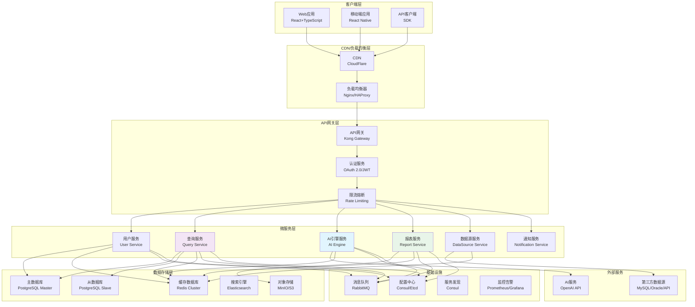
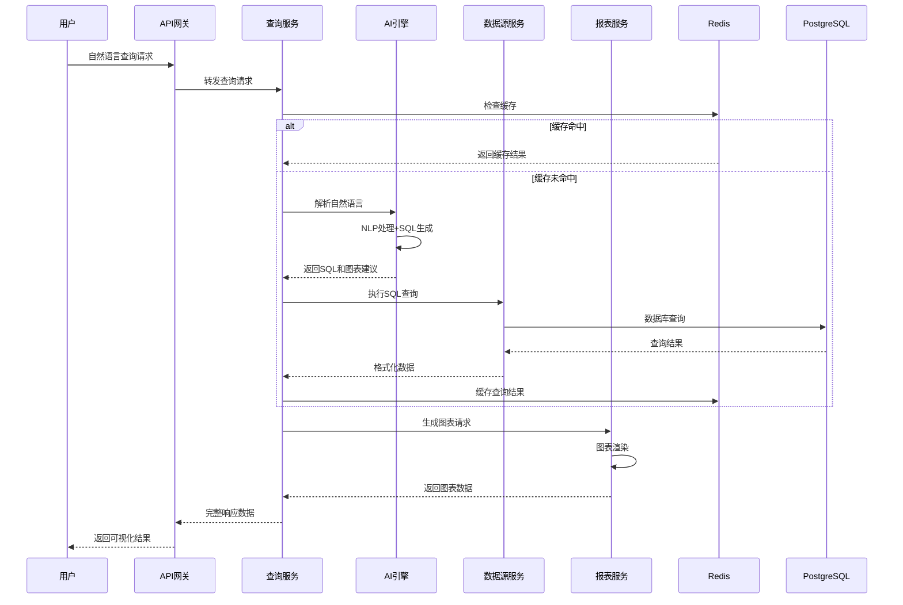
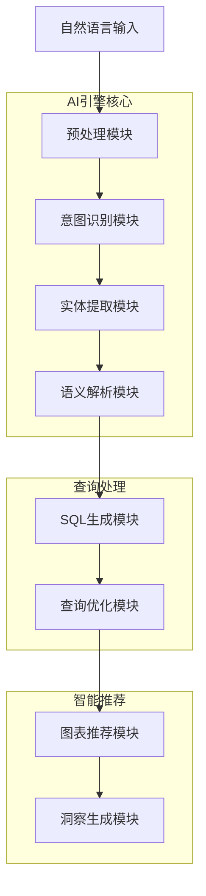
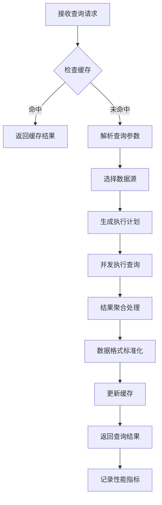
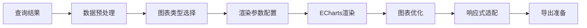
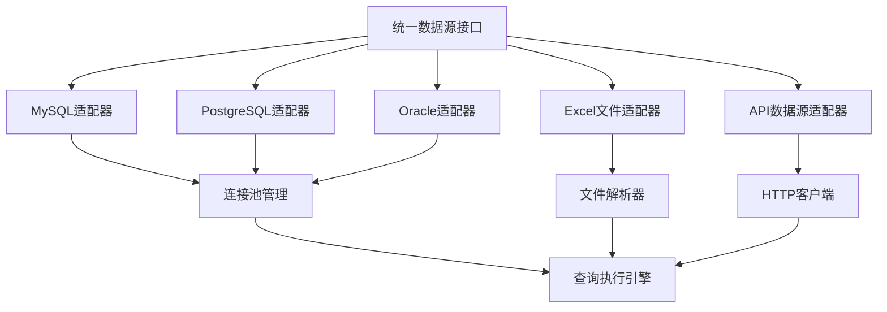
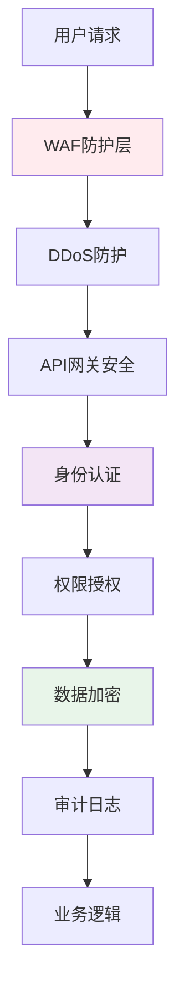
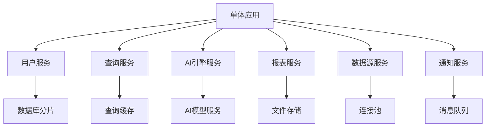

# ai-agile-dap 技术架构文档

**版本**: v1.0  
**创建日期**: 2024年8月18日  
**架构师**: David  
**项目代号**: ai-agile-dap MVP

---

## 1. 架构概述

### 1.1 设计目标
- **高性能**: 查询响应时间 ≤ 3秒，支持1000+并发用户
- **高可用**: 系统可用性 ≥ 99.5%，故障自动恢复
- **高安全**: 企业级安全防护，数据加密传输存储
- **可扩展**: 微服务架构，支持水平扩展
- **易维护**: 标准化部署，完善的监控告警

### 1.2 架构原则
- **微服务架构**: 独立部署、独立扩展、故障隔离
- **事件驱动**: 异步处理提升系统吞吐量
- **云原生**: 容器化部署，支持多云环境
- **API优先**: RESTful + GraphQL，前后端完全分离
- **安全第一**: 零信任架构，端到端安全防护

### 1.3 技术选型矩阵

| 组件类型 | 技术选择 | 版本 | 选择理由 |
|---------|----------|------|----------|
| **前端框架** | React + TypeScript | 18+ | 生态成熟，TypeScript增强开发体验 |
| **状态管理** | Redux Toolkit | 2.0+ | 标准化状态管理，DevTools支持好 |
| **UI组件库** | Ant Design | 5.0+ | 企业级组件，国际化支持完善 |
| **图表库** | Apache ECharts | 5.4+ | 功能强大，支持多种图表类型 |
| **后端框架** | Node.js + Express | 18+/4.18+ | JavaScript全栈，生态丰富 |
| **数据库** | PostgreSQL | 15+ | ACID支持，JSON查询，扩展性强 |
| **缓存** | Redis | 7+ | 高性能内存数据库，支持多种数据结构 |
| **消息队列** | RabbitMQ | 3.12+ | 可靠消息传递，支持复杂路由 |
| **搜索引擎** | Elasticsearch | 8.0+ | 全文搜索，日志分析，实时聚合 |
| **文件存储** | MinIO | 2024+ | S3兼容，私有云存储方案 |
| **容器化** | Docker + K8s | 24+/1.28+ | 标准化部署，自动扩缩容 |
| **API网关** | Kong | 3.4+ | 高性能，插件生态丰富 |
| **监控** | Prometheus + Grafana | 2.45+/10+ | 云原生监控标准 |

---

## 2. 整体架构设计

### 2.1 系统架构图



### 2.2 服务间通信架构



---

## 3. 核心服务详细设计

### 3.1 AI引擎服务 (AI Engine Service)

#### 3.1.1 服务职责
- 自然语言理解和意图识别
- SQL查询生成和优化
- 智能图表类型推荐
- 查询结果智能洞察

#### 3.1.2 技术架构


#### 3.1.3 关键算法实现
```typescript
// AI引擎核心处理器
class AIEngineProcessor {
  private nlpModel: NLPModel;
  private sqlGenerator: SQLGenerator;
  private chartRecommender: ChartRecommender;
  
  async processQuery(request: QueryRequest): Promise<QueryResponse> {
    // 1. 预处理
    const preprocessed = await this.preprocess(request.query);
    
    // 2. 意图识别
    const intent = await this.nlpModel.identifyIntent(preprocessed);
    
    // 3. 实体提取
    const entities = await this.nlpModel.extractEntities(preprocessed);
    
    // 4. SQL生成
    const sql = await this.sqlGenerator.generate({
      intent,
      entities,
      schema: request.schema
    });
    
    // 5. 图表推荐
    const chartSuggestion = await this.chartRecommender.recommend({
      sql,
      dataTypes: entities.dataTypes
    });
    
    return {
      sql,
      chartType: chartSuggestion.type,
      confidence: chartSuggestion.confidence,
      insights: await this.generateInsights(intent, entities)
    };
  }
}
```

#### 3.1.4 准确率保障机制

**1. 多模型集成策略**
```typescript
class EnsembleNLPProcessor {
  private models: NLPModel[] = [
    new OpenAIModel(),
    new LocalTransformerModel(),
    new RuleBasedModel()
  ];
  
  async processWithEnsemble(query: string): Promise<EnsembleResult> {
    const results = await Promise.all(
      this.models.map(model => model.process(query))
    );
    
    // 投票机制决定最终结果
    return this.votingMechanism(results);
  }
}
```

**2. 渐进式学习系统**
```typescript
class LearningSystem {
  async collectFeedback(
    originalQuery: string, 
    generatedSQL: string, 
    userCorrection: string,
    userRating: number
  ) {
    // 存储用户反馈
    await this.feedbackRepo.save({
      query: originalQuery,
      generated: generatedSQL,
      corrected: userCorrection,
      rating: userRating,
      timestamp: new Date()
    });
    
    // 触发模型重训练
    if (this.shouldRetrain()) {
      await this.scheduleRetraining();
    }
  }
}
```

### 3.2 查询服务 (Query Service)

#### 3.2.1 服务职责
- 查询请求路由和调度
- 查询结果缓存管理
- 查询性能监控优化
- 数据源抽象和适配

#### 3.2.2 查询执行流程


#### 3.2.3 缓存策略设计
```typescript
interface CacheStrategy {
  // 三层缓存架构
  l1Cache: BrowserCache;  // 浏览器缓存
  l2Cache: CDNCache;      // CDN缓存
  l3Cache: RedisCache;    // 服务端缓存
}

class QueryCacheManager {
  async getCachedResult(queryKey: string): Promise<CacheResult | null> {
    // L1: 检查浏览器缓存（客户端处理）
    // L2: 检查CDN缓存
    const cdnResult = await this.l2Cache.get(queryKey);
    if (cdnResult) return cdnResult;
    
    // L3: 检查Redis缓存
    const redisResult = await this.l3Cache.get(queryKey);
    if (redisResult) {
      // 回填CDN缓存
      await this.l2Cache.set(queryKey, redisResult, TTL.CDN);
      return redisResult;
    }
    
    return null;
  }
  
  async setCachedResult(queryKey: string, result: QueryResult) {
    const ttl = this.calculateTTL(result);
    
    // 写入Redis缓存
    await this.l3Cache.set(queryKey, result, ttl.redis);
    
    // 写入CDN缓存
    await this.l2Cache.set(queryKey, result, ttl.cdn);
  }
}
```

### 3.3 报表服务 (Report Service)

#### 3.3.1 服务职责
- 图表渲染和生成
- 报表模板管理
- 多格式导出功能
- 静态资源管理

#### 3.3.2 图表渲染架构


#### 3.3.3 高性能图表渲染
```typescript
class ChartRenderer {
  private echarts: EChartsInstance;
  private canvas: OffscreenCanvas;
  
  async renderChart(data: ChartData, config: ChartConfig): Promise<ChartResult> {
    // 使用Web Worker进行图表渲染，避免阻塞主线程
    const worker = new Worker('/workers/chart-renderer.js');
    
    return new Promise((resolve, reject) => {
      worker.postMessage({ data, config });
      
      worker.onmessage = (e) => {
        const { chartImage, chartConfig } = e.data;
        resolve({
          svg: chartImage,
          config: chartConfig,
          metadata: this.generateMetadata(data)
        });
      };
      
      worker.onerror = reject;
    });
  }
}
```

#### 3.3.4 PDF导出优化
```typescript
class PDFExportService {
  private puppeteer: Browser;
  
  async exportToPDF(report: ReportData): Promise<Buffer> {
    const page = await this.puppeteer.newPage();
    
    // 设置PDF参数
    await page.emulateMediaType('print');
    await page.setViewport({ width: 1200, height: 800 });
    
    // 渲染HTML内容
    const html = await this.templateEngine.render(report);
    await page.setContent(html, { waitUntil: 'networkidle0' });
    
    // 生成PDF
    const pdf = await page.pdf({
      format: 'A4',
      printBackground: true,
      margin: { top: '20mm', bottom: '20mm', left: '15mm', right: '15mm' }
    });
    
    await page.close();
    return pdf;
  }
}
```

### 3.4 数据源服务 (DataSource Service)

#### 3.4.1 服务职责
- 多数据源连接管理
- 数据源适配和抽象
- 元数据管理和同步
- 数据源权限控制

#### 3.4.2 数据源适配器架构


#### 3.4.3 连接池优化配置
```typescript
interface ConnectionPoolConfig {
  // 连接池配置
  min: number;          // 最小连接数
  max: number;          // 最大连接数
  acquireTimeoutMillis: number;  // 获取连接超时
  idleTimeoutMillis: number;     // 空闲连接超时
  reapIntervalMillis: number;    // 连接清理间隔
}

class DataSourceManager {
  private pools: Map<string, Pool> = new Map();
  
  async createConnection(config: DataSourceConfig): Promise<Connection> {
    const poolKey = this.generatePoolKey(config);
    
    if (!this.pools.has(poolKey)) {
      const pool = new Pool({
        host: config.host,
        port: config.port,
        database: config.database,
        user: config.user,
        password: config.password,
        min: 2,
        max: 10,
        acquireTimeoutMillis: 30000,
        idleTimeoutMillis: 600000
      });
      
      this.pools.set(poolKey, pool);
    }
    
    return await this.pools.get(poolKey)!.acquire();
  }
}
```

---

## 4. 数据架构设计

### 4.1 数据库设计

#### 4.1.1 核心数据模型
```sql
-- 用户表
CREATE TABLE users (
    id SERIAL PRIMARY KEY,
    email VARCHAR(255) UNIQUE NOT NULL,
    password_hash VARCHAR(255) NOT NULL,
    full_name VARCHAR(100) NOT NULL,
    role VARCHAR(50) NOT NULL DEFAULT 'user',
    organization_id INTEGER REFERENCES organizations(id),
    created_at TIMESTAMP DEFAULT NOW(),
    updated_at TIMESTAMP DEFAULT NOW()
);

-- 数据源表
CREATE TABLE data_sources (
    id SERIAL PRIMARY KEY,
    name VARCHAR(100) NOT NULL,
    type VARCHAR(50) NOT NULL, -- mysql, postgresql, excel, api
    connection_config JSONB NOT NULL,
    schema_metadata JSONB,
    user_id INTEGER REFERENCES users(id),
    is_active BOOLEAN DEFAULT true,
    created_at TIMESTAMP DEFAULT NOW()
);

-- 查询历史表
CREATE TABLE query_history (
    id SERIAL PRIMARY KEY,
    user_id INTEGER REFERENCES users(id),
    natural_query TEXT NOT NULL,
    generated_sql TEXT,
    data_source_id INTEGER REFERENCES data_sources(id),
    execution_time_ms INTEGER,
    result_rows INTEGER,
    chart_type VARCHAR(50),
    is_successful BOOLEAN DEFAULT true,
    error_message TEXT,
    created_at TIMESTAMP DEFAULT NOW()
);

-- 报表模板表
CREATE TABLE report_templates (
    id SERIAL PRIMARY KEY,
    name VARCHAR(100) NOT NULL,
    description TEXT,
    template_config JSONB NOT NULL,
    industry VARCHAR(50),
    is_public BOOLEAN DEFAULT false,
    creator_id INTEGER REFERENCES users(id),
    usage_count INTEGER DEFAULT 0,
    created_at TIMESTAMP DEFAULT NOW()
);

-- AI训练数据表
CREATE TABLE ai_training_data (
    id SERIAL PRIMARY KEY,
    original_query TEXT NOT NULL,
    generated_sql TEXT NOT NULL,
    corrected_sql TEXT,
    user_rating INTEGER CHECK (user_rating BETWEEN 1 AND 5),
    feedback_text TEXT,
    schema_context JSONB,
    created_at TIMESTAMP DEFAULT NOW()
);
```

#### 4.1.2 读写分离架构
```yaml
database:
  master:
    host: "postgres-master.internal"
    port: 5432
    database: "ai_agile_dap"
    max_connections: 100
    
  slaves:
    - host: "postgres-slave-1.internal"
      port: 5432
      weight: 50
      lag_threshold: "100ms"
    - host: "postgres-slave-2.internal" 
      port: 5432
      weight: 50
      lag_threshold: "100ms"
      
  routing_rules:
    - pattern: "SELECT.*"
      target: "slave"
    - pattern: "INSERT|UPDATE|DELETE.*"
      target: "master"
```

### 4.2 缓存架构设计

#### 4.2.1 Redis集群配置
```yaml
redis:
  cluster:
    nodes:
      - host: "redis-1.internal"
        port: 6379
      - host: "redis-2.internal"
        port: 6379
      - host: "redis-3.internal"
        port: 6379
        
  cache_strategies:
    query_results:
      ttl: 1800  # 30分钟
      max_memory: "2GB"
      eviction: "allkeys-lru"
      
    user_sessions:
      ttl: 86400  # 24小时
      max_memory: "500MB"
      
    chart_cache:
      ttl: 3600  # 1小时
      max_memory: "1GB"
```

#### 4.2.2 缓存键设计策略
```typescript
class CacheKeyGenerator {
  // 查询结果缓存键
  static queryResult(sql: string, dataSourceId: number): string {
    const sqlHash = this.hashSQL(sql);
    return `query:${dataSourceId}:${sqlHash}`;
  }
  
  // 图表缓存键
  static chartCache(queryKey: string, chartType: string): string {
    return `chart:${queryKey}:${chartType}`;
  }
  
  // 用户会话缓存键
  static userSession(userId: number): string {
    return `session:user:${userId}`;
  }
  
  // 元数据缓存键
  static metadata(dataSourceId: number): string {
    return `metadata:${dataSourceId}`;
  }
}
```

---

## 5. 安全架构设计

### 5.1 安全防护层次



### 5.2 身份认证和授权

#### 5.2.1 JWT认证实现
```typescript
class AuthenticationService {
  private jwtSecret: string;
  private refreshTokenTTL = 7 * 24 * 60 * 60; // 7天
  
  async authenticate(email: string, password: string): Promise<AuthResult> {
    const user = await this.userService.validateCredentials(email, password);
    if (!user) {
      throw new AuthenticationError('Invalid credentials');
    }
    
    const payload = {
      userId: user.id,
      email: user.email,
      role: user.role,
      organizationId: user.organizationId
    };
    
    const accessToken = jwt.sign(payload, this.jwtSecret, { expiresIn: '15m' });
    const refreshToken = jwt.sign(
      { userId: user.id }, 
      this.jwtSecret, 
      { expiresIn: '7d' }
    );
    
    // 存储refresh token到Redis
    await this.redis.set(
      `refresh_token:${user.id}`, 
      refreshToken, 
      this.refreshTokenTTL
    );
    
    return { accessToken, refreshToken, user };
  }
}
```

#### 5.2.2 RBAC权限模型
```typescript
interface Permission {
  resource: string;  // 资源类型：datasource, query, report
  action: string;    // 操作类型：read, write, delete, share
  conditions?: any;  // 条件：own_only, organization_only
}

interface Role {
  id: string;
  name: string;
  permissions: Permission[];
}

class AuthorizationService {
  private roles: Map<string, Role> = new Map([
    ['admin', {
      id: 'admin',
      name: 'Administrator',
      permissions: [
        { resource: '*', action: '*' }
      ]
    }],
    ['analyst', {
      id: 'analyst', 
      name: 'Data Analyst',
      permissions: [
        { resource: 'datasource', action: 'read' },
        { resource: 'query', action: '*' },
        { resource: 'report', action: '*', conditions: { own_only: true } }
      ]
    }],
    ['viewer', {
      id: 'viewer',
      name: 'Report Viewer', 
      permissions: [
        { resource: 'query', action: 'read' },
        { resource: 'report', action: 'read' }
      ]
    }]
  ]);
  
  async checkPermission(
    user: User, 
    resource: string, 
    action: string,
    context?: any
  ): Promise<boolean> {
    const userRole = this.roles.get(user.role);
    if (!userRole) return false;
    
    return userRole.permissions.some(permission => {
      const resourceMatch = permission.resource === '*' || 
                           permission.resource === resource;
      const actionMatch = permission.action === '*' || 
                         permission.action === action;
      const conditionMatch = this.evaluateConditions(
        permission.conditions, 
        user, 
        context
      );
      
      return resourceMatch && actionMatch && conditionMatch;
    });
  }
}
```

### 5.3 数据安全防护

#### 5.3.1 数据加密策略
```typescript
class DataEncryptionService {
  private aes256Key: string;
  
  // 敏感数据字段加密
  encrypt(plaintext: string): string {
    const iv = crypto.randomBytes(16);
    const cipher = crypto.createCipher('aes-256-cbc', this.aes256Key);
    cipher.setAutoPadding(true);
    
    let encrypted = cipher.update(plaintext, 'utf8', 'base64');
    encrypted += cipher.final('base64');
    
    return iv.toString('hex') + ':' + encrypted;
  }
  
  decrypt(ciphertext: string): string {
    const parts = ciphertext.split(':');
    const iv = Buffer.from(parts[0], 'hex');
    const encrypted = parts[1];
    
    const decipher = crypto.createDecipher('aes-256-cbc', this.aes256Key);
    let decrypted = decipher.update(encrypted, 'base64', 'utf8');
    decrypted += decipher.final('utf8');
    
    return decrypted;
  }
  
  // 数据脱敏
  maskSensitiveData(data: any[], userRole: string): any[] {
    if (userRole === 'admin') return data;
    
    return data.map(row => {
      const maskedRow = { ...row };
      
      // 脱敏规则
      for (const [key, value] of Object.entries(row)) {
        if (this.isSensitiveField(key)) {
          maskedRow[key] = this.applyMask(value as string, key);
        }
      }
      
      return maskedRow;
    });
  }
  
  private isSensitiveField(fieldName: string): boolean {
    const sensitivePatterns = [
      /phone/i, /mobile/i, /tel/i,
      /email/i, /mail/i,
      /id_card/i, /passport/i,
      /salary/i, /income/i,
      /password/i, /pwd/i
    ];
    
    return sensitivePatterns.some(pattern => pattern.test(fieldName));
  }
}
```

#### 5.3.2 SQL注入防护
```typescript
class SQLInjectionProtection {
  private dangerousPatterns = [
    /(\b(SELECT|INSERT|UPDATE|DELETE|DROP|CREATE|ALTER)\b)/gi,
    /(;|\-\-|\/\*|\*\/)/g,
    /(\b(UNION|OR|AND)\b.*\b(SELECT|INSERT|UPDATE|DELETE)\b)/gi
  ];
  
  sanitizeQuery(query: string): string {
    // 移除注释
    let sanitized = query.replace(/\/\*.*?\*\//g, '');
    sanitized = sanitized.replace(/--.*$/gm, '');
    
    // 转义特殊字符
    sanitized = sanitized.replace(/'/g, "''");
    
    return sanitized.trim();
  }
  
  validateSQL(sql: string): ValidationResult {
    const errors: string[] = [];
    
    // 检查危险模式
    for (const pattern of this.dangerousPatterns) {
      if (pattern.test(sql)) {
        errors.push(`Potentially dangerous SQL pattern detected: ${pattern}`);
      }
    }
    
    // 检查SQL语法
    try {
      this.parseSQLAST(sql);
    } catch (error) {
      errors.push(`SQL syntax error: ${error.message}`);
    }
    
    return {
      isValid: errors.length === 0,
      errors,
      sanitizedSQL: this.sanitizeQuery(sql)
    };
  }
}
```

### 5.4 审计日志系统
```typescript
interface AuditLog {
  id: string;
  userId: number;
  action: string;
  resource: string;
  resourceId?: string;
  details: any;
  ipAddress: string;
  userAgent: string;
  timestamp: Date;
  success: boolean;
  errorMessage?: string;
}

class AuditLogger {
  async logUserAction(
    user: User,
    action: string,
    resource: string,
    details: any,
    request: Request
  ) {
    const auditLog: AuditLog = {
      id: generateUUID(),
      userId: user.id,
      action,
      resource,
      details,
      ipAddress: request.ip,
      userAgent: request.get('User-Agent') || '',
      timestamp: new Date(),
      success: true
    };
    
    // 异步写入日志
    await this.writeToElasticsearch(auditLog);
    
    // 实时监控告警
    if (this.isHighRiskAction(action)) {
      await this.triggerSecurityAlert(auditLog);
    }
  }
}
```

---

## 6. 部署架构设计

### 6.1 容器化部署架构

#### 6.1.1 Docker镜像构建
```dockerfile
# Node.js后端服务Dockerfile
FROM node:18-alpine AS builder

WORKDIR /app
COPY package*.json ./
RUN npm ci --only=production

COPY . .
RUN npm run build

FROM node:18-alpine AS runtime
RUN addgroup -g 1001 -S nodejs
RUN adduser -S nextjs -u 1001

WORKDIR /app
COPY --from=builder /app/dist ./dist
COPY --from=builder /app/node_modules ./node_modules
COPY --from=builder /app/package.json ./package.json

USER nextjs
EXPOSE 3000

CMD ["node", "dist/index.js"]
```

#### 6.1.2 Kubernetes部署配置
```yaml
# ai-agile-dap-backend.yaml
apiVersion: apps/v1
kind: Deployment
metadata:
  name: ai-agile-dap-backend
  labels:
    app: ai-agile-dap-backend
spec:
  replicas: 3
  selector:
    matchLabels:
      app: ai-agile-dap-backend
  template:
    metadata:
      labels:
        app: ai-agile-dap-backend
    spec:
      containers:
      - name: backend
        image: ai-agile-dap/backend:latest
        ports:
        - containerPort: 3000
        env:
        - name: DATABASE_URL
          valueFrom:
            secretKeyRef:
              name: database-secret
              key: url
        - name: REDIS_URL
          valueFrom:
            configMapKeyRef:
              name: redis-config
              key: url
        resources:
          requests:
            memory: "512Mi"
            cpu: "500m"
          limits:
            memory: "1Gi"
            cpu: "1000m"
        readinessProbe:
          httpGet:
            path: /health
            port: 3000
          initialDelaySeconds: 10
          periodSeconds: 5
        livenessProbe:
          httpGet:
            path: /health
            port: 3000
          initialDelaySeconds: 30
          periodSeconds: 10
---
apiVersion: v1
kind: Service
metadata:
  name: ai-agile-dap-backend-service
spec:
  selector:
    app: ai-agile-dap-backend
  ports:
  - port: 80
    targetPort: 3000
  type: ClusterIP
```

### 6.2 CI/CD流水线

#### 6.2.1 GitHub Actions配置
```yaml
# .github/workflows/deploy.yml
name: CI/CD Pipeline

on:
  push:
    branches: [ main, develop ]
  pull_request:
    branches: [ main ]

env:
  REGISTRY: ghcr.io
  IMAGE_NAME: ${{ github.repository }}

jobs:
  test:
    runs-on: ubuntu-latest
    steps:
    - uses: actions/checkout@v3
    
    - name: Setup Node.js
      uses: actions/setup-node@v3
      with:
        node-version: '18'
        cache: 'npm'
    
    - name: Install dependencies
      run: npm ci
    
    - name: Run tests
      run: npm test
    
    - name: Run security scan
      run: npm audit
      
  build:
    needs: test
    runs-on: ubuntu-latest
    steps:
    - uses: actions/checkout@v3
    
    - name: Set up Docker Buildx
      uses: docker/setup-buildx-action@v2
    
    - name: Log in to Container Registry
      uses: docker/login-action@v2
      with:
        registry: ${{ env.REGISTRY }}
        username: ${{ github.actor }}
        password: ${{ secrets.GITHUB_TOKEN }}
    
    - name: Build and push Docker image
      uses: docker/build-push-action@v4
      with:
        context: .
        platforms: linux/amd64,linux/arm64
        push: true
        tags: |
          ${{ env.REGISTRY }}/${{ env.IMAGE_NAME }}:latest
          ${{ env.REGISTRY }}/${{ env.IMAGE_NAME }}:${{ github.sha }}
          
  deploy:
    needs: build
    runs-on: ubuntu-latest
    if: github.ref == 'refs/heads/main'
    steps:
    - name: Deploy to Kubernetes
      uses: azure/k8s-deploy@v1
      with:
        manifests: |
          k8s/deployment.yaml
          k8s/service.yaml
        images: |
          ${{ env.REGISTRY }}/${{ env.IMAGE_NAME }}:${{ github.sha }}
```

### 6.3 监控和告警

#### 6.3.1 Prometheus监控配置
```yaml
# prometheus.yml
global:
  scrape_interval: 15s
  evaluation_interval: 15s

scrape_configs:
  - job_name: 'ai-agile-dap-backend'
    static_configs:
      - targets: ['backend:3000']
    metrics_path: '/metrics'
    scrape_interval: 30s
    
  - job_name: 'postgresql'
    static_configs:
      - targets: ['postgres-exporter:9187']
      
  - job_name: 'redis'
    static_configs:  
      - targets: ['redis-exporter:9121']

rule_files:
  - "alert_rules.yml"

alerting:
  alertmanagers:
    - static_configs:
        - targets:
          - alertmanager:9093
```

#### 6.3.2 关键监控指标
```typescript
// 业务指标监控
class MetricsCollector {
  private prometheus = require('prom-client');
  
  private queryDurationHistogram = new this.prometheus.Histogram({
    name: 'ai_query_duration_seconds',
    help: 'AI查询处理时间',
    labelNames: ['query_type', 'data_source']
  });
  
  private queryAccuracyGauge = new this.prometheus.Gauge({
    name: 'ai_query_accuracy_ratio',
    help: 'AI查询准确率',
    labelNames: ['model_version']
  });
  
  private activeUsersGauge = new this.prometheus.Gauge({
    name: 'active_users_total',
    help: '活跃用户数',
    labelNames: ['time_window']
  });
  
  recordQueryDuration(duration: number, queryType: string, dataSource: string) {
    this.queryDurationHistogram
      .labels(queryType, dataSource)
      .observe(duration);
  }
  
  updateQueryAccuracy(accuracy: number, modelVersion: string) {
    this.queryAccuracyGauge
      .labels(modelVersion)
      .set(accuracy);
  }
}
```

---

## 7. 性能优化策略

### 7.1 前端性能优化

#### 7.1.1 代码分割和懒加载
```typescript
// 路由级别代码分割
import { lazy, Suspense } from 'react';

const Dashboard = lazy(() => import('../pages/Dashboard'));
const QueryPage = lazy(() => import('../pages/QueryPage'));
const ReportPage = lazy(() => import('../pages/ReportPage'));

function AppRouter() {
  return (
    <Suspense fallback={<LoadingSpinner />}>
      <Routes>
        <Route path="/dashboard" element={<Dashboard />} />
        <Route path="/query" element={<QueryPage />} />
        <Route path="/report" element={<ReportPage />} />
      </Routes>
    </Suspense>
  );
}

// 组件级别懒加载
const HeavyChart = lazy(() => 
  import('./HeavyChart').then(module => ({
    default: module.HeavyChart
  }))
);
```

#### 7.1.2 图表渲染优化
```typescript
class ChartPerformanceOptimizer {
  private chartCache = new Map<string, ChartInstance>();
  
  async renderOptimizedChart(
    data: ChartData, 
    container: HTMLElement
  ): Promise<ChartInstance> {
    const cacheKey = this.generateCacheKey(data);
    
    // 检查缓存
    if (this.chartCache.has(cacheKey)) {
      return this.chartCache.get(cacheKey)!;
    }
    
    // 数据采样优化
    const optimizedData = this.optimizeDataForRendering(data);
    
    // 使用Web Worker渲染大数据量图表
    if (optimizedData.length > 10000) {
      return await this.renderInWorker(optimizedData, container);
    }
    
    // 常规渲染
    const chart = echarts.init(container);
    chart.setOption(this.buildChartOption(optimizedData));
    
    this.chartCache.set(cacheKey, chart);
    return chart;
  }
  
  private optimizeDataForRendering(data: ChartData): ChartData {
    // 数据点过多时进行采样
    if (data.length > 5000) {
      return this.sampleData(data, 1000);
    }
    return data;
  }
}
```

### 7.2 后端性能优化

#### 7.2.1 数据库查询优化
```sql
-- 创建合适的索引
CREATE INDEX CONCURRENTLY idx_query_history_user_created 
ON query_history(user_id, created_at DESC);

CREATE INDEX CONCURRENTLY idx_data_sources_user_active 
ON data_sources(user_id) WHERE is_active = true;

-- 分区表优化大数据量查询
CREATE TABLE query_history_partitioned (
    LIKE query_history INCLUDING ALL
) PARTITION BY RANGE (created_at);

-- 按月分区
CREATE TABLE query_history_202408 PARTITION OF query_history_partitioned
    FOR VALUES FROM ('2024-08-01') TO ('2024-09-01');
```

#### 7.2.2 API响应优化
```typescript
class APIOptimizer {
  // 响应压缩
  enableCompression(app: Express) {
    app.use(compression({
      filter: (req, res) => {
        if (req.headers['x-no-compression']) return false;
        return compression.filter(req, res);
      },
      level: 6,
      threshold: 1024
    }));
  }
  
  // 分页优化
  async getPaginatedResults(
    query: string,
    page: number = 1,
    limit: number = 50
  ): Promise<PaginatedResult> {
    const maxLimit = 1000;
    const safeLimit = Math.min(limit, maxLimit);
    const offset = (page - 1) * safeLimit;
    
    // 使用窗口函数优化分页查询
    const optimizedQuery = `
      WITH paginated_data AS (
        ${query}
      )
      SELECT *, COUNT(*) OVER() as total_count
      FROM paginated_data
      LIMIT $1 OFFSET $2
    `;
    
    const results = await this.db.query(optimizedQuery, [safeLimit, offset]);
    
    return {
      data: results.rows,
      pagination: {
        page,
        limit: safeLimit,
        total: results.rows[0]?.total_count || 0,
        hasNext: offset + safeLimit < (results.rows[0]?.total_count || 0)
      }
    };
  }
}
```

---

## 8. 扩展性设计

### 8.1 微服务扩展

#### 8.1.1 服务拆分策略


#### 8.1.2 服务通信设计
```typescript
// 事件驱动架构
interface DomainEvent {
  eventId: string;
  eventType: string;
  aggregateId: string;
  data: any;
  timestamp: Date;
  version: number;
}

class EventBus {
  private publisher: RabbitMQPublisher;
  private subscribers = new Map<string, EventHandler[]>();
  
  async publishEvent(event: DomainEvent) {
    // 发布到消息队列
    await this.publisher.publish(event.eventType, event);
    
    // 本地事件处理
    const handlers = this.subscribers.get(event.eventType) || [];
    await Promise.all(handlers.map(handler => handler.handle(event)));
  }
  
  subscribe(eventType: string, handler: EventHandler) {
    if (!this.subscribers.has(eventType)) {
      this.subscribers.set(eventType, []);
    }
    this.subscribers.get(eventType)!.push(handler);
  }
}

// 事件处理示例
class QueryCompletedEventHandler implements EventHandler {
  async handle(event: DomainEvent) {
    if (event.eventType === 'QueryCompleted') {
      // 更新查询历史
      await this.queryHistoryService.recordQuery(event.data);
      
      // 触发缓存预热
      await this.cacheService.preWarmRelatedQueries(event.data.queryPattern);
      
      // 发送通知
      await this.notificationService.notifyQueryCompletion(event.data.userId);
    }
  }
}
```

### 8.2 数据扩展性

#### 8.2.1 数据库水平分片
```typescript
interface ShardingStrategy {
  getShardKey(entity: any): string;
  getShard(shardKey: string): string;
}

class UserBasedSharding implements ShardingStrategy {
  private shards = ['shard1', 'shard2', 'shard3', 'shard4'];
  
  getShardKey(entity: any): string {
    return entity.userId.toString();
  }
  
  getShard(shardKey: string): string {
    const hash = this.hashFunction(shardKey);
    return this.shards[hash % this.shards.length];
  }
  
  private hashFunction(key: string): number {
    let hash = 0;
    for (let i = 0; i < key.length; i++) {
      hash = ((hash << 5) - hash) + key.charCodeAt(i);
      hash = hash & hash; // Convert to 32-bit integer
    }
    return Math.abs(hash);
  }
}

class ShardedRepository<T> {
  constructor(
    private sharding: ShardingStrategy,
    private connections: Map<string, Database>
  ) {}
  
  async save(entity: T): Promise<void> {
    const shardKey = this.sharding.getShardKey(entity);
    const shard = this.sharding.getShard(shardKey);
    const db = this.connections.get(shard)!;
    
    await db.save(entity);
  }
  
  async findById(id: string, userId: number): Promise<T | null> {
    const shardKey = userId.toString();
    const shard = this.sharding.getShard(shardKey);
    const db = this.connections.get(shard)!;
    
    return await db.findById(id);
  }
}
```

---

## 9. 风险评估与应对

### 9.1 技术风险

| 风险项 | 风险等级 | 影响 | 应对策略 |
|--------|----------|------|----------|
| **AI准确率不达标** | 高 | 用户体验差，产品失败 | 多模型集成、渐进式学习、人工校验 |
| **性能瓶颈** | 中 | 用户流失，扩展受限 | 缓存策略、数据库优化、CDN加速 |
| **数据安全漏洞** | 高 | 法律风险，信任危机 | 多层安全防护、定期安全审计 |
| **第三方API依赖** | 中 | 服务中断，成本上升 | 多供应商策略、本地化备选方案 |

### 9.2 业务风险

| 风险项 | 风险等级 | 影响 | 应对策略 |
|--------|----------|------|----------|
| **市场接受度低** | 中 | 增长缓慢，投资回报差 | MVP快速验证、用户反馈驱动迭代 |
| **竞争对手跟进** | 高 | 市场份额流失 | 技术护城河建设、用户体验差异化 |
| **合规风险** | 中 | 法律处罚，业务受限 | 合规性设计、法律咨询、审计认证 |

---

## 10. 总结和建议

### 10.1 架构优势
1. **高性能**: 三层缓存 + 数据库优化，响应时间 ≤ 3秒
2. **高可用**: 微服务架构 + 故障隔离，可用性 ≥ 99.5%
3. **高安全**: 多层防护 + 数据加密，企业级安全标准
4. **易扩展**: 水平扩展 + 事件驱动，支持业务快速增长
5. **易维护**: 标准化部署 + 完善监控，运维成本可控

### 10.2 关键成功要素
1. **AI引擎准确率**: 核心竞争力，需要持续优化
2. **用户体验**: 简单易用是产品成功的关键
3. **性能优化**: 响应速度直接影响用户满意度  
4. **数据安全**: 企业客户的基本要求
5. **运维自动化**: 保障服务稳定性

### 10.3 实施建议
1. **MVP优先**: 先实现核心功能，快速验证市场
2. **渐进式架构**: 从单体开始，根据需要拆分微服务
3. **持续监控**: 建立完善的监控体系，及时发现问题
4. **安全合规**: 从设计阶段就考虑安全和合规要求
5. **团队能力**: 确保团队具备相关技术栈的开发能力

---

**文档状态**: ✅ 初版完成，待开发团队评审  
**下一步**: 开发环境搭建，技术选型确认，开发计划制定  
**负责人**: 架构师 David  
**评审时间**: 2024年8月20日