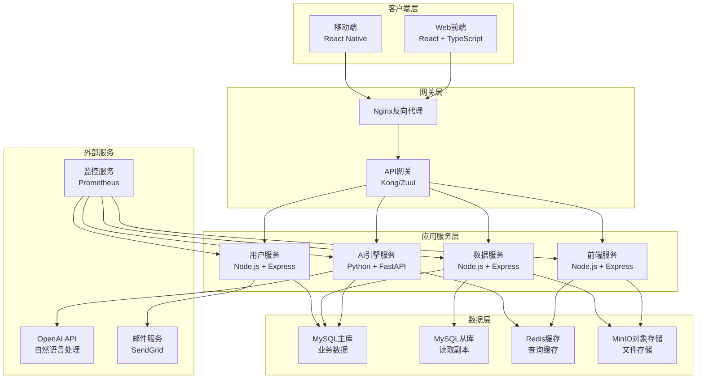
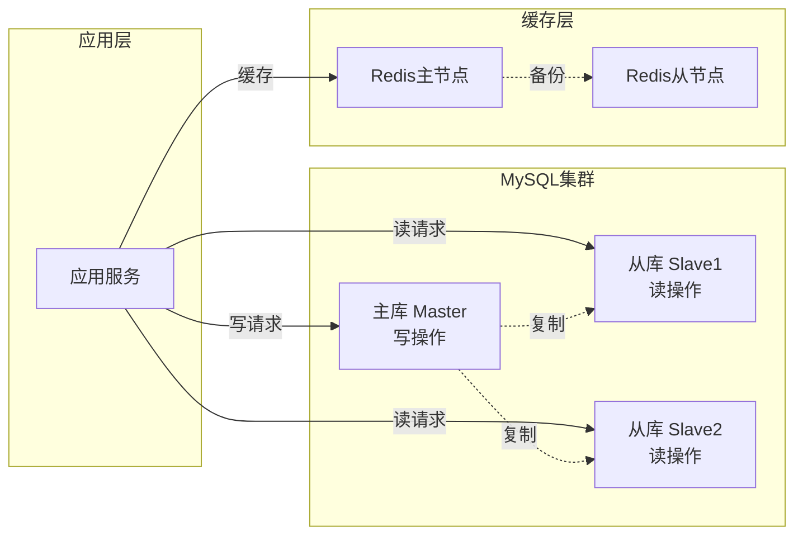

# ai-agile-dap 详细系统架构设计

**版本**: v2.0  
**更新时间**: 2024年8月18日  
**架构师**: AI开发团队

---

## 🎯 架构概览

### 整体架构图



---

## 🗄️ 数据库架构设计

### MySQL数据库选型理由

1. **高性能**: 优秀的查询性能，支持复杂SQL
2. **高可用**: 成熟的主从复制方案
3. **生态完善**: 丰富的工具和社区支持
4. **团队熟悉**: 开发团队经验丰富

### 数据库架构



### 核心数据表设计

#### 1. 用户管理表

```sql
-- 用户表
CREATE TABLE users (
    id BIGINT PRIMARY KEY AUTO_INCREMENT,
    username VARCHAR(50) UNIQUE NOT NULL,
    email VARCHAR(255) UNIQUE NOT NULL,
    password_hash VARCHAR(255) NOT NULL,
    full_name VARCHAR(100),
    avatar_url VARCHAR(255),
    role ENUM('admin', 'user', 'viewer') DEFAULT 'user',
    status ENUM('active', 'inactive', 'suspended') DEFAULT 'active',
    created_at TIMESTAMP DEFAULT CURRENT_TIMESTAMP,
    updated_at TIMESTAMP DEFAULT CURRENT_TIMESTAMP ON UPDATE CURRENT_TIMESTAMP,
    INDEX idx_email (email),
    INDEX idx_username (username),
    INDEX idx_status (status)
);

-- 用户会话表
CREATE TABLE user_sessions (
    id BIGINT PRIMARY KEY AUTO_INCREMENT,
    user_id BIGINT NOT NULL,
    session_token VARCHAR(255) UNIQUE NOT NULL,
    expires_at TIMESTAMP NOT NULL,
    created_at TIMESTAMP DEFAULT CURRENT_TIMESTAMP,
    FOREIGN KEY (user_id) REFERENCES users(id) ON DELETE CASCADE,
    INDEX idx_token (session_token),
    INDEX idx_user_expires (user_id, expires_at)
);
```

#### 2. 查询管理表

```sql
-- 查询历史表
CREATE TABLE query_history (
    id BIGINT PRIMARY KEY AUTO_INCREMENT,
    user_id BIGINT NOT NULL,
    session_id VARCHAR(255),
    natural_query TEXT NOT NULL,
    query_type ENUM('trend', 'comparison', 'ranking', 'statistics', 'proportion'),
    generated_sql TEXT,
    chart_type ENUM('line', 'bar', 'pie', 'number', 'table'),
    execution_time_ms INT,
    result_count INT,
    status ENUM('success', 'failed', 'timeout') DEFAULT 'success',
    error_message TEXT,
    created_at TIMESTAMP DEFAULT CURRENT_TIMESTAMP,
    FOREIGN KEY (user_id) REFERENCES users(id) ON DELETE CASCADE,
    INDEX idx_user_created (user_id, created_at),
    INDEX idx_query_type (query_type),
    INDEX idx_status (status)
);

-- 查询结果缓存表
CREATE TABLE query_cache (
    id BIGINT PRIMARY KEY AUTO_INCREMENT,
    query_hash VARCHAR(64) UNIQUE NOT NULL,
    natural_query TEXT NOT NULL,
    sql_query TEXT NOT NULL,
    result_data JSON,
    chart_config JSON,
    expires_at TIMESTAMP NOT NULL,
    hit_count INT DEFAULT 0,
    created_at TIMESTAMP DEFAULT CURRENT_TIMESTAMP,
    updated_at TIMESTAMP DEFAULT CURRENT_TIMESTAMP ON UPDATE CURRENT_TIMESTAMP,
    INDEX idx_hash (query_hash),
    INDEX idx_expires (expires_at)
);
```

#### 3. 数据源管理表

```sql
-- 数据源表
CREATE TABLE data_sources (
    id BIGINT PRIMARY KEY AUTO_INCREMENT,
    user_id BIGINT NOT NULL,
    name VARCHAR(100) NOT NULL,
    type ENUM('csv', 'excel', 'mysql', 'postgresql', 'api') NOT NULL,
    connection_config JSON,
    schema_info JSON,
    status ENUM('active', 'inactive', 'error') DEFAULT 'active',
    last_sync_at TIMESTAMP NULL,
    created_at TIMESTAMP DEFAULT CURRENT_TIMESTAMP,
    updated_at TIMESTAMP DEFAULT CURRENT_TIMESTAMP ON UPDATE CURRENT_TIMESTAMP,
    FOREIGN KEY (user_id) REFERENCES users(id) ON DELETE CASCADE,
    INDEX idx_user_status (user_id, status),
    INDEX idx_type (type)
);

-- 业务数据表 (示例表结构)
CREATE TABLE business_data (
    id BIGINT PRIMARY KEY AUTO_INCREMENT,
    data_source_id BIGINT NOT NULL,
    date DATE NOT NULL,
    department VARCHAR(100),
    product_name VARCHAR(255),
    region VARCHAR(100),
    sales_amount DECIMAL(15,2),
    customer_count INT,
    revenue DECIMAL(15,2),
    cost DECIMAL(15,2),
    created_at TIMESTAMP DEFAULT CURRENT_TIMESTAMP,
    FOREIGN KEY (data_source_id) REFERENCES data_sources(id) ON DELETE CASCADE,
    INDEX idx_date (date),
    INDEX idx_department (department),
    INDEX idx_product (product_name),
    INDEX idx_region (region),
    INDEX idx_source_date (data_source_id, date)
);
```

#### 4. 报表管理表

```sql
-- 报表模板表
CREATE TABLE report_templates (
    id BIGINT PRIMARY KEY AUTO_INCREMENT,
    name VARCHAR(255) NOT NULL,
    description TEXT,
    category VARCHAR(100),
    template_config JSON NOT NULL,
    is_public BOOLEAN DEFAULT FALSE,
    created_by BIGINT NOT NULL,
    usage_count INT DEFAULT 0,
    created_at TIMESTAMP DEFAULT CURRENT_TIMESTAMP,
    updated_at TIMESTAMP DEFAULT CURRENT_TIMESTAMP ON UPDATE CURRENT_TIMESTAMP,
    FOREIGN KEY (created_by) REFERENCES users(id) ON DELETE CASCADE,
    INDEX idx_category (category),
    INDEX idx_public (is_public),
    INDEX idx_created_by (created_by)
);

-- 用户报表表
CREATE TABLE user_reports (
    id BIGINT PRIMARY KEY AUTO_INCREMENT,
    user_id BIGINT NOT NULL,
    template_id BIGINT,
    name VARCHAR(255) NOT NULL,
    config JSON NOT NULL,
    chart_data JSON,
    is_favorite BOOLEAN DEFAULT FALSE,
    shared_token VARCHAR(255) UNIQUE,
    created_at TIMESTAMP DEFAULT CURRENT_TIMESTAMP,
    updated_at TIMESTAMP DEFAULT CURRENT_TIMESTAMP ON UPDATE CURRENT_TIMESTAMP,
    FOREIGN KEY (user_id) REFERENCES users(id) ON DELETE CASCADE,
    FOREIGN KEY (template_id) REFERENCES report_templates(id) ON DELETE SET NULL,
    INDEX idx_user_favorite (user_id, is_favorite),
    INDEX idx_shared_token (shared_token)
);
```

---

## 🚀 微服务架构设计

### 服务拆分策略

#### 1. 前端服务 (Frontend Service)
**技术栈**: Node.js + Express + React SSR
```yaml
责任:
  - 页面渲染和路由
  - 静态资源服务
  - SEO优化
  - 前端缓存管理

端口: 3000
依赖: 
  - API网关
  - CDN服务
```

#### 2. AI引擎服务 (AI Engine Service) 
**技术栈**: Python + FastAPI
```yaml
责任:
  - 自然语言处理
  - SQL生成和优化
  - 图表推荐
  - 查询意图分析

端口: 8001
依赖:
  - OpenAI API
  - Redis缓存
  - MySQL数据库

API端点:
  - POST /api/v1/query
  - POST /api/v1/validate
  - GET /api/v1/supported-queries
```

#### 3. 数据服务 (Data Service)
**技术栈**: Node.js + Express + TypeORM
```yaml
责任:
  - 数据源管理
  - 业务数据CRUD
  - 数据同步和ETL
  - 查询执行

端口: 8002
依赖:
  - MySQL主从库
  - Redis缓存
  - 文件存储

API端点:
  - GET /api/v1/data-sources
  - POST /api/v1/data-sources
  - POST /api/v1/execute-query
  - GET /api/v1/business-data
```

#### 4. 用户服务 (User Service)
**技术栈**: Node.js + Express + JWT
```yaml
责任:
  - 用户认证和授权
  - 用户信息管理
  - 权限控制
  - 会话管理

端口: 8003
依赖:
  - MySQL数据库
  - Redis会话存储
  - 邮件服务

API端点:
  - POST /api/v1/auth/login
  - POST /api/v1/auth/register
  - GET /api/v1/users/profile
  - PUT /api/v1/users/profile
```

#### 5. 报表服务 (Report Service)
**技术栈**: Node.js + Express + Puppeteer
```yaml
责任:
  - 报表生成和导出
  - 模板管理
  - 图表渲染
  - 文件格式转换

端口: 8004
依赖:
  - MySQL数据库
  - 文件存储
  - 图表库

API端点:
  - GET /api/v1/reports
  - POST /api/v1/reports/generate
  - GET /api/v1/templates
  - POST /api/v1/export/{format}
```

---

## 🔧 技术栈详细规格

### 前端技术栈
```yaml
框架: React 18.2.0
语言: TypeScript 5.0+
构建工具: Vite 4.0+
状态管理: Zustand
UI组件库: Ant Design 5.0
图表库: Apache ECharts 5.4
样式: Tailwind CSS 3.0
测试: Jest + React Testing Library
```

### 后端技术栈
```yaml
API服务: Node.js 20 + Express 4.18
AI引擎: Python 3.9 + FastAPI 0.104
数据库: MySQL 8.0 (主) + MySQL 8.0 (从)
缓存: Redis 7.0 (主从)
对象存储: MinIO
消息队列: Redis Pub/Sub
认证: JWT + bcrypt
文档: Swagger/OpenAPI 3.0
```

### 基础设施
```yaml
容器化: Docker + Docker Compose
编排: Kubernetes 1.28
网关: Nginx 1.24 + Kong 3.0
监控: Prometheus + Grafana
日志: ELK Stack (Elasticsearch + Logstash + Kibana)
CI/CD: GitHub Actions
云服务: AWS/阿里云
```

---

## 📊 性能和扩展性设计

### 性能目标
```yaml
响应时间:
  - API响应: < 200ms (95%ile)
  - 查询处理: < 2s (AI引擎)
  - 页面加载: < 1s (首屏)

吞吐量:
  - 并发用户: 1000+
  - QPS: 500+ (查询接口)
  - 数据处理: 10MB/s

可用性:
  - 服务可用性: 99.9%
  - 数据一致性: 强一致性
  - 故障恢复: < 5min
```

### 缓存策略
```yaml
多级缓存:
  1. 浏览器缓存 (静态资源)
  2. CDN缓存 (图片、JS、CSS)
  3. Redis缓存 (查询结果)
  4. 应用缓存 (内存缓存)

缓存配置:
  - 查询结果: TTL 1小时
  - 用户会话: TTL 24小时
  - 静态资源: TTL 30天
  - API响应: TTL 5分钟
```

### 数据库优化
```yaml
读写分离:
  - 主库: 写操作 + 实时读取
  - 从库: 分析查询 + 报表生成
  - 延迟控制: < 100ms

索引策略:
  - 主键索引: 所有表
  - 复合索引: 常用查询组合
  - 覆盖索引: 高频查询字段
  - 前缀索引: 长文本字段

分区策略:
  - 时间分区: 按月分区业务数据
  - 哈希分区: 用户数据负载均衡
```

---

## 🔒 安全架构设计

### 认证授权体系
```yaml
认证方式:
  - JWT Token: API访问
  - Session Cookie: Web会话
  - API Key: 第三方集成
  - OAuth 2.0: 社交登录

权限模型:
  - RBAC: 基于角色的访问控制
  - 角色: admin, user, viewer
  - 资源: 数据源, 报表, 查询
  - 操作: create, read, update, delete
```

### 数据安全
```yaml
传输安全:
  - HTTPS: 全站SSL/TLS
  - WebSocket安全: WSS协议
  - API安全: 请求签名验证

存储安全:
  - 密码: bcrypt哈希 + 盐值
  - 敏感数据: AES-256加密
  - 数据库连接: SSL连接
  - 备份加密: 数据库备份加密
```

### 接口安全
```yaml
防护措施:
  - 限流: 基于IP和用户的速率限制
  - 防刷: 验证码 + 设备指纹
  - SQL注入: 参数化查询 + ORM
  - XSS防护: 输入验证 + 输出编码
  - CSRF防护: Token验证
```

---

## 📈 监控和运维设计

### 监控体系
```yaml
应用监控:
  - 服务健康: 健康检查接口
  - 性能指标: 响应时间、吞吐量
  - 错误率: 4xx/5xx错误统计
  - 业务指标: 用户活跃度、查询成功率

基础设施监控:
  - 服务器: CPU、内存、磁盘、网络
  - 数据库: 连接数、查询性能、锁等待
  - 缓存: 命中率、内存使用、键过期
  - 队列: 消息积压、处理速度
```

### 日志体系
```yaml
日志分级:
  - ERROR: 系统错误和异常
  - WARN: 警告信息和降级
  - INFO: 关键业务操作
  - DEBUG: 调试和诊断信息

日志内容:
  - 访问日志: 请求路径、响应时间、状态码
  - 业务日志: 用户操作、查询记录、数据变更
  - 错误日志: 异常堆栈、错误上下文
  - 审计日志: 权限变更、敏感操作
```

---

**架构设计负责人**: AI开发团队  
**审核状态**: 待技术评审  
**下一步**: API接口规范设计