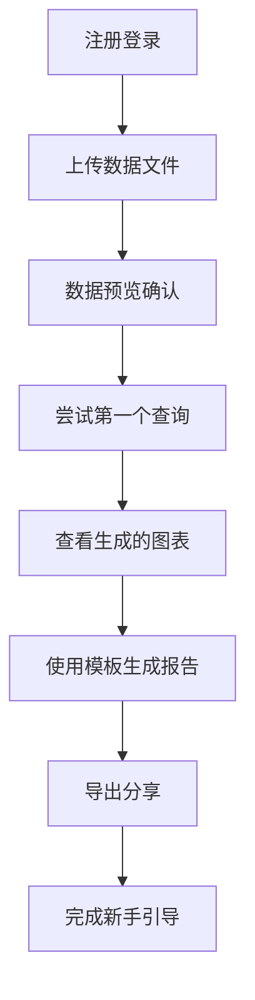
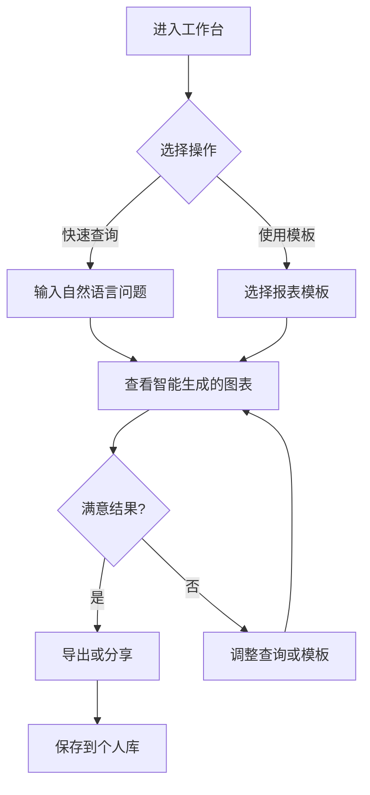

# ai-agile-dap 产品需求文档 (PRD)

**版本**: v1.0  
**创建日期**: 2024年8月18日  
**产品经理**: PM Alex  
**项目代号**: ai-agile-dap MVP

---

## 1. 产品概述

### 1.1 产品定位
ai-agile-dap 是一款AI驱动的零门槛企业数据洞察平台，通过自然语言交互让每个业务人员都能在10分钟内生成专业级数据报表，无需掌握SQL或复杂的数据分析技能。

### 1.2 产品愿景
**让数据洞察像聊天一样简单，让每个业务人员都成为数据分析师**

### 1.3 核心价值主张
- **10分钟法则**: 从想法到专业报表，不超过10分钟
- **零技术门槛**: 像和AI助手对话一样自然
- **企业级专业**: 咨询公司级别的图表质量
- **智能化洞察**: 不仅生成图表，更提供业务建议

### 1.4 目标用户群体

#### 主要用户 (Primary Users)
1. **业务分析师** (35%)
   - 需要频繁制作数据报表
   - 有分析思维但缺乏SQL技能
   - 追求效率和专业度

2. **企业决策者** (30%)
   - CEO、总监、部门负责人
   - 需要数据支撑决策但缺乏技术背景
   - 重视时效性和准确性

3. **运营人员** (25%)
   - 日常需要监控业务指标
   - 制作周期性运营报告
   - 对工具易用性要求高

#### 次要用户 (Secondary Users)
4. **数据分析师** (10%)
   - 希望提高工作效率
   - 减少重复性报表制作
   - 专注高价值分析工作

---

## 2. 市场分析

### 2.1 市场规模
- **全球BI市场**: 300亿美元，年增长10%+
- **目标细分市场**: 中小企业BI工具（50亿美元）
- **中国市场**: 数据可视化工具市场约15亿人民币

### 2.2 竞争分析

| 竞品 | 优势 | 劣势 | 差异化机会 |
|------|------|------|------------|
| **Tableau** | 功能强大，生态完善 | 学习成本高，价格昂贵 | 易用性革命 |
| **Power BI** | 微软生态，性价比高 | 仍需技术基础 | AI自然语言交互 |
| **帆软FineBI** | 本土化，实施服务好 | AI能力有限 | 智能化程度 |
| **钉钉宜搭** | 集成度高，免费 | 专业度不足 | 企业级专业度 |

### 2.3 用户痛点分析（基于调研）

#### 核心痛点
1. **技术门槛高** (100%反馈)
   - 89%业务人员不会SQL
   - 数据需求响应周期2-3天
   
2. **重复工作多** (90%反馈)
   - 60%需求为重复性"看趋势、做对比"
   - 70%时间花在图表美化
   
3. **决策响应慢** (85%反馈)
   - 临时需求至少半天响应
   - 错过最佳决策时机

---

## 3. 产品目标

### 3.1 商业目标
- **Year 1**: 100家企业客户，1000+活跃用户
- **Year 2**: 500家企业客户，ARR达到500万
- **Year 3**: 成为细分领域头部产品

### 3.2 产品目标
- **用户体验**: 5分钟内完成首次报表生成
- **准确性**: 自然语言理解准确率 ≥ 90%
- **留存率**: 月活跃用户留存率 ≥ 80%
- **满意度**: 用户满意度 ≥ 4.5/5.0

### 3.3 技术目标
- **响应速度**: 查询响应时间 ≤ 3秒
- **并发支持**: 支持1000+并发用户
- **可用性**: 服务可用性 ≥ 99.5%
- **安全性**: 通过等保三级认证

---

## 4. 功能需求

### 4.1 MVP功能列表 (Phase 1 - 0-3月)

#### 4.1.1 自然语言查询引擎
**功能描述**: 用户可以用自然语言提问，系统智能理解并生成相应的数据查询

**用户故事**:
```
作为一名业务分析师
我希望能够用自然语言询问数据问题
这样我就不需要学习SQL语法了

示例查询:
- "显示过去3个月的销售趋势"
- "哪个渠道的转化率最高？"
- "本季度各部门费用支出对比"
```

**功能规格**:
- 支持中文自然语言输入
- 识别时间范围（昨天、上周、上月、上季度等）
- 识别比较类查询（对比、排名、趋势等）
- 识别聚合计算（总计、平均、最大值等）
- 支持模糊匹配字段名

**验收标准**:
- [ ] 基础查询意图识别准确率 ≥ 90%
- [ ] 支持至少20种常见业务查询模式
- [ ] 查询解析响应时间 ≤ 1秒
- [ ] 错误查询有友好的提示和建议

#### 4.1.2 智能图表生成
**功能描述**: 基于查询结果和数据特征，自动选择最佳图表类型并生成专业图表

**用户故事**:
```
作为一名运营经理
我希望系统能自动选择合适的图表类型
这样我就不需要纠结用什么图表展示数据了
```

**功能规格**:
- 支持5种基础图表类型：柱状图、折线图、饼图、表格、数值卡片
- 基于数据类型自动选择图表（时间序列→折线图，分类对比→柱状图）
- 自动设置合理的颜色方案和样式
- 支持图表标题、轴标签、图例的智能生成

**验收标准**:
- [ ] 图表类型选择准确率 ≥ 85%
- [ ] 图表渲染时间 ≤ 2秒
- [ ] 支持响应式布局，适配不同屏幕尺寸
- [ ] 图表样式符合商业报告标准

#### 4.1.3 专业报表模板
**功能描述**: 提供预设的报表模板，用户可快速生成格式化的业务报告

**用户故事**:
```
作为一名企业决策者
我希望能快速生成标准格式的业务报告
这样我就能直接用于会议展示了
```

**功能规格**:
- 3个通用模板：销售分析报告、运营数据总览、财务概况报表
- 每个模板包含标题页、核心指标、趋势分析、对比分析
- 支持企业logo和品牌颜色定制
- 一键生成完整的多页报告

**验收标准**:
- [ ] 模板生成时间 ≤ 10秒
- [ ] 生成的报告格式专业，可直接用于商务场景
- [ ] 支持公司品牌元素定制
- [ ] 模板内容逻辑清晰，数据关联准确

#### 4.1.4 数据源管理
**功能描述**: 支持用户上传和管理数据文件，为分析提供数据基础

**用户故事**:
```
作为一名数据分析新手
我希望能方便地上传Excel文件进行分析
这样我就能用现有的数据快速开始
```

**功能规格**:
- 支持Excel (.xlsx, .xls) 和CSV文件上传
- 文件大小限制：单文件最大100MB
- 自动识别数据类型（文本、数字、日期等）
- 数据预览和字段映射功能
- 支持数据源的重命名和删除

**验收标准**:
- [ ] 支持主流Excel和CSV格式
- [ ] 文件上传成功率 ≥ 99%
- [ ] 数据类型识别准确率 ≥ 95%
- [ ] 上传10MB文件耗时 ≤ 30秒

#### 4.1.5 导出功能
**功能描述**: 将生成的报表导出为多种格式，便于分享和存档

**用户故事**:
```
作为一名项目经理
我希望能将报表导出为PDF
这样我就能通过邮件发送给团队成员了
```

**功能规格**:
- 支持PDF和Excel格式导出
- PDF保持高清图表质量，支持A4页面布局
- Excel导出包含原始数据和图表
- 导出文件自动命名（包含时间戳）

**验收标准**:
- [ ] 导出成功率 ≥ 99%
- [ ] PDF图表清晰度适合打印
- [ ] 导出时间 ≤ 5秒（标准报表）
- [ ] 文件大小合理（PDF < 10MB）

### 4.2 用户体验流程

#### 4.2.1 新用户首次使用流程


#### 4.2.2 日常使用流程


---

## 5. 非功能需求

### 5.1 性能需求
- **响应时间**: 
  - 自然语言解析 ≤ 1秒
  - 图表生成 ≤ 3秒
  - 报表导出 ≤ 5秒
- **并发性能**: 支持1000并发用户
- **数据处理**: 单次查询处理数据量 ≤ 10万行

### 5.2 可用性需求
- **系统可用性**: 99.5%
- **数据备份**: 每日自动备份，保留30天
- **容错机制**: 系统异常时优雅降级

### 5.3 安全需求
- **数据加密**: 传输和存储采用AES-256加密
- **访问控制**: 基于角色的权限管理
- **审计日志**: 完整的操作审计记录
- **合规要求**: 符合GDPR和中国网络安全法

### 5.4 兼容性需求
- **浏览器**: Chrome 80+, Firefox 75+, Safari 13+, Edge 80+
- **移动端**: 响应式设计，支持主流移动浏览器
- **数据格式**: Excel 2007+, CSV UTF-8

---

## 6. 用户界面需求

### 6.1 整体设计原则
- **简洁优先**: 界面元素最小化，突出核心功能
- **一致性**: 统一的视觉语言和交互模式
- **可访问性**: 支持键盘导航和屏幕阅读器
- **响应式**: 适配桌面和移动设备

### 6.2 核心页面结构

#### 6.2.1 主工作台
```
+------------------------------------------+
|  Logo    [搜索框: "输入您的问题..."]    用户 |
+------------------------------------------+
|                                          |
| [快速开始]                               |
| • 上传数据文件                            |
| • 尝试示例查询                            |
| • 选择报表模板                            |
|                                          |
| [我的分析] (最近查询历史)                  |
| +------+ +------+ +------+              |
| |图表1 | |图表2 | |图表3 |              |
| +------+ +------+ +------+              |
+------------------------------------------+
```

#### 6.2.2 分析结果页
```
+------------------------------------------+
| ← 返回  [查询框] "显示上月销售趋势"     导出 |
+------------------------------------------+
|                                          |
| [生成的图表区域]                          |
| +------------------------------------+   |
| |         销售趋势图表               |   |
| |                                    |   |
| |    [图表展示区域]                  |   |
| +------------------------------------+   |
|                                          |
| [AI洞察] 💡                            |
| • 销售额环比增长15%                      |
| • 产品A表现突出，建议加大推广            |
|                                          |
| [建议操作]                              |
| • 查看产品A详细数据                      |
| • 对比去年同期数据                       |
+------------------------------------------+
```

---

## 7. 技术架构需求

### 7.1 系统架构要求
- **微服务架构**: 支持水平扩展和独立部署
- **前后端分离**: RESTful API设计
- **云原生**: 支持容器化部署
- **数据库**: 关系型数据库 + 时序数据库

### 7.2 核心技术组件

#### 7.2.1 AI引擎模块
- **自然语言处理**: 基于大语言模型的意图识别
- **SQL生成**: 自然语言到SQL的转换引擎
- **智能推荐**: 基于数据特征的图表类型推荐

#### 7.2.2 数据处理模块
- **数据接入**: 支持多种数据源连接
- **数据转换**: ETL处理和数据清洗
- **查询引擎**: 高性能SQL执行引擎

#### 7.2.3 可视化引擎
- **图表渲染**: 基于Canvas/SVG的图表库
- **模板引擎**: 报表模板的渲染和定制
- **导出服务**: PDF/Excel生成服务

---

## 8. 成功指标与验收标准

### 8.1 产品成功指标

#### 8.1.1 用户体验指标
- **首次成功率**: 95%的新用户能成功完成首次查询
- **学习成本**: 平均5分钟掌握基本操作
- **错误率**: 用户操作错误率 ≤ 5%

#### 8.1.2 技术性能指标
- **查询准确性**: 自然语言理解准确率 ≥ 90%
- **响应速度**: 平均查询响应时间 ≤ 3秒
- **系统稳定性**: 可用性 ≥ 99.5%

#### 8.1.3 业务指标
- **用户留存**: 30天留存率 ≥ 60%
- **使用频率**: 活跃用户周均使用 ≥ 3次
- **满意度**: NPS分数 ≥ 50

### 8.2 MVP验收标准

#### 必须满足 (Must Have)
- [ ] 支持5种基础查询类型
- [ ] 生成5种基础图表类型
- [ ] 完整的Excel/CSV数据上传流程
- [ ] PDF/Excel导出功能正常
- [ ] 用户注册和基础权限管理

#### 应该具备 (Should Have)
- [ ] 基础的自然语言错误处理
- [ ] 简单的数据预览功能
- [ ] 基础的操作提示和帮助
- [ ] 查询历史记录

#### 可以拥有 (Could Have)
- [ ] 高级图表定制选项
- [ ] 数据分享功能
- [ ] 移动端优化
- [ ] API接口文档

---

## 9. 项目计划

### 9.1 里程碑规划

#### Milestone 1: 技术验证 (Week 1-4)
- 自然语言处理引擎POC
- 数据处理管道搭建
- 基础UI框架建立

#### Milestone 2: 核心功能 (Week 5-8)
- 自然语言查询功能
- 智能图表生成
- 数据源管理

#### Milestone 3: 完整MVP (Week 9-12)
- 报表模板系统
- 导出功能
- 用户管理和权限

#### Milestone 4: 测试优化 (Week 13-16)
- 全面功能测试
- 性能优化
- 用户体验优化

### 9.2 风险与应对

#### 高风险项
1. **AI准确性风险**
   - 风险: 自然语言理解准确率不达标
   - 应对: 建立comprehensive测试数据集，持续模型训练

2. **性能风险**
   - 风险: 大数据量处理性能不足
   - 应对: 分层缓存策略，查询优化

#### 中等风险项
1. **用户体验风险**
   - 风险: 界面复杂度超出用户接受度
   - 应对: 持续用户测试和反馈收集

---

## 10. 附录

### 10.1 用户调研参考
- 调研对象: 3家企业，涵盖互联网、传统企业、咨询公司
- 核心发现: 100%付费意愿，平均预期15万/年
- 关键痛点: SQL门槛、响应速度、图表专业度

### 10.2 竞品功能对比
[详见用户调研报告竞品分析部分]

### 10.3 技术选型建议
- 前端: React/Vue.js + TypeScript
- 后端: Node.js/Python + FastAPI
- 数据库: PostgreSQL + Redis
- AI: OpenAI API + 自研NLP模块
- 部署: Docker + Kubernetes

---

**文档状态**: ✅ 初版完成，待架构师和技术团队评审
**下一步**: 创建技术架构文档，启动UI/UX设计
**负责人**: PM Alex
**评审时间**: 2024年8月20日