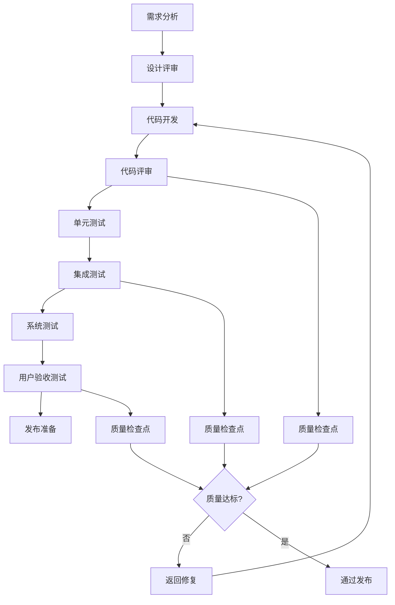
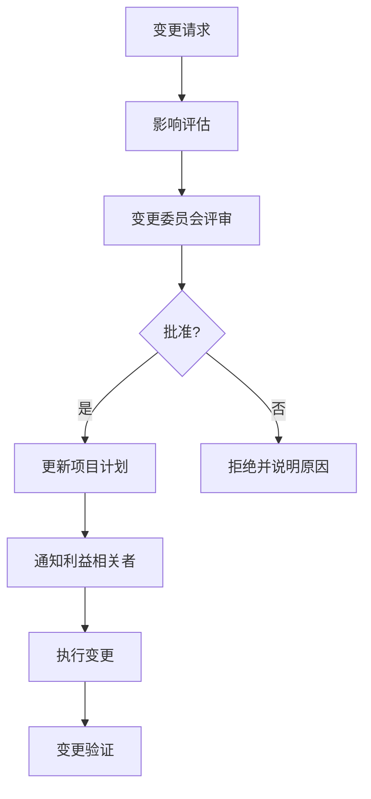

# ai-agile-dap 项目管理计划

**版本**: v1.0  
**创建日期**: 2024年8月18日  
**项目经理**: Sam  
**项目代号**: ai-agile-dap MVP

---

## 1. 项目概述

### 1.1 项目背景
基于前期用户调研和市场分析，ai-agile-dap项目旨在开发一款AI驱动的零门槛企业数据洞察平台，解决企业在数据分析中面临的SQL技能门槛高、响应速度慢、图表制作复杂等核心痛点。

### 1.2 项目目标
- **产品目标**: 实现10分钟内生成专业级数据报表
- **技术目标**: 查询准确率≥90%，响应时间≤3秒，支持1000+并发
- **商业目标**: MVP阶段获得100家企业客户，ARR达到500万

### 1.3 项目范围
**包含内容**:
- 自然语言查询引擎
- 智能图表生成系统
- 专业报表模板库
- 多数据源连接管理
- 用户权限和安全管理
- Web端完整应用

**不包含内容**:
- 移动端应用
- 高级AI洞察功能
- 第三方系统深度集成
- 私有化部署方案

---

## 2. 风险管理计划

### 2.1 风险识别矩阵

| 风险类别 | 风险描述 | 概率 | 影响 | 风险等级 | 责任人 |
|---------|----------|------|------|----------|--------|
| **技术风险** |  |  |  |  |  |
| 1 | AI查询准确率无法达到90%目标 | 高 | 高 | 🔴 极高 | AI工程师 |
| 2 | 系统性能无法满足3秒响应要求 | 中 | 高 | 🟡 高 | 技术负责人 |
| 3 | 第三方API服务不稳定(OpenAI) | 中 | 中 | 🟡 中 | 技术负责人 |
| 4 | 数据安全合规性问题 | 低 | 高 | 🟡 中 | 安全专家 |
| **资源风险** |  |  |  |  |  |
| 5 | 关键技术人员离职 | 中 | 高 | 🟡 高 | 项目经理 |
| 6 | 开发进度延期 | 中 | 中 | 🟡 中 | 项目经理 |
| 7 | 预算超支 | 低 | 中 | 🟢 低 | 项目经理 |
| **市场风险** |  |  |  |  |  |
| 8 | 竞争对手推出类似产品 | 高 | 中 | 🟡 中 | 产品负责人 |
| 9 | 用户接受度低于预期 | 中 | 高 | 🟡 高 | 产品负责人 |
| 10 | 监管政策变化影响业务 | 低 | 高 | 🟡 中 | 项目经理 |

### 2.2 风险应对策略

#### 🔴 极高风险应对
**风险1: AI查询准确率不达标**
- **预防措施**: 
  - 建立多模型集成架构
  - 设置85%的最低可接受标准
  - 每周进行准确率测试
- **应急预案**:
  - 启用备选AI模型方案
  - 增加人工校验机制
  - 降低复杂查询的自动化程度
- **负责人**: AI工程师 + 技术负责人
- **监控指标**: 每日准确率报告

#### 🟡 高风险应对
**风险2: 系统性能不达标**
- **预防措施**:
  - 每Sprint进行性能测试
  - 建立性能监控dashboard
  - 提前进行架构优化
- **应急预案**:
  - 启用缓存预热策略
  - 实施数据库读写分离
  - 增加服务器资源配置
- **负责人**: 技术负责人 + 后端开发

**风险5: 关键人员离职**
- **预防措施**:
  - 建立知识文档体系
  - 实施代码review和知识共享
  - 提供有竞争力的薪酬包
- **应急预案**:
  - 维护候选人才库
  - 建立快速招聘流程
  - 实施代码和架构备份

### 2.3 风险监控机制
- **每日风险检查**: 技术风险和进度风险
- **每周风险评估**: 全面风险状态更新
- **月度风险评审**: 风险等级调整和策略优化

---

## 3. 质量管理计划

### 3.1 质量标准定义

| 质量维度 | 质量标准 | 测量方法 | 责任人 |
|---------|----------|----------|--------|
| **功能质量** |  |  |  |
| 功能完整性 | 100%需求功能实现 | 需求追踪矩阵 | 测试工程师 |
| 查询准确率 | ≥90% | 自动化准确率测试 | AI工程师 |
| 功能可用性 | 99%核心功能正常 | 功能测试覆盖率 | 测试工程师 |
| **性能质量** |  |  |  |
| 响应时间 | ≤3秒 | 性能测试工具 | 后端开发 |
| 并发能力 | 1000+用户 | 负载测试 | 测试工程师 |
| 系统可用性 | ≥99% | 监控系统 | 运维工程师 |
| **用户体验** |  |  |  |
| 界面易用性 | SUS评分≥80 | 用户测试 | UI/UX设计师 |
| 学习成本 | ≤5分钟掌握基本操作 | 用户测试 | 产品负责人 |
| 用户满意度 | ≥4.5/5.0 | 用户反馈调研 | 产品负责人 |

### 3.2 质量保证流程



### 3.3 测试策略

#### 测试金字塔
```
       E2E Tests (10%)
    Integration Tests (20%) 
  Unit Tests (70%)
```

#### 测试计划
| 测试类型 | 覆盖率目标 | 工具/框架 | 执行频率 |
|---------|------------|-----------|----------|
| **单元测试** | 80%+ | Jest, Mocha | 每次提交 |
| **集成测试** | 70%+ | Supertest | 每日构建 |
| **端到端测试** | 主流程100% | Playwright | 每Sprint |
| **性能测试** | 核心API100% | JMeter | 每周 |
| **安全测试** | 全覆盖 | OWASP ZAP | 每Sprint |

---

## 4. 沟通管理计划

### 4.1 利益相关者分析

| 利益相关者 | 角色 | 关注点 | 沟通频率 | 沟通方式 |
|------------|------|--------|----------|----------|
| **项目发起人** | 决策层 | ROI、里程碑、风险 | 每月 | 董事会报告 |
| **产品负责人** | 产品团队 | 功能、用户体验、市场反馈 | 每日 | 站会、即时沟通 |
| **技术团队** | 开发团队 | 技术方案、开发进度、技术债务 | 每日 | 站会、技术评审 |
| **测试团队** | 质量团队 | 缺陷状态、测试进度、质量指标 | 每日 | 站会、质量报告 |
| **运维团队** | 基础设施 | 部署、监控、性能、安全 | 每周 | 运维会议 |
| **早期用户** | 外部客户 | 产品功能、使用反馈、价格 | 每2周 | 用户访谈 |

### 4.2 沟通矩阵

| 信息类型 | 频率 | 格式 | 分发对象 | 负责人 |
|---------|------|------|----------|--------|
| **项目状态报告** | 每周五 | PPT+邮件 | 全体利益相关者 | 项目经理 |
| **技术进展报告** | 每周三 | 文档 | 技术团队+产品 | 技术负责人 |
| **质量报告** | 每Sprint | Dashboard | 技术团队+管理层 | 测试工程师 |
| **风险报告** | 每月 | 文档 | 管理层 | 项目经理 |
| **用户反馈报告** | 每2周 | 文档 | 产品团队+技术 | 产品分析师 |

### 4.3 会议管理

#### 核心会议安排
```yaml
weekly_meetings:
  项目周会:
    time: "每周五 10:00-11:00"
    participants: ["全体核心团队"]
    agenda: ["进度回顾", "风险讨论", "下周计划"]
    
  技术评审会:
    time: "每周三 14:00-15:00"  
    participants: ["技术团队"]
    agenda: ["架构决策", "技术债务", "性能优化"]
    
  产品评审会:
    time: "每周二 16:00-17:00"
    participants: ["产品团队", "技术负责人"]
    agenda: ["需求确认", "优先级调整", "用户反馈"]

milestone_meetings:
  里程碑评审:
    frequency: "每个里程碑结束"
    participants: ["全体团队", "利益相关者"]
    agenda: ["交付物验收", "经验总结", "下阶段规划"]
```

---

## 5. 采购管理计划

### 5.1 采购清单

| 采购项目 | 类型 | 预算 | 采购时间 | 供应商 | 负责人 |
|---------|------|------|----------|--------|--------|
| **技术服务** |  |  |  |  |  |
| OpenAI API服务 | SaaS | ¥8万/4月 | 2024-08-20 | OpenAI | 技术负责人 |
| 云服务器 | IaaS | ¥6万/4月 | 2024-08-19 | 阿里云/腾讯云 | 运维工程师 |
| 数据库服务 | PaaS | ¥4万/4月 | 2024-08-20 | 云服务商 | 技术负责人 |
| **开发工具** |  |  |  |  |  |
| IDE许可证 | 工具 | ¥2万 | 2024-08-19 | JetBrains | 项目经理 |
| 设计工具 | 工具 | ¥1万 | 2024-08-19 | Adobe/Figma | 设计师 |
| 项目管理工具 | SaaS | ¥1万/4月 | 2024-08-19 | Jira/禅道 | 项目经理 |
| **第三方服务** |  |  |  |  |  |
| 监控服务 | SaaS | ¥2万/4月 | 2024-08-25 | DataDog | 运维工程师 |
| 安全扫描 | 服务 | ¥1万 | 2024-09-01 | 安全厂商 | 安全专家 |

### 5.2 供应商管理

#### 核心供应商评估
```yaml
openai:
  评分: 9/10
  优势: ["技术领先", "API稳定", "文档完善"]
  风险: ["成本较高", "依赖性强", "政策风险"]
  备选方案: ["Claude API", "文心一言", "自研模型"]

cloud_providers:
  阿里云:
    评分: 8/10
    优势: ["国内网络好", "服务稳定", "价格合理"]
    风险: ["国际化支持差"]
  腾讯云:
    评分: 8/10  
    优势: ["技术先进", "生态完整", "支持响应快"]
    风险: ["相对较新"]
```

### 5.3 采购风险管理
- **供应商集中度风险**: 避免过度依赖单一供应商
- **价格波动风险**: 签署年度合同锁定价格
- **服务质量风险**: 建立SLA和违约赔偿机制
- **技术迁移风险**: 保持技术方案的可替换性

---

## 6. 项目监控和控制

### 6.1 关键绩效指标 (KPI)

#### 项目执行指标
| 指标类型 | 指标名称 | 目标值 | 当前值 | 状态 |
|---------|----------|--------|--------|------|
| **进度指标** |  |  |  |  |
| 里程碑按时完成率 | 100% | - | 🟢 正常 |
| Sprint计划完成率 | ≥90% | - | 🟢 待启动 |
| 需求变更率 | ≤10% | - | 🟢 待监控 |
| **质量指标** |  |  |  |  |
| 代码质量评分 | ≥8/10 | - | 🟢 待测量 |
| 缺陷逃逸率 | ≤5% | - | 🟢 待测量 |
| 自动化测试覆盖率 | ≥80% | - | 🟢 待建立 |
| **团队指标** |  |  |  |  |
| 团队满意度 | ≥4/5 | - | 🟢 待调研 |
| 人员流失率 | ≤5% | 0% | 🟢 正常 |

### 6.2 报告机制

#### 状态报告模板
```markdown
# 项目周报 - Week X

## 📊 总体状态
- 进度状态: ⚪ 正常 / 🟡 风险 / 🔴 延期
- 质量状态: ⚪ 良好 / 🟡 关注 / 🔴 问题  
- 风险状态: ⚪ 可控 / 🟡 监控 / 🔴 高危

## 🎯 本周成就
- [完成的关键任务]
- [达到的里程碑]
- [解决的重要问题]

## 📈 关键指标
- Sprint燃尽图状态
- 代码质量指标
- 用户反馈统计

## ⚠️ 风险和问题
- 当前风险列表
- 需要升级的问题
- 请求的支持

## 📅 下周计划  
- 关键任务安排
- 里程碑准备
- 风险应对措施
```

### 6.3 项目控制机制

#### 变更控制流程


#### 质量控制检查点
- **代码提交**: 自动化测试通过
- **功能完成**: Code Review + 功能测试
- **Sprint结束**: 演示 + 回顾
- **里程碑**: 全面质量评审

---

## 7. 项目交接和收尾

### 7.1 PM到SM角色交接

#### 交接清单
- [ ] **项目文档移交**
  - [x] 项目管理计划
  - [x] 风险管理计划  
  - [x] 质量管理计划
  - [ ] 采购合同和供应商信息
  - [ ] 预算执行报告

- [ ] **团队状态移交**
  - [ ] 团队成员信息和能力评估
  - [ ] 当前工作分配和进度
  - [ ] 团队协作模式和沟通机制
  - [ ] 已识别的团队问题和改进点

- [ ] **利益相关者关系移交**
  - [ ] 关键联系人和沟通偏好
  - [ ] 正在进行的沟通和承诺
  - [ ] 外部合作伙伴关系

### 7.2 SM角色准备事项
- [ ] **敏捷流程建立**
  - [ ] Sprint周期设定 (推荐2周)
  - [ ] Scrum仪式时间安排
  - [ ] 团队协作工具配置
  - [ ] DoD (Definition of Done) 制定

- [ ] **团队能力建设**
  - [ ] 敏捷开发培训
  - [ ] 工具使用培训
  - [ ] 团队建设活动
  - [ ] 知识分享机制

### 7.3 持续监督机制
作为项目发起人，我将在以下方面保持监督：
- **月度里程碑评审**: 确保项目目标不偏离
- **风险升级处理**: 重大风险和问题的决策支持
- **资源协调**: 跨部门资源需求的协调
- **利益相关者管理**: 高级别沟通和汇报

---

## 8. 总结和建议

### 8.1 项目管理总结
1. **目标明确**: 基于用户调研的明确产品目标
2. **计划详实**: 16周详细里程碑和任务分解
3. **风险可控**: 识别了10个关键风险并制定应对策略  
4. **质量保障**: 多层次质量标准和测试策略
5. **团队就绪**: 9人核心团队配置合理

### 8.2 成功关键要素
1. **AI引擎准确率**: 核心技术能力，需持续关注
2. **团队协作效率**: 敏捷开发能力的快速建立
3. **用户反馈循环**: 与早期用户的紧密合作
4. **技术债务控制**: 在快速开发中保持代码质量
5. **风险主动管理**: 及时识别和应对新风险

### 8.3 给SM的建议
1. **关注团队速度**: 建立稳定的Sprint velocity
2. **移除障碍**: 主动识别和解决团队协作问题
3. **质量优先**: 不能为了速度牺牲质量
4. **持续改进**: 通过回顾会持续优化流程
5. **数据驱动**: 用数据支撑团队改进决策

---

**文档状态**: ✅ PM工作完成，准备交接给SM  
**交接时间**: 2024年8月19日  
**下一步**: 启动Sprint 0，建立敏捷开发流程  
**项目经理**: Sam → **Scrum Master**: [待接手]

**🚀 准备切换到Scrum Master角色！**