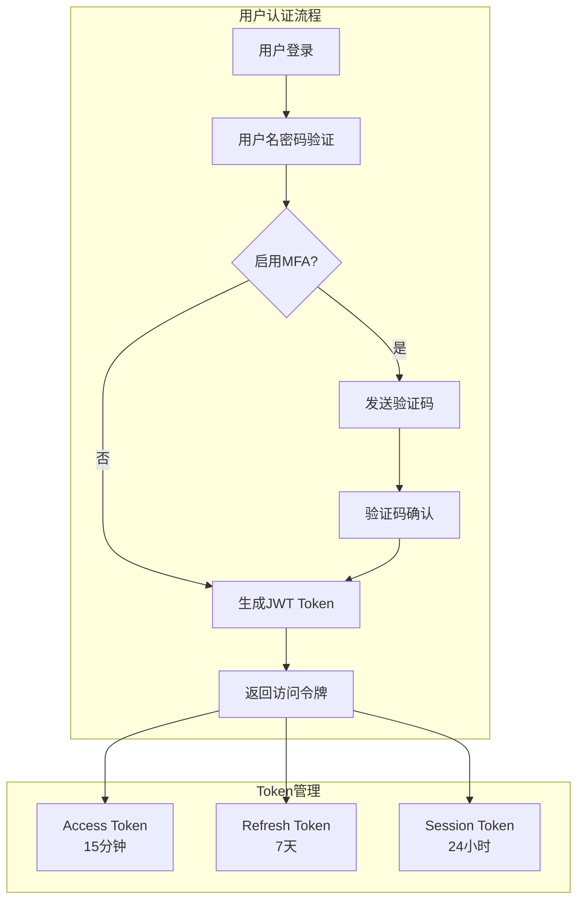
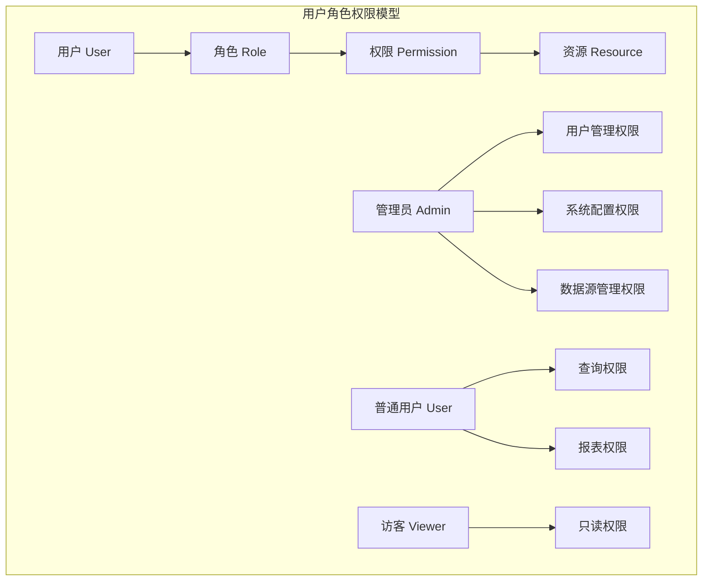

# ai-agile-dap 安全策略和权限设计

**版本**: v1.0  
**更新时间**: 2024年8月18日  
**安全团队**: AI开发团队

---

## 🎯 安全设计原则

### 纵深防御策略
- **多层防护**: 网络、应用、数据多层安全控制
- **最小权限**: 用户和系统组件只获得必需的最小权限
- **零信任**: 不信任任何网络内外的请求，全面验证
- **失败安全**: 系统故障时默认拒绝访问

### 数据保护原则
- **数据分类**: 按敏感级别分类管理
- **加密传输**: 全程HTTPS/TLS加密
- **加密存储**: 敏感数据静态加密
- **访问审计**: 完整的访问日志记录

---

## 🔐 认证体系设计

### 1. 多因素认证架构



### 2. JWT Token设计

#### Access Token结构
```json
{
  "header": {
    "alg": "HS256",
    "typ": "JWT"
  },
  "payload": {
    "sub": "user_123",
    "username": "john_doe",
    "role": "user",
    "permissions": ["query:read", "report:create"],
    "iat": 1692345600,
    "exp": 1692346500,
    "jti": "token_abc123"
  }
}
```

#### Token配置策略
```yaml
Access Token:
  - 有效期: 15分钟
  - 用途: API访问授权
  - 算法: HS256
  - 密钥轮换: 每30天

Refresh Token:
  - 有效期: 7天
  - 用途: 刷新Access Token
  - 存储: HttpOnly Cookie
  - 单次使用: 刷新后立即失效

Session Token:
  - 有效期: 24小时
  - 用途: Web会话管理
  - 存储: Redis Session Store
  - 自动延期: 活跃用户自动续期
```

### 3. 密码安全策略

#### 密码强度要求
```yaml
长度要求: 最少8位，推荐12位以上
复杂度要求:
  - 必须包含大小写字母
  - 必须包含数字
  - 必须包含特殊字符
  - 不能是常见弱密码
  - 不能包含用户名或邮箱

历史检查:
  - 不能重复最近5次密码
  - 密码修改间隔至少24小时
```

#### 密码存储和验证
```yaml
哈希算法: bcrypt
工作因子: 12 (约250ms验证时间)
盐值: 每个密码独立随机盐值
存储格式: $2b$12$salt$hash

密码重置:
  - 重置链接有效期: 30分钟
  - 重置令牌: 256位随机字符串
  - 单次使用: 使用后立即失效
  - 邮件发送: 异步队列处理
```

---

## 🛡️ 权限控制系统

### 1. RBAC权限模型



### 2. 角色定义

#### 系统角色
```yaml
Super Admin (超级管理员):
  权限:
    - 系统配置管理
    - 用户账户管理  
    - 数据源全局管理
    - 安全策略配置
    - 系统监控和审计
  限制:
    - 需要双重认证
    - 操作记录审计
    - IP地址白名单

Admin (管理员):
  权限:
    - 组织内用户管理
    - 数据源管理
    - 报表模板管理
    - 使用统计查看
  限制:
    - 组织范围内权限
    - 关键操作需要确认

User (普通用户):
  权限:
    - 自然语言查询
    - 个人报表创建
    - 数据导出(限制格式)
    - 个人设置管理
  限制:
    - 查询频率限制
    - 数据访问范围限制
    - 文件大小限制

Viewer (访客):
  权限:
    - 查看公开报表
    - 基础查询功能
  限制:
    - 只读权限
    - 无导出功能
    - 严格的访问限制
```

### 3. 资源权限矩阵

| 资源/操作 | Super Admin | Admin | User | Viewer |
|-----------|-------------|-------|------|--------|
| **用户管理** | ✅ | ✅ (组织内) | ❌ | ❌ |
| **数据源管理** | ✅ | ✅ (组织内) | ❌ | ❌ |
| **自然语言查询** | ✅ | ✅ | ✅ | ✅ (限制) |
| **SQL查询** | ✅ | ✅ | ❌ | ❌ |
| **报表创建** | ✅ | ✅ | ✅ | ❌ |
| **报表导出** | ✅ | ✅ | ✅ (限制) | ❌ |
| **系统配置** | ✅ | ❌ | ❌ | ❌ |
| **审计日志** | ✅ | ✅ (组织内) | ❌ | ❌ |

### 4. 动态权限控制

#### 基于上下文的权限
```yaml
时间限制:
  - 工作时间访问控制
  - 会话超时管理
  - 定期权限审核

地理位置:
  - IP地址白名单
  - 地理位置限制
  - 异常登录检测

设备限制:
  - 设备指纹认证
  - 移动设备管理
  - 多设备并发限制

数据敏感度:
  - 数据分级访问
  - 敏感字段脱敏
  - 特殊数据申请流程
```

---

## 🔒 API安全防护

### 1. 输入验证和过滤

#### SQL注入防护
```yaml
预防措施:
  - 参数化查询 (Prepared Statements)
  - ORM框架使用
  - 输入内容验证
  - SQL关键词过滤
  - 查询结果大小限制

危险模式检测:
  - UNION注入检测
  - 布尔盲注检测  
  - 时间盲注检测
  - 错误注入检测

实时防护:
  - WAF规则引擎
  - 异常查询监控
  - 自动阻断机制
```

#### XSS防护策略
```yaml
输入过滤:
  - HTML标签过滤
  - 脚本内容检测
  - 事件处理器过滤
  - CSS表达式过滤

输出编码:
  - HTML实体编码
  - JavaScript转义
  - URL编码
  - CSS编码

内容安全策略:
  - CSP头部设置
  - 内联脚本禁止
  - 外部资源白名单
  - 报告收集机制
```

### 2. API访问控制

#### 限流策略实现
```yaml
限流维度:
  - 用户级别限流
  - IP地址限流
  - 接口级别限流
  - 全局并发限流

限流算法:
  - 令牌桶算法 (Token Bucket)
  - 滑动窗口计数
  - 漏桶算法 (Leaky Bucket)

限流配置:
  普通用户:
    - 查询接口: 20次/分钟
    - 认证接口: 10次/分钟
    - 导出接口: 5次/分钟
  
  高级用户:
    - 查询接口: 100次/分钟
    - 认证接口: 30次/分钟
    - 导出接口: 20次/分钟

应对策略:
  - 优雅降级服务
  - 队列缓冲机制
  - 用户通知提醒
```

#### API密钥管理
```yaml
密钥生成:
  - 256位随机密钥
  - 前缀标识功能
  - 校验和验证
  - 创建时间戳

密钥权限:
  - 作用域限制
  - 有效期设置
  - IP白名单绑定
  - 功能权限映射

密钥轮换:
  - 定期自动轮换
  - 手动即时轮换
  - 双密钥过渡期
  - 轮换通知机制
```

---

## 🔐 数据安全保护

### 1. 数据加密策略

#### 传输加密
```yaml
HTTPS配置:
  - TLS 1.3协议
  - 强加密套件
  - HSTS策略
  - 证书固定

WebSocket加密:
  - WSS协议
  - 消息级加密
  - 密钥协商
  - 重放攻击防护

API加密:
  - 请求签名
  - 时间戳验证
  - Nonce防重放
  - 载荷加密
```

#### 存储加密
```yaml
数据库加密:
  - 透明数据加密 (TDE)
  - 字段级加密
  - 密钥管理服务
  - 备份加密

敏感字段加密:
  - 密码: bcrypt + 盐值
  - 身份证号: AES-256-GCM
  - 手机号: AES-256-GCM
  - 邮箱: 可逆加密

文件存储加密:
  - 对象存储加密
  - 客户端加密
  - 服务端加密
  - 密钥托管
```

### 2. 数据脱敏和匿名化

#### 敏感数据识别
```yaml
自动识别规则:
  - 身份证号模式
  - 手机号模式
  - 邮箱地址模式
  - 银行卡号模式
  - IP地址模式

数据分类标准:
  - 公开数据 (Public)
  - 内部数据 (Internal)
  - 机密数据 (Confidential)
  - 绝密数据 (Top Secret)
```

#### 脱敏策略
```yaml
脱敏方法:
  - 掩码脱敏: 138****5678
  - 替换脱敏: 张三 -> 用户A
  - 打乱脱敏: 随机重排
  - 截断脱敏: 保留前缀

应用场景:
  - 开发测试环境
  - 数据分析场景
  - 第三方集成
  - 报表展示
```

---

## 🚨 安全监控和响应

### 1. 安全事件监控

#### 实时监控指标
```yaml
认证异常:
  - 登录失败率
  - 异地登录检测
  - 暴力破解检测
  - 账户锁定事件

访问异常:
  - 异常API调用
  - 权限越界尝试
  - 大量数据访问
  - 敏感操作频率

系统异常:
  - 服务器错误率
  - 响应时间异常
  - 资源使用异常
  - 依赖服务故障
```

#### 日志收集和分析
```yaml
安全日志类型:
  - 认证日志
  - 授权日志
  - 操作日志
  - 错误日志
  - 审计日志

日志格式标准:
  时间戳: ISO 8601格式
  用户ID: 脱敏用户标识
  操作类型: 标准化动作
  资源对象: 统一资源标识
  结果状态: 成功/失败/异常
  来源信息: IP、设备、位置

日志存储策略:
  - 实时索引: Elasticsearch
  - 长期存储: 对象存储
  - 备份策略: 3-2-1备份
  - 保留期限: 7年审计要求
```

### 2. 安全事件响应

#### 自动响应机制
```yaml
轻度威胁:
  - 记录安全日志
  - 发送警告通知
  - 增强监控频率

中度威胁:
  - 临时账户锁定
  - 要求重新认证
  - 通知安全团队
  - 触发人工审查

高度威胁:
  - 立即阻断访问
  - 撤销所有Token
  - 紧急通知管理员
  - 启动应急预案
```

#### 应急响应流程
```yaml
事件分类:
  P0 - 严重安全事件 (数据泄露)
  P1 - 重要安全事件 (系统入侵)
  P2 - 一般安全事件 (异常访问)
  P3 - 轻微安全事件 (策略违规)

响应时间要求:
  P0: 15分钟内响应，1小时内控制
  P1: 30分钟内响应，4小时内控制
  P2: 2小时内响应，1天内解决
  P3: 1天内响应，3天内解决

处置措施:
  1. 事件确认和分级
  2. 影响范围评估
  3. 临时控制措施
  4. 根因分析
  5. 永久修复方案
  6. 事后复盘总结
```

---

## 🔍 安全审计和合规

### 1. 审计日志规范

#### 关键操作审计
```yaml
用户操作审计:
  - 登录登出记录
  - 权限变更记录
  - 敏感数据访问
  - 配置修改操作

数据操作审计:
  - 数据源连接
  - 查询执行记录
  - 数据导出操作
  - 报表生成记录

系统操作审计:
  - 配置变更记录
  - 用户管理操作
  - 系统升级记录
  - 备份恢复操作
```

#### 审计日志格式
```json
{
  "timestamp": "2024-08-18T10:30:00.000Z",
  "eventId": "audit_123456789",
  "userId": "user_456",
  "userRole": "user",
  "action": "DATA_EXPORT",
  "resource": "report_789",
  "resourceType": "report",
  "result": "success",
  "sourceIP": "192.168.1.100",
  "userAgent": "Mozilla/5.0...",
  "sessionId": "session_abc123",
  "details": {
    "exportFormat": "pdf",
    "recordCount": 1500,
    "fileSize": 2048576
  },
  "riskLevel": "medium"
}
```

### 2. 合规性要求

#### 数据保护法规遵循
```yaml
GDPR (欧盟通用数据保护条例):
  - 数据主体权利保护
  - 数据处理合法性基础
  - 数据最小化原则
  - 被遗忘权实现
  - 数据泄露72小时通知

CCPA (加州消费者隐私法):
  - 消费者知情权
  - 数据删除权
  - 数据可携带权
  - 选择退出权利

中国网络安全法:
  - 数据本地化存储
  - 关键信息基础设施保护
  - 个人信息保护
  - 数据出境安全评估
```

---

## 🛠️ 安全开发生命周期

### 1. 开发阶段安全

#### 代码安全审查
```yaml
静态代码分析:
  - SonarQube代码质量
  - SAST安全扫描
  - 依赖漏洞检测
  - 代码规范检查

安全编码规范:
  - 输入验证规范
  - 输出编码规范
  - 错误处理规范
  - 日志记录规范

代码审查清单:
  - SQL注入风险
  - XSS漏洞风险
  - 身份认证缺陷
  - 权限控制缺陷
  - 敏感信息泄露
```

### 2. 部署安全配置

#### 基础设施安全
```yaml
服务器安全:
  - 操作系统加固
  - 服务最小化安装
  - 定期安全更新
  - 防火墙配置

容器安全:
  - 基础镜像安全
  - 镜像漏洞扫描
  - 运行时安全策略
  - 容器间网络隔离

网络安全:
  - VPC网络隔离
  - 安全组配置
  - DDoS防护
  - WAF防护规则
```

---

## 📊 安全指标和评估

### 1. 安全KPI指标

```yaml
技术指标:
  - 漏洞修复时间: MTTR < 24小时
  - 安全事件响应: MTTD < 15分钟
  - 认证成功率: > 99.5%
  - 系统可用性: > 99.9%

业务指标:
  - 用户数据泄露: 0次
  - 恶意访问阻断: > 99%
  - 合规审计通过率: 100%
  - 安全培训覆盖率: 100%
```

### 2. 安全评估计划

```yaml
定期评估:
  - 月度: 漏洞扫描
  - 季度: 渗透测试
  - 半年: 安全审计
  - 年度: 合规评估

评估内容:
  - 网络安全评估
  - 应用安全测试
  - 数据安全审查
  - 人员安全意识
```

---

**安全策略制定**: AI开发团队  
**审核状态**: 待安全专家评审  
**生效日期**: Sprint 1开始实施  
**下一步**: 安全基础设施部署