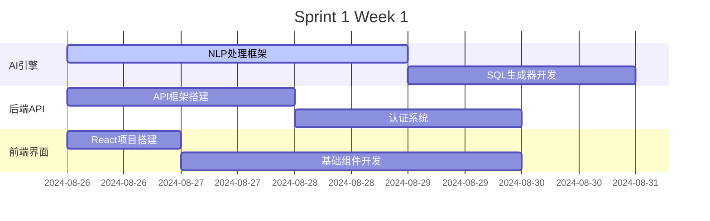
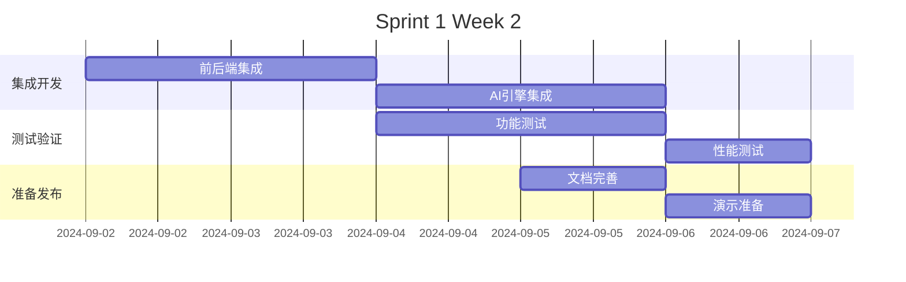

# Sprint 1 规划文档

**Sprint目标**: 构建AI引擎核心功能，实现自然语言到SQL的转换  
**Sprint周期**: 2024-08-26 到 2024-09-08 (2周)  
**Scrum Master**: Alex  
**团队承诺**: 待Sprint规划会议确认

---

## 🎯 Sprint 1 目标

### 核心目标
**"让用户能够用自然语言查询数据，并获得准确的结果"**

### 具体成功标准
1. **AI引擎准确率**: 自然语言查询准确率达到85%+
2. **支持查询类型**: 支持20种常见业务查询模式
3. **响应性能**: API响应时间≤2秒
4. **基础集成**: 前后端基础框架搭建完成
5. **技术验证**: 关键技术风险得到验证和消除

### 业务价值
- 验证核心产品假设：AI能否准确理解用户意图
- 为后续Sprint建立技术基础
- 降低最大技术风险：自然语言理解准确性

---

## 📋 Product Backlog (Sprint 1)

### 🥇 高优先级 Epic: AI引擎核心

#### User Story 1: 自然语言查询理解
```yaml
title: "作为数据分析师，我希望用自然语言查询数据，这样我就不需要写SQL了"
priority: P0 - 必须完成
story_points: 13
acceptance_criteria:
  - 能够理解基本的查询意图（统计、对比、趋势、排名）
  - 能够识别时间范围（今天、本周、上月、去年等）
  - 能够识别数据维度和指标
  - 对于不理解的查询给出友好提示
  - 查询意图识别准确率≥85%
  
example_queries:
  - "显示过去3个月的销售趋势"
  - "哪个产品的销售额最高？"
  - "本季度各部门的费用支出对比"
  - "上个月用户增长情况如何？"

technical_notes:
  - 使用OpenAI GPT-4 API作为主要NLP引擎
  - 建立查询模式匹配和验证机制
  - 实现fallback机制处理边缘情况
```

#### User Story 2: SQL生成引擎
```yaml
title: "作为系统，我需要将自然语言转换为可执行的SQL查询"
priority: P0 - 必须完成  
story_points: 8
acceptance_criteria:
  - 根据意图和实体生成语法正确的SQL
  - 支持基础聚合函数（COUNT, SUM, AVG, MAX, MIN）
  - 支持WHERE条件和时间筛选
  - 支持ORDER BY排序和LIMIT限制
  - 生成的SQL通过语法检查≥95%

supported_sql_patterns:
  - SELECT 基础查询
  - GROUP BY 分组统计  
  - WHERE 条件筛选
  - ORDER BY 排序
  - JOIN 表关联（简单）

safety_measures:
  - SQL注入防护
  - 危险操作检测
  - 查询复杂度限制
```

#### User Story 3: 智能图表推荐
```yaml
title: "作为业务用户，我希望系统自动推荐合适的图表类型"
priority: P1 - 重要
story_points: 5
acceptance_criteria:
  - 基于数据类型自动选择图表类型
  - 时间序列数据推荐折线图
  - 分类对比数据推荐柱状图  
  - 占比数据推荐饼图
  - 推荐准确率≥80%

chart_mapping:
  trend_analysis: 折线图
  category_comparison: 柱状图
  proportion_analysis: 饼图
  single_metric: 数值卡片
  ranking: 排行榜
```

### 🥈 中优先级 Epic: 基础架构

#### User Story 4: API服务框架
```yaml
title: "作为开发者，我需要一个稳定的API服务来支持前端调用"
priority: P1 - 重要
story_points: 5
acceptance_criteria:
  - RESTful API设计规范
  - 统一的错误处理和响应格式
  - API文档自动生成
  - 基础的认证和授权
  - 健康检查接口

api_endpoints:
  - POST /api/v1/query - 自然语言查询
  - GET /api/v1/health - 健康检查
  - POST /api/v1/auth/login - 用户登录
  - GET /api/v1/datasources - 数据源列表
```

#### User Story 5: 前端查询界面
```yaml
title: "作为最终用户，我需要一个简单易用的查询界面"
priority: P1 - 重要
story_points: 8
acceptance_criteria:
  - 简洁的自然语言输入框
  - 查询历史记录显示
  - 查询结果表格展示
  - 基础的图表渲染
  - 响应式设计支持

ui_components:
  - 智能查询输入框（带提示）
  - 查询结果展示区域
  - 图表渲染容器
  - 查询历史侧边栏
```

### 🥉 低优先级 Epic: 数据管理

#### User Story 6: 数据源连接
```yaml
title: "作为系统管理员，我需要配置数据源连接"
priority: P2 - 可选
story_points: 5
acceptance_criteria:
  - 支持Excel/CSV文件上传
  - 基础的数据预览功能
  - 数据类型自动识别
  - 连接状态检查

supported_formats:
  - Excel (.xlsx, .xls)
  - CSV (.csv)
  - JSON (结构化数据)
```

---

## 📊 Sprint规划会议议程

### 会议信息
- **时间**: 2024年8月26日 (周一) 9:00-13:00
- **地点**: 会议室B / 线上会议
- **参与者**: 全体开发团队 + 产品负责人
- **主持人**: Scrum Master Alex

### 议程安排 (4小时)

#### Part 1: Sprint回顾和准备 (30分钟)
- **9:00-9:15** Sprint 0成果回顾
- **9:15-9:30** 团队速度(velocity)基准讨论

#### Part 2: Product Backlog梳理 (90分钟) 
- **9:30-10:30** User Story详细讲解和澄清
- **10:30-10:45** ☕ 休息
- **10:45-11:00** 验收标准确认和细化

#### Part 3: 工作量评估 (60分钟)
- **11:00-12:00** Planning Poker估算
  - Story Points评估方法培训
  - 团队估算和讨论
  - 风险和依赖识别

#### Part 4: Sprint承诺 (30分钟)
- **12:00-12:20** 团队容量(capacity)计算
- **12:20-12:30** Sprint目标和Story选择确认
- **12:30-13:00** 🍽️ 工作午餐和非正式讨论

---

## 🎲 Story Points 评估指南

### 斐波那契数列评估
- **1点**: 非常简单，1-2小时完成
- **2点**: 简单，半天完成  
- **3点**: 中等简单，1天完成
- **5点**: 中等，2-3天完成
- **8点**: 复杂，1周完成
- **13点**: 非常复杂，需要分解

### 参考基准
```yaml
1_point_example:
  - 简单的UI组件修改
  - 基础配置文件更新
  - 简单的工具函数

3_point_example:  
  - 新增API端点
  - 基础数据库操作
  - 简单的前端页面

8_point_example:
  - 复杂业务逻辑实现
  - 第三方服务集成
  - 性能优化任务

13_point_example:
  - 核心算法开发 (如AI引擎)
  - 架构重大变更
  - 需要研究的新技术
```

---

## 🏃‍♂️ Sprint执行计划

### Week 1 (8/26-8/30): 基础建设周


### Week 2 (9/2-9/6): 集成测试周  


### 每日站会重点关注
- **Monday**: Sprint目标确认，任务启动
- **Tuesday**: 技术风险识别，依赖解决  
- **Wednesday**: 进度检查，障碍移除
- **Thursday**: 集成问题解决，质量检查
- **Friday**: Sprint目标评估，准备演示

---

## 📈 成功指标和监控

### Sprint级别指标
| 指标 | 目标值 | 测量方法 | 负责人 |
|------|--------|----------|--------|
| **Story完成率** | 100% | Story状态跟踪 | Scrum Master |
| **AI查询准确率** | ≥85% | 自动化测试 | AI工程师 |  
| **API响应时间** | ≤2秒 | 性能监控 | 后端开发 |
| **代码覆盖率** | ≥80% | 测试报告 | 测试工程师 |
| **团队满意度** | ≥4.0/5 | Sprint回顾调研 | Scrum Master |

### 每日跟踪指标
- 📊 **燃尽图**: Story Points完成趋势
- 🐛 **缺陷趋势**: 新增vs修复缺陷数量
- ⏱️ **站会效率**: 每日站会时长控制
- 🚧 **障碍数量**: 识别和解决的障碍统计

---

## 🚧 风险管理

### 高风险项监控
| 风险 | 概率 | 影响 | 应对策略 | 负责人 |
|------|------|------|----------|--------|
| **AI准确率不达标** | 中 | 高 | 备用模型方案 | AI工程师 |
| **OpenAI API不稳定** | 低 | 中 | 本地模型备选 | 技术负责人 |
| **团队成员请假** | 中 | 中 | 交叉技能培训 | Scrum Master |
| **第三方依赖延期** | 低 | 高 | 自研备选方案 | 技术负责人 |

### 每日风险检查
- **技术风险**: AI模型性能，API稳定性
- **进度风险**: Story完成进度，团队速度
- **质量风险**: 测试覆盖率，代码质量
- **协作风险**: 团队沟通，跨团队依赖

---

## 🎯 Definition of Ready

### Story准备就绪标准
- [ ] **需求明确**: 验收标准详细且可测试
- [ ] **设计完成**: 必要的技术设计和界面设计
- [ ] **依赖清晰**: 外部依赖已识别和处理
- [ ] **工作量估算**: 团队达成一致的Story Points
- [ ] **风险评估**: 技术风险已识别和评估

### 技术准备标准  
- [ ] **环境就绪**: 开发和测试环境可用
- [ ] **工具配置**: 必要的开发工具和库就绪
- [ ] **API设计**: 接口规范已确定
- [ ] **测试策略**: 测试方法和覆盖率要求明确

---

## 📝 Sprint 1 之后的展望

### Sprint 2 预期目标
- 报表生成和图表渲染功能
- 多数据源连接支持  
- 用户管理和权限系统
- 系统性能优化

### 长期目标对齐
Sprint 1的成功将为以下目标奠定基础：
- 16周MVP交付目标
- 90%AI查询准确率目标
- 用户满意度4.5/5.0目标
- 企业客户试用和反馈收集

---

**Sprint 1规划完成！准备在8/26启动我们的第一个开发冲刺！** 🚀

**Scrum Master**: Alex  
**文档更新**: 2024年8月18日  
**下次更新**: Sprint规划会议后