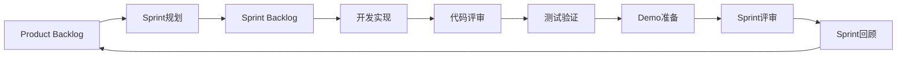
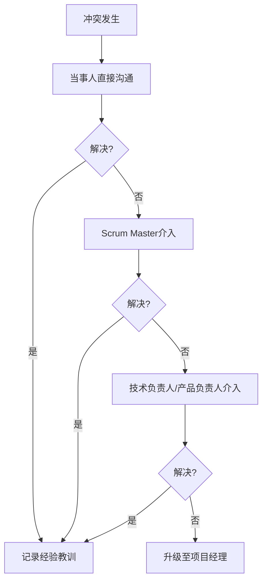

# ai-agile-dap 团队协作章程

**生效日期**: 2024年8月18日  
**Scrum Master**: Alex  
**团队规模**: 9人核心团队

---

## 🎯 团队愿景和使命

### 产品愿景
**让数据洞察像聊天一样简单，让每个业务人员都成为数据分析师**

### 团队使命  
在16周内交付一个AI驱动的零门槛企业数据洞察平台，实现：
- 90%查询准确率
- 3秒响应时间
- 1000+并发支持
- 用户满意度4.5/5.0

---

## 👥 团队组成和角色

| 角色 | 姓名 | 职责 | 主要技能 |
|------|------|------|----------|
| **Scrum Master** | Alex | 流程促进、障碍移除、团队赋能 | 敏捷管理、团队协作 |
| **产品负责人** | [待确认] | 需求管理、用户价值、优先级决策 | 产品设计、用户研究 |
| **技术负责人** | [待确认] | 架构决策、技术选型、代码评审 | 全栈开发、架构设计 |
| **AI工程师** | [待确认] | NLP算法、模型优化、准确率提升 | Python、NLP、机器学习 |
| **前端开发** | [待确认] × 2 | React开发、UI组件、用户体验 | React、TypeScript、ECharts |
| **后端开发** | [待确认] × 2 | API开发、数据处理、系统集成 | Node.js、数据库、微服务 |
| **测试工程师** | [待确认] | 测试策略、质量保障、自动化测试 | 测试框架、性能测试 |
| **UI/UX设计师** | [待确认] | 界面设计、交互设计、用户体验 | Figma、用户研究 |

---

## 📅 工作节奏和仪式

### Sprint配置
- **Sprint长度**: 2周 (除Sprint 0为1周)
- **工作时间**: 周一至周五 9:00-18:00
- **核心协作时间**: 10:00-16:00 (所有人在线)

### Scrum仪式时间表

| 仪式 | 频率 | 时间 | 时长 | 地点 |
|------|------|------|------|------|
| **每日站会** | 每天 | 9:30-9:45 | 15分钟 | 会议室A/在线 |
| **Sprint规划** | 每2周一 | 9:00-13:00 | 4小时 | 会议室B |
| **Sprint评审** | 每2周五 | 14:00-16:00 | 2小时 | 演示厅 |
| **Sprint回顾** | 每2周五 | 16:15-17:15 | 1小时 | 会议室A |
| **Backlog梳理** | 每周三 | 15:00-16:00 | 1小时 | 会议室A |

---

## 🗣️ 沟通协议

### 沟通工具矩阵

| 场景 | 首选工具 | 备选工具 | 响应时间 |
|------|----------|----------|----------|
| **即时沟通** | 微信群/Slack | 钉钉 | 15分钟内 |
| **正式通知** | 邮件 | 项目管理系统 | 2小时内 |
| **技术讨论** | Slack技术频道 | 面对面 | 1小时内 |
| **代码评审** | GitHub PR | - | 8小时内 |
| **紧急事项** | 电话 | 微信私聊 | 立即 |

### 沟通原则
1. **👂 主动聆听** - 理解他人观点，避免打断
2. **🗣️ 简洁明确** - 信息传达简洁、具体、可操作
3. **🤝 建设性反馈** - 对事不对人，提供改进建议
4. **📊 数据驱动** - 用事实和数据支撑观点
5. **🔄 及时反馈** - 按约定时间给出回复

---

## 🛠️ 工作方式

### 开发工作流

### Definition of Done
✅ **代码质量**
- 单元测试覆盖率 ≥ 80%
- 代码评审通过 (≥2人review)
- 代码规范检查通过
- 技术债务评分 ≥ 8/10

✅ **功能质量**  
- 验收标准100%满足
- 集成测试通过
- 性能要求达标
- 无阻塞性缺陷

✅ **文档完整**
- API文档更新
- 用户文档更新
- 技术文档更新
- 变更日志记录

---

## 🎯 团队价值观和行为准则

### 核心价值观
1. **🚀 用户第一** - 始终以用户价值为导向
2. **🏆 追求卓越** - 对质量和技术精益求精
3. **🤝 团队协作** - 相互支持，共同成功
4. **📈 持续学习** - 拥抱变化，不断进步
5. **💡 创新思维** - 勇于尝试，解决难题

### 行为准则
**✅ 我们提倡**:
- 主动承担责任
- 开放透明沟通  
- 相互帮助支持
- 持续改进优化
- 准时参加会议
- 遵守承诺约定

**❌ 我们避免**:
- 推诿责任和指责
- 私下抱怨和消极
- 会议迟到早退
- 违反代码规范
- 忽视质量要求
- 独自承担风险

---

## 🚧 冲突解决机制

### 解决流程

### 常见冲突类型和处理
| 冲突类型 | 处理方式 | 负责人 |
|---------|----------|--------|
| **技术分歧** | 技术评审会议讨论决策 | 技术负责人 |
| **需求理解分歧** | 澄清验收标准，必要时联系用户 | 产品负责人 |
| **工作方式冲突** | 团队回顾会议讨论改进 | Scrum Master |
| **个人冲突** | 一对一谈话，寻找共同点 | Scrum Master |

---

## 📊 团队成功指标

### 团队健康度指标
| 指标 | 目标值 | 测量频率 |
|------|--------|----------|
| **团队满意度** | ≥4.0/5.0 | 每Sprint |
| **Sprint目标达成率** | ≥90% | 每Sprint |
| **代码质量评分** | ≥8.0/10 | 每周 |
| **缺陷逃逸率** | ≤5% | 每Sprint |
| **团队速度稳定性** | 变化≤20% | 每Sprint |

### 业务成功指标
| 指标 | 目标值 | 测量频率 |
|------|--------|----------|
| **AI查询准确率** | ≥90% | 每日 |
| **系统响应时间** | ≤3秒 | 每日 |
| **用户满意度** | ≥4.5/5.0 | 每2周 |
| **功能可用性** | ≥99% | 每日 |

---

## 🔄 持续改进机制

### 改进流程
1. **📊 数据收集** - 持续收集团队和产品指标
2. **🤔 问题识别** - 每Sprint回顾识别改进点
3. **💡 解决方案** - 头脑风暴改进措施
4. **🧪 实验验证** - 小步快跑验证改进效果
5. **📈 标准化** - 将有效改进融入工作流程

### 学习和分享
- **每周技术分享** - 周三下午技术话题分享
- **读书会** - 每月一本技术/管理书籍
- **外部学习** - 参加技术会议和培训
- **经验总结** - 项目结束后撰写总结报告

---

## 📋 团队承诺

### 团队共同承诺
我们作为ai-agile-dap团队，共同承诺：

1. **🎯 目标承诺** - 全力以赴实现16周MVP交付目标
2. **👥 协作承诺** - 相互支持，共享知识，共同成功
3. **📈 质量承诺** - 不为速度牺牲质量，追求技术卓越
4. **🔄 改进承诺** - 持续学习，拥抱变化，不断优化
5. **🤝 责任承诺** - 主动承担责任，兑现个人承诺

### 个人承诺签名
_[团队成员在此签名确认接受团队章程]_

---

**团队章程制定**: 2024年8月18日  
**Scrum Master**: Alex  
**下次更新**: 根据团队反馈持续优化

---

**🎯 让我们一起创造历史，交付一个改变世界的产品！** 🚀