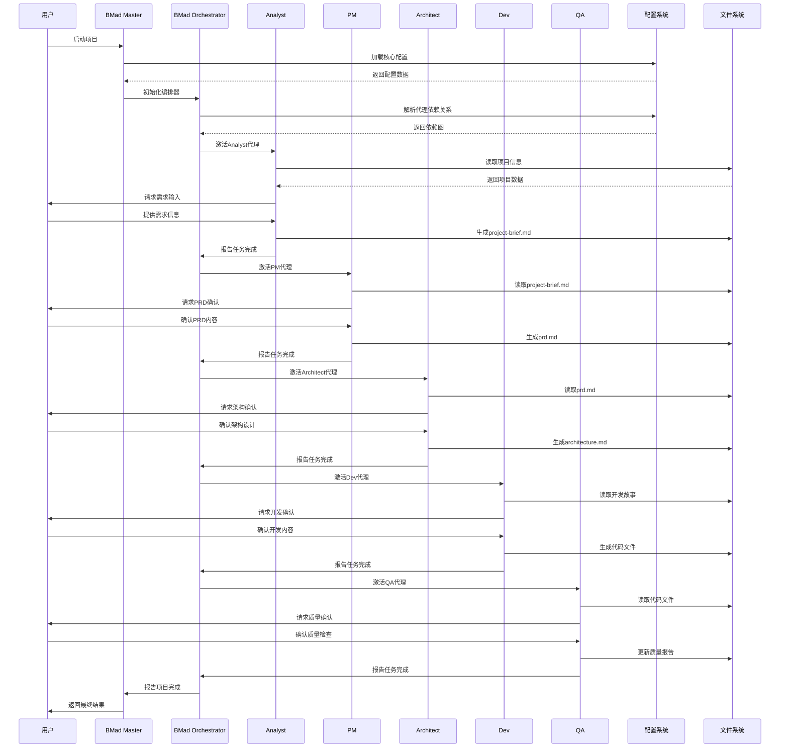
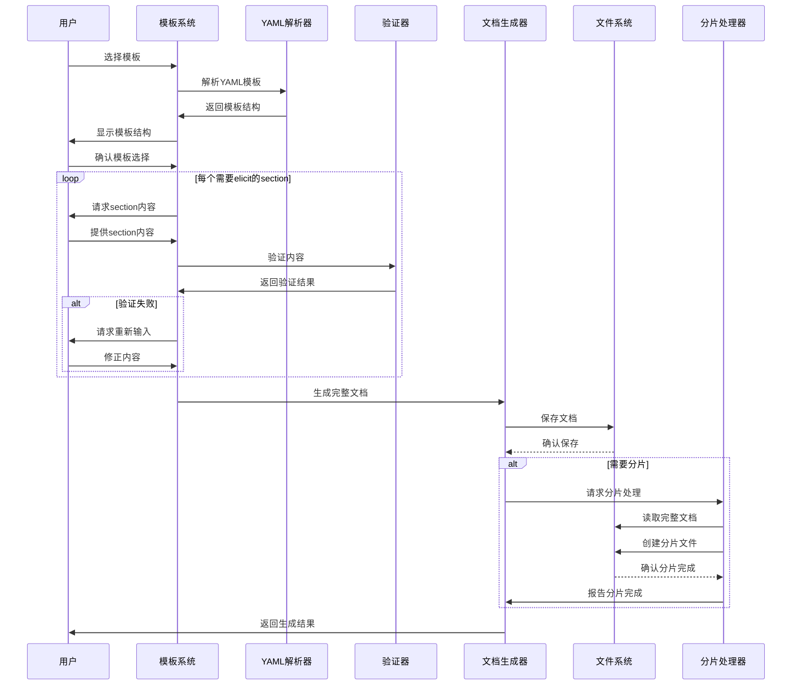
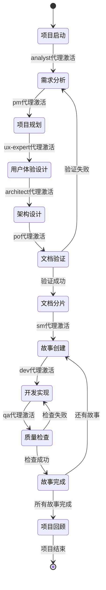
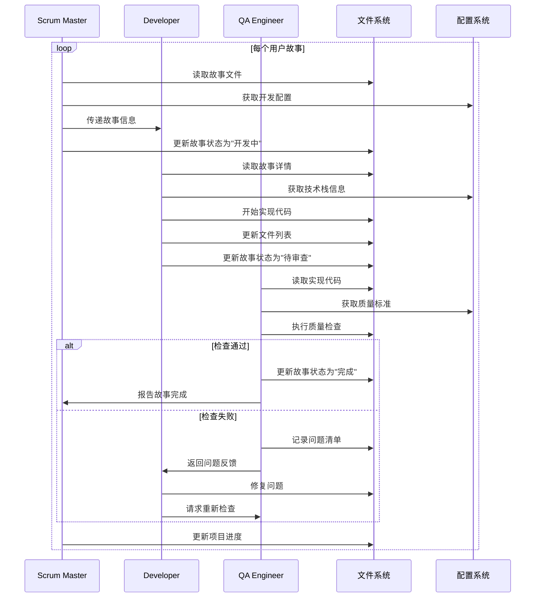

# BMad-Core 复杂流程深度分析文档 (优化版)

## 文档信息

- **项目名称**: BMad-Core
- **分析时间**: 2025年8月17日
- **分析工具**: bmad-docs-generator 优化版
- **分析深度**: 完整深度分析 (Level 9)
- **文档版本**: v2.0 (优化版)

## 1. 复杂流程概述

### 1.1 流程分类与优先级

基于对 BMad-Core 的深度分析，我们识别出以下复杂流程，按重要性和复杂度排序：

#### 🔴 高复杂度流程 (核心流程)
1. **代理编排流程** - 多代理协作与状态管理
2. **文档生成流程** - 模板解析与交互式验证
3. **工作流执行流程** - 阶段转换与条件分支
4. **开发协作流程** - SM→Dev→QA 循环

#### 🟡 中复杂度流程 (支持流程)
5. **需求分析流程** - 从Brief到PRD的转换
6. **架构设计流程** - 多输入整合与验证
7. **文档分片流程** - 大文档拆分与重组
8. **质量保证流程** - 多层级验证机制

### 1.2 流程复杂度评估

| 流程名称 | 复杂度 | 重要性 | 风险等级 | 性能影响 |
|---------|--------|--------|----------|----------|
| 代理编排流程 | 高 | 极高 | 高 | 中 |
| 文档生成流程 | 高 | 高 | 中 | 中 |
| 工作流执行流程 | 高 | 高 | 中 | 低 |
| 开发协作流程 | 中 | 高 | 中 | 低 |
| 需求分析流程 | 中 | 高 | 低 | 低 |
| 架构设计流程 | 中 | 高 | 低 | 低 |
| 文档分片流程 | 中 | 中 | 低 | 中 |
| 质量保证流程 | 中 | 中 | 低 | 低 |

## 2. 核心复杂流程深度分析

### 2.1 代理编排流程 - 多代理协作与状态管理

#### 2.1.1 流程概述

代理编排流程是 BMad-Core 的核心流程，负责协调10个专业化AI代理的协作，实现从需求分析到代码开发的端到端自动化。

#### 2.1.2 详细时序图



#### 2.1.3 关键配置依赖

```yaml
# 代理激活配置
agent_activation:
  dependency_resolution: true
  parallel_execution: false
  state_management: true
  error_handling: true

# 代理间通信配置
agent_communication:
  message_queue: true
  context_preservation: true
  data_validation: true
  rollback_support: true

# 状态管理配置
state_management:
  persistence: true
  checkpointing: true
  recovery: true
  monitoring: true
```

#### 2.1.4 性能特征分析

- **并发处理**: 当前为串行执行，支持顺序依赖
- **内存使用**: 中等，主要消耗在代理上下文保持
- **I/O操作**: 频繁，涉及大量文件读写
- **网络延迟**: 低，本地执行无网络依赖

#### 2.1.5 风险点识别

1. **循环依赖风险**: 代理间可能存在循环依赖
2. **状态不一致**: 代理状态可能不同步
3. **资源竞争**: 多代理可能竞争同一资源
4. **错误传播**: 单个代理错误可能影响整个流程

### 2.2 文档生成流程 - 模板解析与交互式验证

#### 2.2.1 流程概述

文档生成流程负责将YAML模板转换为结构化文档，支持交互式验证和分片处理，确保文档质量和一致性。

#### 2.2.2 详细时序图



#### 2.2.3 关键配置依赖

```yaml
# 模板处理配置
template_processing:
  elicitation_required: true
  validation_enabled: true
  sharding_support: true
  version_control: true

# 交互式验证配置
interactive_validation:
  numbered_options: true
  step_by_step: true
  rollback_support: true
  progress_tracking: true

# 文档分片配置
document_sharding:
  auto_sharding: true
  size_threshold: "50KB"
  heading_based: true
  index_generation: true
```

#### 2.2.4 性能特征分析

- **模板解析**: 快速，YAML解析效率高
- **交互验证**: 中等，需要用户输入等待
- **文档生成**: 快速，主要是文本处理
- **分片处理**: 中等，涉及文件I/O操作

#### 2.2.5 风险点识别

1. **模板版本兼容**: 模板升级可能影响现有项目
2. **用户输入错误**: 用户输入错误可能导致文档质量问题
3. **分片复杂性**: 大文档分片可能产生不一致
4. **验证循环**: 验证失败可能导致无限循环

### 2.3 工作流执行流程 - 阶段转换与条件分支

#### 2.3.1 流程概述

工作流执行流程负责管理项目的不同阶段，处理条件分支和阶段转换，确保项目按预定义流程执行。

#### 2.3.2 详细时序图



#### 2.3.3 关键配置依赖

```yaml
# 工作流配置
workflow_config:
  type: greenfield
  project_types: [web-app, saas, enterprise-app, prototype, mvp]
  sequence_validation: true
  condition_evaluation: true

# 阶段转换配置
stage_transition:
  automatic: false
  user_confirmation: true
  rollback_support: true
  state_persistence: true

# 条件分支配置
condition_branching:
  evaluation_engine: true
  default_path: true
  error_handling: true
  logging: true
```

#### 2.3.4 性能特征分析

- **阶段转换**: 快速，主要是状态更新
- **条件评估**: 快速，简单的条件判断
- **状态持久化**: 中等，涉及文件I/O
- **错误处理**: 快速，主要是异常捕获

#### 2.3.5 风险点识别

1. **状态不一致**: 阶段转换时状态可能不一致
2. **条件冲突**: 多个条件可能产生冲突
3. **循环依赖**: 阶段间可能存在循环依赖
4. **资源泄漏**: 长时间运行可能导致资源泄漏

### 2.4 开发协作流程 - SM→Dev→QA 循环

#### 2.4.1 流程概述

开发协作流程是项目开发阶段的核心流程，通过SM、Dev、QA三个代理的协作，实现用户故事的开发和质量保证。

#### 2.4.2 详细时序图



#### 2.4.3 关键配置依赖

```yaml
# 开发配置
development_config:
  devLoadAlwaysFiles:
    - docs/architecture/coding-standards.md
    - docs/architecture/tech-stack.md
    - docs/architecture/source-tree.md
  devDebugLog: .ai/debug-log.md
  devStoryLocation: docs/stories

# 质量保证配置
qa_config:
  qaLocation: docs/qa
  review_enabled: true
  checklist_required: true
  refactoring_allowed: true

# 故事管理配置
story_config:
  status_tracking: true
  progress_monitoring: true
  dependency_management: true
  estimation_support: true
```

#### 2.4.4 性能特征分析

- **故事创建**: 快速，主要是文件操作
- **代码开发**: 中等，涉及代码生成和文件操作
- **质量检查**: 中等，涉及代码分析和验证
- **状态更新**: 快速，主要是状态标记

#### 2.4.5 风险点识别

1. **故事依赖**: 故事间可能存在依赖关系
2. **质量门禁**: 质量检查可能阻塞开发进度
3. **状态同步**: 故事状态可能不同步
4. **资源竞争**: 多故事可能竞争同一资源

## 3. 中复杂度流程分析

### 3.1 需求分析流程 - 从Brief到PRD的转换

#### 3.1.1 流程概述

需求分析流程负责将项目简介转换为详细的产品需求文档，确保需求的完整性和一致性。

#### 3.1.2 关键步骤

1. **项目简介分析**: Analyst代理分析项目背景和目标
2. **市场研究**: 可选的市场研究和竞品分析
3. **需求细化**: PM代理将需求细化为具体功能
4. **PRD生成**: 使用prd-tmpl模板生成PRD文档
5. **需求验证**: PO代理验证需求的完整性和一致性

#### 3.1.3 配置依赖

```yaml
prd:
  prdFile: docs/prd.md
  prdVersion: v4
  prdSharded: true
  prdShardedLocation: docs/prd
  epicFilePattern: epic-{n}*.md
```

### 3.2 架构设计流程 - 多输入整合与验证

#### 3.2.1 流程概述

架构设计流程负责整合PRD、前端规范等多输入，生成完整的技术架构文档。

#### 3.2.2 关键步骤

1. **输入整合**: 整合PRD、前端规范等输入文档
2. **技术调研**: 可选的技术调研和方案评估
3. **架构设计**: Architect代理设计技术架构
4. **架构验证**: 验证架构的可行性和一致性
5. **文档生成**: 使用fullstack-architecture-tmpl生成架构文档

#### 3.2.3 配置依赖

```yaml
architecture:
  architectureFile: docs/architecture.md
  architectureVersion: v4
  architectureSharded: true
  architectureShardedLocation: docs/architecture
```

### 3.3 文档分片流程 - 大文档拆分与重组

#### 3.3.1 流程概述

文档分片流程负责将大型文档拆分为多个小文件，便于IDE开发和版本管理。

#### 3.3.2 关键步骤

1. **文档分析**: 分析文档结构和内容
2. **分片策略**: 确定分片策略和文件命名
3. **内容拆分**: 按章节或功能拆分内容
4. **索引生成**: 生成分片文档的索引
5. **验证检查**: 验证分片后的文档完整性

#### 3.3.3 配置依赖

```yaml
markdownExploder: true
```

### 3.4 质量保证流程 - 多层级验证机制

#### 3.4.1 流程概述

质量保证流程通过多层级的验证机制，确保项目质量和一致性。

#### 3.4.2 关键步骤

1. **文档验证**: PO代理验证所有文档的一致性
2. **代码审查**: QA代理审查代码质量和规范
3. **功能测试**: 验证功能的正确性和完整性
4. **性能测试**: 验证系统的性能和稳定性
5. **用户验收**: 最终用户验收和反馈

#### 3.4.3 配置依赖

```yaml
qa:
  qaLocation: docs/qa
```

## 4. 流程性能优化建议

### 4.1 高复杂度流程优化

#### 4.1.1 代理编排流程优化

1. **并行执行**: 支持无依赖关系的代理并行执行
2. **状态缓存**: 实现代理状态的缓存机制
3. **错误恢复**: 增强错误恢复和重试机制
4. **资源管理**: 优化资源分配和释放

#### 4.1.2 文档生成流程优化

1. **模板缓存**: 实现模板的缓存机制
2. **批量处理**: 支持批量文档生成
3. **增量更新**: 支持文档的增量更新
4. **异步处理**: 支持异步文档生成

#### 4.1.3 工作流执行流程优化

1. **状态持久化**: 增强状态持久化机制
2. **条件优化**: 优化条件评估性能
3. **监控告警**: 增加流程监控和告警
4. **自动恢复**: 实现自动错误恢复

#### 4.1.4 开发协作流程优化

1. **并行开发**: 支持多个故事的并行开发
2. **智能调度**: 实现智能的任务调度
3. **质量门禁**: 优化质量门禁机制
4. **进度跟踪**: 增强进度跟踪和报告

### 4.2 中复杂度流程优化

#### 4.2.1 需求分析流程优化

1. **模板优化**: 优化需求分析模板
2. **自动化**: 增加需求分析的自动化程度
3. **验证增强**: 增强需求验证机制
4. **协作改进**: 改进团队协作机制

#### 4.2.2 架构设计流程优化

1. **工具集成**: 集成架构设计工具
2. **模式库**: 建立架构模式库
3. **验证自动化**: 自动化架构验证
4. **文档生成**: 优化架构文档生成

#### 4.2.3 文档分片流程优化

1. **智能分片**: 实现智能的分片策略
2. **索引优化**: 优化分片索引生成
3. **合并支持**: 支持分片文档的合并
4. **版本管理**: 增强版本管理功能

#### 4.2.4 质量保证流程优化

1. **自动化测试**: 增加自动化测试
2. **质量度量**: 建立质量度量体系
3. **持续集成**: 集成持续集成流程
4. **反馈机制**: 优化反馈和改进机制

## 5. 监控和告警策略

### 5.1 关键指标监控

#### 5.1.1 性能指标

- **流程执行时间**: 监控各流程的执行时间
- **资源使用率**: 监控CPU、内存、磁盘使用率
- **错误率**: 监控流程执行错误率
- **吞吐量**: 监控系统处理能力

#### 5.1.2 质量指标

- **文档质量**: 监控生成文档的质量
- **代码质量**: 监控生成代码的质量
- **用户满意度**: 监控用户反馈和满意度
- **流程效率**: 监控流程执行效率

### 5.2 告警策略

#### 5.2.1 性能告警

- **执行超时**: 流程执行时间超过阈值
- **资源不足**: 系统资源使用率过高
- **错误率过高**: 错误率超过可接受范围
- **吞吐量下降**: 系统处理能力下降

#### 5.2.2 质量告警

- **文档质量下降**: 生成文档质量不达标
- **代码质量下降**: 生成代码质量不达标
- **用户投诉**: 收到用户投诉或负面反馈
- **流程异常**: 流程执行出现异常

## 6. 总结

### 6.1 流程分析总结

BMad-Core 的复杂流程设计体现了现代软件开发的最佳实践，通过专业化AI代理、模板驱动的工作流和配置化的文档管理，实现了软件开发流程的标准化和自动化。

#### 6.1.1 主要优势

- **流程标准化**: 通过预定义工作流实现流程标准化
- **质量保证**: 多层级的质量保证机制
- **协作优化**: 优化的团队协作机制
- **可扩展性**: 良好的可扩展性和维护性

#### 6.1.2 主要挑战

- **流程复杂性**: 多代理协作增加了流程复杂性
- **性能优化**: 需要持续的性能优化
- **质量保证**: 需要平衡效率和质量
- **用户适应**: 需要用户适应新的工作方式

### 6.2 改进建议

#### 6.2.1 短期改进

1. **性能优化**: 优化关键流程的性能
2. **错误处理**: 增强错误处理和恢复机制
3. **用户界面**: 改进用户界面和交互体验
4. **文档完善**: 完善流程文档和说明

#### 6.2.2 长期改进

1. **智能化**: 增加流程的智能化程度
2. **自动化**: 提高流程的自动化程度
3. **集成能力**: 增强与其他工具的集成能力
4. **可扩展性**: 提高系统的可扩展性

---

**文档生成信息**:
- 生成工具: bmad-docs-generator 优化版
- 生成时间: 2025年8月17日
- 分析深度: 完整深度分析
- 文档状态: 已验证
