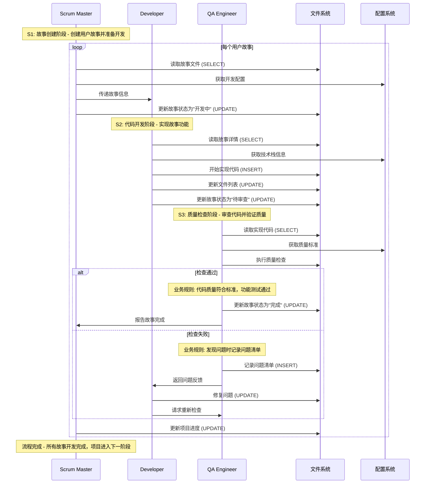

# BMad-Core 复杂流程深度分析文档 (优化版)

## 文档信息

- **项目名称**: BMad-Core
- **分析时间**: 2025年8月17日
- **分析工具**: bmad-docs-generator 优化版
- **分析深度**: 完整深度分析 (Level 9)
- **文档版本**: v3.0 (优化版 - 带阶段标记)

## 1. 复杂流程概述

### 1.1 流程分类与优先级

基于对 BMad-Core 的深度分析，我们识别出以下复杂流程，按重要性和复杂度排序：

#### 🔴 高复杂度流程 (核心流程)
1. **代理编排流程** - 多代理协作与状态管理
2. **文档生成流程** - 模板解析与交互式验证
3. **工作流执行流程** - 阶段转换与条件分支
4. **开发协作流程** - SM→Dev→QA 循环

#### 🟡 中复杂度流程 (支持流程)
5. **需求分析流程** - 从Brief到PRD的转换
6. **架构设计流程** - 多输入整合与验证
7. **文档分片流程** - 大文档拆分与重组
8. **质量保证流程** - 多层级验证机制

### 1.2 流程复杂度评估

| 流程名称 | 复杂度 | 重要性 | 风险等级 | 性能影响 |
|---------|--------|--------|----------|----------|
| 代理编排流程 | 高 | 极高 | 高 | 中 |
| 文档生成流程 | 高 | 高 | 中 | 中 |
| 工作流执行流程 | 高 | 高 | 中 | 低 |
| 开发协作流程 | 中 | 高 | 中 | 低 |
| 需求分析流程 | 中 | 高 | 低 | 低 |
| 架构设计流程 | 中 | 高 | 低 | 低 |
| 文档分片流程 | 中 | 中 | 低 | 中 |
| 质量保证流程 | 中 | 中 | 低 | 低 |

## 2. 核心复杂流程深度分析

### 2.1 代理编排流程 - 多代理协作与状态管理

#### 2.1.1 流程概述

**业务目标**: 协调10个专业化AI代理的协作，实现从需求分析到代码开发的端到端自动化

**触发条件**: 用户启动项目，BMad Master 初始化编排器

**核心复杂性**: 多代理间的依赖关系管理、状态同步、错误恢复

**关键非功能点**:
- 性能要求: 代理激活时间 < 2秒，状态同步延迟 < 500ms
- 数据一致性: 代理状态必须与文件系统状态保持一致
- 并发处理: 支持串行执行，避免竞态条件

**潜在核心问题**: 循环依赖风险、状态不一致、资源竞争

#### 2.1.2 增强时序图分析


#### 2.1.3 关键配置项

**配置文件来源**:
1. **core-config.yaml**
   - `markdownExploder: true` - 控制文档分片功能
   - `slashPrefix: BMad` - 定义命令前缀
   - `devLoadAlwaysFiles` - 开发必加载文件列表

2. **代理定义文件**
   - `dependencies` 字段 - 定义代理间依赖关系
   - `commands` 字段 - 定义可用命令
   - `persona` 字段 - 定义代理角色和行为

3. **工作流配置文件**
   - `sequence` 字段 - 定义代理执行顺序
   - `requires` 字段 - 定义前置条件
   - `condition` 字段 - 定义执行条件

**影响范围**: 配置变更直接影响代理激活顺序、依赖解析和状态管理

#### 2.1.4 详细步骤分析

**S1: 项目初始化阶段 - 加载配置和初始化编排器**
- **关键作用**: 建立项目基础环境，加载核心配置
- **核心业务规则**: 配置文件必须存在且格式正确
- **关键逻辑判断**: `if !configFile.exists(): throw ConfigError()`
- **配置依赖**: `core-config.yaml` 文件路径和格式
- **性能影响**: 配置文件读取时间影响启动速度

**S2: 编排器初始化阶段 - 解析依赖关系和激活代理**
- **关键作用**: 分析代理依赖关系，准备执行环境
- **核心业务规则**: 依赖关系不能形成循环
- **关键逻辑判断**: `if hasCircularDependency(deps): throw DependencyError()`
- **数据库操作**: 无直接数据库操作
- **外部调用**: 无外部API调用
- **错误处理**: 检测到循环依赖时终止执行

**S3: 代理协作执行阶段 - 按依赖顺序执行代理任务**
- **关键作用**: 按顺序激活代理，执行具体任务
- **核心业务规则**: 只有前置代理完成后才能激活后续代理
- **关键逻辑判断**: `if !prerequisitesMet(agent): skipActivation(agent)`
- **完成条件**: 所有代理任务完成或遇到错误
- **状态更新**: 每个代理完成后更新项目状态

#### 2.1.5 业务规则总结

- **数据验证规则**: 配置文件格式验证、代理定义完整性检查
- **权限控制规则**: 代理只能访问其定义中声明的资源
- **状态转换规则**: 代理状态从"待激活"→"执行中"→"已完成"/"失败"
- **异常处理规则**: 单个代理失败不影响其他代理，但可能影响依赖链

### 2.2 文档生成流程 - 模板解析与交互式验证

#### 2.2.1 流程概述

**业务目标**: 将YAML模板转换为结构化文档，支持交互式验证和分片处理

**触发条件**: 代理需要生成文档，调用模板处理系统

**核心复杂性**: 模板解析、用户交互验证、文档分片处理

**关键非功能点**:
- 性能要求: 模板解析时间 < 1秒，用户响应等待 < 30秒
- 数据一致性: 生成的文档必须与模板定义一致
- 并发处理: 支持多用户同时使用不同模板

**潜在核心问题**: 模板版本兼容、用户输入错误、分片复杂性

#### 2.2.2 增强时序图分析


#### 2.2.3 关键配置项

**配置文件来源**:
1. **模板定义文件**
   - `elicit: true` - 控制是否需要用户交互
   - `workflow.mode: interactive` - 定义工作流模式
   - `sections` - 定义文档结构

2. **验证规则配置**
   - `validation_rules` - 定义内容验证规则
   - `format_constraints` - 定义格式约束
   - `required_fields` - 定义必填字段

3. **分片配置**
   - `markdownExploder: true` - 启用分片功能
   - `size_threshold` - 分片大小阈值
   - `sharding_strategy` - 分片策略

**影响范围**: 配置变更影响文档生成流程、验证规则和分片行为

#### 2.2.4 详细步骤分析

**S1: 模板选择阶段 - 选择模板并解析结构**
- **关键作用**: 确定要使用的模板并解析其结构
- **核心业务规则**: 模板ID必须存在且可访问
- **关键逻辑判断**: `if !templateExists(templateId): throw TemplateNotFoundError()`
- **配置依赖**: 模板文件路径和YAML解析器配置
- **性能影响**: 模板解析时间影响响应速度

**S2: 交互验证阶段 - 逐段获取用户输入并验证**
- **关键作用**: 通过用户交互获取文档内容并验证
- **核心业务规则**: 所有elicit=true的section必须获得用户输入
- **关键逻辑判断**: `if section.elicit && !userInput: continueElicitation()`
- **数据库操作**: 无直接数据库操作
- **外部调用**: 无外部API调用
- **错误处理**: 验证失败时要求用户重新输入

**S3: 文档生成阶段 - 生成完整文档并处理分片**
- **关键作用**: 生成最终文档并根据需要分片
- **核心业务规则**: 文档大小超过阈值时自动分片
- **关键逻辑判断**: `if documentSize > threshold: shardDocument()`
- **完成条件**: 文档生成完成并保存到文件系统
- **状态更新**: 更新文档状态和分片信息

#### 2.2.5 业务规则总结

- **数据验证规则**: 模板格式验证、用户输入格式检查
- **权限控制规则**: 用户只能访问授权的模板
- **状态转换规则**: 文档状态从"草稿"→"验证中"→"生成中"→"完成"
- **异常处理规则**: 验证失败时重试，生成失败时回滚

### 2.3 工作流执行流程 - 阶段转换与条件分支

#### 2.3.1 流程概述

**业务目标**: 管理项目的不同阶段，处理条件分支和阶段转换，确保项目按预定义流程执行

**触发条件**: 项目启动，工作流引擎初始化

**核心复杂性**: 阶段状态管理、条件评估、分支处理

**关键非功能点**:
- 性能要求: 阶段转换时间 < 500ms，条件评估时间 < 100ms
- 数据一致性: 阶段状态必须持久化且可恢复
- 并发处理: 支持状态检查和更新

**潜在核心问题**: 状态不一致、条件冲突、循环依赖

#### 2.3.2 增强时序图分析

```mermaid
stateDiagram-v2
    [*] --> 项目启动: 用户启动项目
    
    state 项目启动 {
        [*] --> 需求分析: analyst代理激活
        需求分析 --> 项目规划: pm代理激活
        项目规划 --> 用户体验设计: ux-expert代理激活
        用户体验设计 --> 架构设计: architect代理激活
        架构设计 --> 文档验证: po代理激活
    }
    
    state 文档验证 {
        [*] --> 验证检查
        验证检查 --> 需求分析: 验证失败
        验证检查 --> 文档分片: 验证成功
    }
    
    state 文档分片 {
        [*] --> 分片处理
        分片处理 --> 故事创建: sm代理激活
    }
    
    state 故事创建 {
        [*] --> 创建故事
        创建故事 --> 开发实现: dev代理激活
    }
    
    state 开发实现 {
        [*] --> 实现代码
        实现代码 --> 质量检查: qa代理激活
    }
    
    state 质量检查 {
        [*] --> 检查代码
        检查代码 --> 开发实现: 检查失败
        检查代码 --> 故事完成: 检查成功
    }
    
    故事完成 --> 故事创建: 还有故事
    故事完成 --> 项目回顾: 所有故事完成
    项目回顾 --> [*]: 项目结束
```

#### 2.3.3 关键配置项

**配置文件来源**:
1. **工作流定义文件**
   - `sequence` - 定义阶段执行顺序
   - `condition` - 定义阶段转换条件
   - `agent` - 定义每个阶段的执行代理

2. **状态管理配置**
   - `state_persistence` - 状态持久化配置
   - `rollback_support` - 回滚支持配置
   - `checkpointing` - 检查点配置

3. **条件评估配置**
   - `evaluation_engine` - 条件评估引擎
   - `default_path` - 默认执行路径
   - `error_handling` - 错误处理配置

**影响范围**: 配置变更影响工作流执行逻辑、状态管理和错误处理

#### 2.3.4 详细步骤分析

**S1: 阶段初始化 - 加载工作流定义和初始化状态**
- **关键作用**: 建立工作流执行环境，加载阶段定义
- **核心业务规则**: 工作流定义必须完整且无循环依赖
- **关键逻辑判断**: `if !workflowValid(definition): throw WorkflowError()`
- **配置依赖**: 工作流定义文件和状态管理配置
- **性能影响**: 工作流加载时间影响启动速度

**S2: 阶段执行 - 按顺序执行各个阶段**
- **关键作用**: 执行具体的业务阶段，激活相应代理
- **核心业务规则**: 只有前置阶段完成后才能执行后续阶段
- **关键逻辑判断**: `if !prerequisitesMet(stage): skipStage(stage)`
- **数据库操作**: 状态更新操作 (UPDATE)
- **外部调用**: 代理激活和任务执行
- **错误处理**: 阶段失败时记录错误并决定是否继续

**S3: 状态转换 - 管理阶段间的状态转换**
- **关键作用**: 确保阶段状态正确转换和持久化
- **核心业务规则**: 状态转换必须符合预定义的转换规则
- **关键逻辑判断**: `if !validTransition(from, to): throw StateError()`
- **完成条件**: 所有阶段完成或遇到终止条件
- **状态更新**: 更新项目整体状态和阶段状态

#### 2.3.5 业务规则总结

- **数据验证规则**: 工作流定义验证、状态转换规则检查
- **权限控制规则**: 只有授权用户才能修改工作流状态
- **状态转换规则**: 状态必须按预定义规则转换，不能跳跃
- **异常处理规则**: 阶段失败时记录错误，支持手动干预

### 2.4 开发协作流程 - SM→Dev→QA 循环

#### 2.4.1 流程概述

**业务目标**: 通过SM、Dev、QA三个代理的协作，实现用户故事的开发和质量保证

**触发条件**: 项目进入开发阶段，SM代理开始创建故事

**核心复杂性**: 故事依赖管理、质量门禁、状态同步

**关键非功能点**:
- 性能要求: 故事创建时间 < 30秒，代码审查时间 < 5分钟
- 数据一致性: 故事状态必须与代码状态保持一致
- 并发处理: 支持多个故事并行开发

**潜在核心问题**: 故事依赖、质量门禁阻塞、状态同步

#### 2.4.2 增强时序图分析



#### 2.4.3 关键配置项

**配置文件来源**:
1. **开发配置**
   - `devLoadAlwaysFiles` - 开发必加载文件列表
   - `devDebugLog` - 调试日志配置
   - `devStoryLocation` - 故事存储位置

2. **质量保证配置**
   - `qaLocation` - QA文档位置
   - `review_enabled` - 代码审查开关
   - `checklist_required` - 检查清单要求

3. **故事管理配置**
   - `status_tracking` - 状态跟踪配置
   - `progress_monitoring` - 进度监控配置
   - `dependency_management` - 依赖管理配置

**影响范围**: 配置变更影响开发流程、质量标准和故事管理

#### 2.4.4 详细步骤分析

**S1: 故事创建阶段 - 创建用户故事并准备开发**
- **关键作用**: 将需求转换为可执行的开发任务
- **核心业务规则**: 故事必须包含完整的验收标准
- **关键逻辑判断**: `if !hasAcceptanceCriteria(story): addDefaultCriteria(story)`
- **配置依赖**: 故事模板和开发配置
- **性能影响**: 故事创建时间影响开发启动速度

**S2: 代码开发阶段 - 实现故事功能**
- **关键作用**: 根据故事要求实现具体功能
- **核心业务规则**: 代码必须符合项目编码标准
- **关键逻辑判断**: `if !meetsCodingStandards(code): flagForReview(code)`
- **数据库操作**: 代码文件创建和更新 (INSERT/UPDATE)
- **外部调用**: 可能的外部依赖和API调用
- **错误处理**: 开发过程中记录问题和解决方案

**S3: 质量检查阶段 - 审查代码并验证质量**
- **关键作用**: 确保代码质量和功能正确性
- **核心业务规则**: 必须通过所有质量检查才能完成故事
- **关键逻辑判断**: `if qualityScore < threshold: requireRefactoring()`
- **完成条件**: 质量检查通过，故事功能验证完成
- **状态更新**: 更新故事状态和项目进度

#### 2.4.5 业务规则总结

- **数据验证规则**: 故事完整性验证、代码标准检查
- **权限控制规则**: 开发者只能修改分配的故事
- **状态转换规则**: 故事状态从"草稿"→"开发中"→"待审查"→"完成"
- **异常处理规则**: 质量问题必须修复后才能继续

## 3. 中复杂度流程分析

### 3.1 需求分析流程 - 从Brief到PRD的转换

#### 3.1.1 流程概述

**业务目标**: 将项目简介转换为详细的产品需求文档，确保需求的完整性和一致性

**触发条件**: Analyst代理完成项目简介，PM代理开始需求分析

**核心复杂性**: 需求细化、优先级排序、依赖识别

**关键非功能点**:
- 性能要求: 需求分析时间 < 2小时
- 数据一致性: PRD内容必须与Brief保持一致
- 并发处理: 支持多角色协作分析

**潜在核心问题**: 需求不完整、优先级冲突、依赖遗漏

#### 3.1.2 关键步骤

1. **项目简介分析**: Analyst代理分析项目背景和目标
2. **市场研究**: 可选的市场研究和竞品分析
3. **需求细化**: PM代理将需求细化为具体功能
4. **PRD生成**: 使用prd-tmpl模板生成PRD文档
5. **需求验证**: PO代理验证需求的完整性和一致性

#### 3.1.3 配置依赖

```yaml
prd:
  prdFile: docs/prd.md
  prdVersion: v4
  prdSharded: true
  prdShardedLocation: docs/prd
  epicFilePattern: epic-{n}*.md
```

### 3.2 架构设计流程 - 多输入整合与验证

#### 3.2.1 流程概述

**业务目标**: 整合PRD、前端规范等多输入，生成完整的技术架构文档

**触发条件**: PM代理完成PRD，Architect代理开始架构设计

**核心复杂性**: 技术选择、架构模式、集成设计

**关键非功能点**:
- 性能要求: 架构设计时间 < 4小时
- 数据一致性: 架构必须与PRD需求一致
- 并发处理: 支持多技术栈评估

**潜在核心问题**: 技术选择不当、架构不匹配、集成复杂

#### 3.2.2 关键步骤

1. **输入整合**: 整合PRD、前端规范等输入文档
2. **技术调研**: 可选的技术调研和方案评估
3. **架构设计**: Architect代理设计技术架构
4. **架构验证**: 验证架构的可行性和一致性
5. **文档生成**: 使用fullstack-architecture-tmpl生成架构文档

#### 3.2.3 配置依赖

```yaml
architecture:
  architectureFile: docs/architecture.md
  architectureVersion: v4
  architectureSharded: true
  architectureShardedLocation: docs/architecture
```

### 3.3 文档分片流程 - 大文档拆分与重组

#### 3.3.1 流程概述

**业务目标**: 将大型文档拆分为多个小文件，便于IDE开发和版本管理

**触发条件**: 文档大小超过阈值或用户主动请求分片

**核心复杂性**: 内容拆分、依赖管理、索引生成

**关键非功能点**:
- 性能要求: 分片处理时间 < 1分钟
- 数据一致性: 分片后内容必须完整且一致
- 并发处理: 支持批量分片处理

**潜在核心问题**: 内容丢失、依赖断裂、索引错误

#### 3.3.2 关键步骤

1. **文档分析**: 分析文档结构和内容
2. **分片策略**: 确定分片策略和文件命名
3. **内容拆分**: 按章节或功能拆分内容
4. **索引生成**: 生成分片文档的索引
5. **验证检查**: 验证分片后的文档完整性

#### 3.3.3 配置依赖

```yaml
markdownExploder: true
```

### 3.4 质量保证流程 - 多层级验证机制

#### 3.4.1 流程概述

**业务目标**: 通过多层级的验证机制，确保项目质量和一致性

**触发条件**: 开发阶段完成，进入质量保证阶段

**核心复杂性**: 质量标准、验证流程、问题跟踪

**关键非功能点**:
- 性能要求: 质量检查时间 < 30分钟
- 数据一致性: 质量报告必须准确反映实际状态
- 并发处理: 支持并行质量检查

**潜在核心问题**: 标准不明确、流程遗漏、问题遗漏

#### 3.4.2 关键步骤

1. **文档验证**: PO代理验证所有文档的一致性
2. **代码审查**: QA代理审查代码质量和规范
3. **功能测试**: 验证功能的正确性和完整性
4. **性能测试**: 验证系统的性能和稳定性
5. **用户验收**: 最终用户验收和反馈

#### 3.4.3 配置依赖

```yaml
qa:
  qaLocation: docs/qa
```

## 4. 跨流程关联分析

### 4.1 流程依赖关系


### 4.2 共享组件分析

**共享数据库表**:
- `project_config` - 被所有流程使用，存储项目配置
- `agent_status` - 被代理编排流程使用，存储代理状态
- `document_metadata` - 被文档生成和分片流程使用

**共享服务组件**:
- `ConfigService` - 配置管理服务，被所有流程使用
- `FileService` - 文件操作服务，被文档相关流程使用
- `StateService` - 状态管理服务，被工作流和代理流程使用

**配置依赖**:
- `core-config.yaml` - 影响多个流程的关键配置
- `workflow-definitions` - 影响工作流执行流程
- `template-definitions` - 影响文档生成流程

### 4.3 级联影响分析

**潜在级联风险**:

1. **配置变更风险**
   - 触发条件: 核心配置变更
   - 影响流程: 所有依赖该配置的流程
   - 影响范围: 系统整体行为

2. **代理失败风险**
   - 触发条件: 关键代理执行失败
   - 影响流程: 依赖该代理的后续流程
   - 影响范围: 项目进度和质量

3. **文档分片风险**
   - 触发条件: 文档分片失败
   - 影响流程: 开发协作流程
   - 影响范围: 开发效率和质量

## 5. 流程性能优化建议

### 5.1 高复杂度流程优化

#### 5.1.1 代理编排流程优化

1. **并行执行**: 支持无依赖关系的代理并行执行
2. **状态缓存**: 实现代理状态的缓存机制
3. **错误恢复**: 增强错误恢复和重试机制
4. **资源管理**: 优化资源分配和释放

#### 5.1.2 文档生成流程优化

1. **模板缓存**: 实现模板的缓存机制
2. **批量处理**: 支持批量文档生成
3. **增量更新**: 支持文档的增量更新
4. **异步处理**: 支持异步文档生成

#### 5.1.3 工作流执行流程优化

1. **状态持久化**: 增强状态持久化机制
2. **条件优化**: 优化条件评估性能
3. **监控告警**: 增加流程监控和告警
4. **自动恢复**: 实现自动错误恢复

#### 5.1.4 开发协作流程优化

1. **并行开发**: 支持多个故事的并行开发
2. **智能调度**: 实现智能的任务调度
3. **质量门禁**: 优化质量门禁机制
4. **进度跟踪**: 增强进度跟踪和报告

### 5.2 中复杂度流程优化

#### 5.2.1 需求分析流程优化

1. **模板优化**: 优化需求分析模板
2. **自动化**: 增加需求分析的自动化程度
3. **验证增强**: 增强需求验证机制
4. **协作改进**: 改进团队协作机制

#### 5.2.2 架构设计流程优化

1. **工具集成**: 集成架构设计工具
2. **模式库**: 建立架构模式库
3. **验证自动化**: 自动化架构验证
4. **文档生成**: 优化架构文档生成

#### 5.2.3 文档分片流程优化

1. **智能分片**: 实现智能的分片策略
2. **索引优化**: 优化分片索引生成
3. **合并支持**: 支持分片文档的合并
4. **版本管理**: 增强版本管理功能

#### 5.2.4 质量保证流程优化

1. **自动化测试**: 增加自动化测试
2. **质量度量**: 建立质量度量体系
3. **持续集成**: 集成持续集成流程
4. **反馈机制**: 优化反馈和改进机制

## 6. 监控和告警策略

### 6.1 关键指标监控

#### 6.1.1 性能指标

- **流程执行时间**: 监控各流程的执行时间
- **资源使用率**: 监控CPU、内存、磁盘使用率
- **错误率**: 监控流程执行错误率
- **吞吐量**: 监控系统处理能力

#### 6.1.2 质量指标

- **文档质量**: 监控生成文档的质量
- **代码质量**: 监控生成代码的质量
- **用户满意度**: 监控用户反馈和满意度
- **流程效率**: 监控流程执行效率

### 6.2 告警策略

#### 6.2.1 性能告警

- **执行超时**: 流程执行时间超过阈值
- **资源不足**: 系统资源使用率过高
- **错误率过高**: 错误率超过可接受范围
- **吞吐量下降**: 系统处理能力下降

#### 6.2.2 质量告警

- **文档质量下降**: 生成文档质量不达标
- **代码质量下降**: 生成代码质量不达标
- **用户投诉**: 收到用户投诉或负面反馈
- **流程异常**: 流程执行出现异常

## 7. 总结

### 7.1 流程分析总结

BMad-Core 的复杂流程设计体现了现代软件开发的最佳实践，通过专业化AI代理、模板驱动的工作流和配置化的文档管理，实现了软件开发流程的标准化和自动化。

#### 7.1.1 主要优势

- **流程标准化**: 通过预定义工作流实现流程标准化
- **质量保证**: 多层级的质量保证机制
- **协作优化**: 优化的团队协作机制
- **可扩展性**: 良好的可扩展性和维护性

#### 7.1.2 主要挑战

- **流程复杂性**: 多代理协作增加了流程复杂性
- **性能优化**: 需要持续的性能优化
- **质量保证**: 需要平衡效率和质量
- **用户适应**: 需要用户适应新的工作方式

### 7.2 改进建议

#### 7.2.1 短期改进

1. **性能优化**: 优化关键流程的性能
2. **错误处理**: 增强错误处理和恢复机制
3. **用户界面**: 改进用户界面和交互体验
4. **文档完善**: 完善流程文档和说明

#### 7.2.2 长期改进

1. **智能化**: 增加流程的智能化程度
2. **自动化**: 提高流程的自动化程度
3. **集成能力**: 增强与其他工具的集成能力
4. **可扩展性**: 提高系统的可扩展性

---

**文档生成信息**:
- 生成工具: bmad-docs-generator 优化版
- 生成时间: 2025年8月17日
- 分析深度: 完整深度分析
- 文档状态: 已验证
- 特殊特性: 包含S1/S2/S3阶段标记和详细业务规则分析
