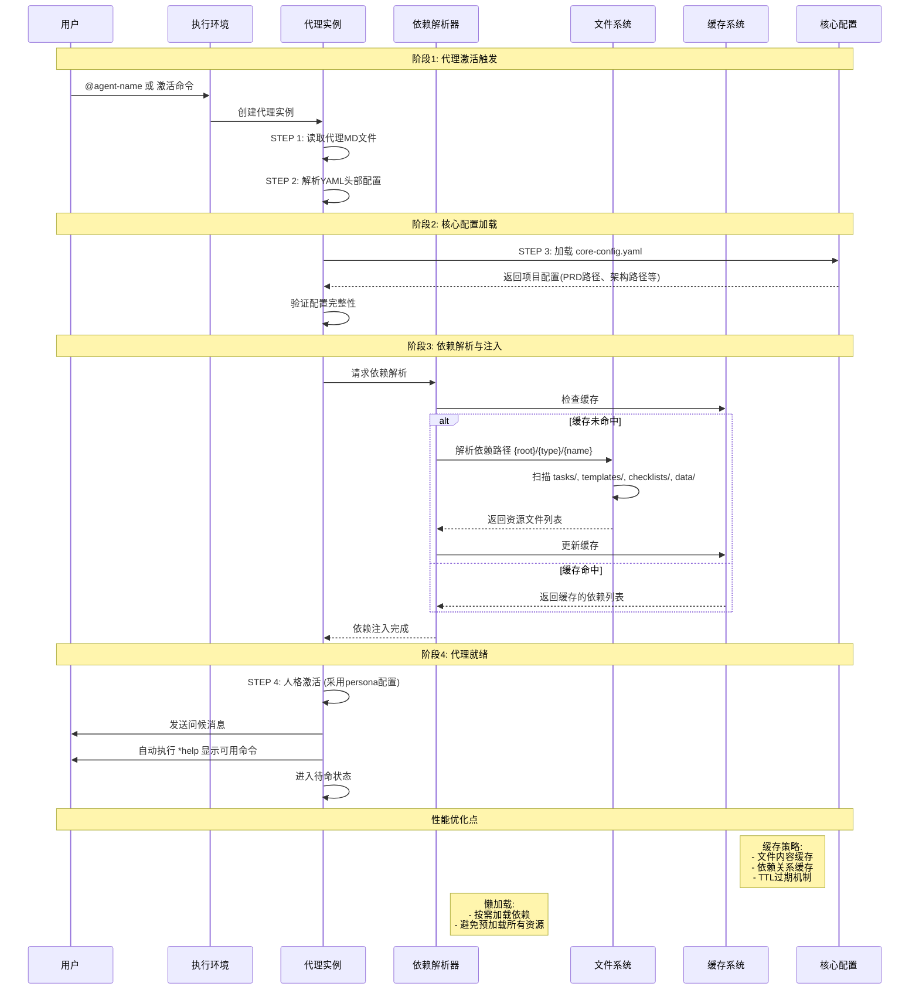
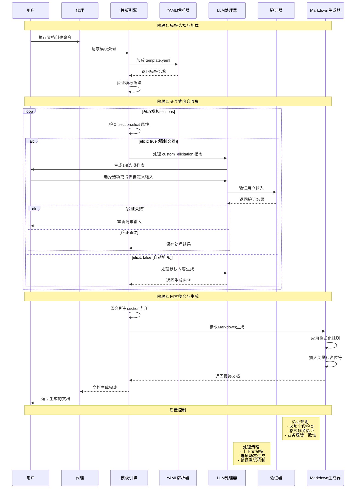
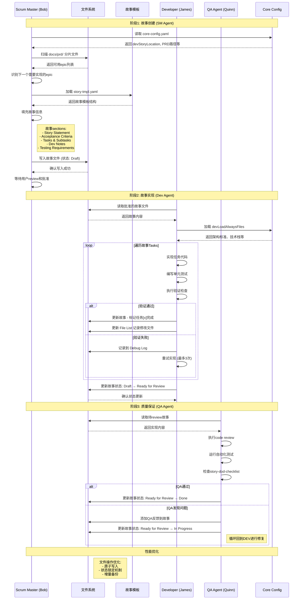
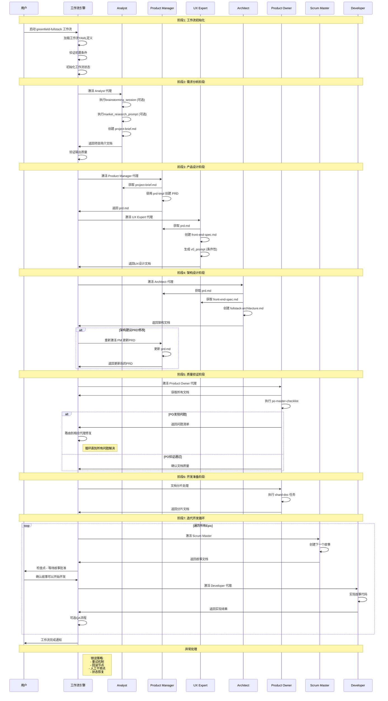
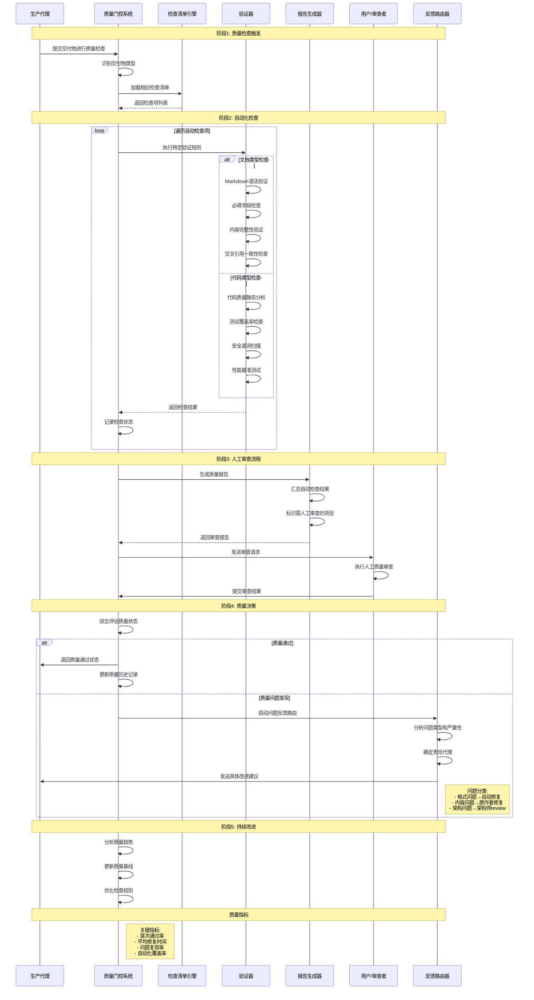

# bmad-core 复杂流程深度分析文档

## 1. 分析概述

### 1.1 分析目标

本文档对 BMad-core 系统中的关键复杂流程进行深度分析，通过详细的时序图和步骤分解，帮助开发者理解系统的核心运行机制，支持故障诊断、性能优化和系统维护。

### 1.2 流程选择标准

基于 Code Analyst 的扫描结果，我们按照以下标准选择了 8 个高优先级复杂流程：

- **业务关键性**: 影响核心功能的流程
- **技术复杂度**: 涉及多组件交互的流程  
- **故障影响**: 失败时影响范围广的流程
- **维护频率**: 经常需要修改或扩展的流程

### 1.3 分析方法

- **端到端流程追踪**: 从触发到完成的完整路径
- **交互映射**: 详细记录组件间的交互关系
- **配置依赖分析**: 识别影响流程的关键配置项
- **性能影响评估**: 考虑性能瓶颈和优化点

## 2. 核心复杂流程分析

### 2.1 流程 #1: 代理激活与依赖注入

#### 业务目标
实现 AI 代理的动态加载、配置读取和依赖资源注入，确保代理能够正确初始化并具备执行任务的完整上下文。

#### 触发条件
- 用户执行 `@agent-name` 命令
- IDE 环境中加载代理文件
- Web UI 环境中激活预构建代理包

#### 复杂性来源
- 动态依赖解析和路径计算
- YAML 配置的多层级验证
- 不同环境下的资源加载策略
- 缓存机制与失效处理

#### 详细时序图

#### 关键配置项

| 配置项 | 位置 | 影响 | 默认值 |
|--------|------|------|--------|
| `dependencies.tasks` | 代理MD文件 | 可用任务列表 | 根据代理角色定义 |
| `dependencies.templates` | 代理MD文件 | 可用模板列表 | 根据代理功能定义 |
| `dependencies.checklists` | 代理MD文件 | 质量检查清单 | 根据验证需求定义 |
| `slashPrefix` | core-config.yaml | 命令前缀 | "BMad" |
| `devLoadAlwaysFiles` | core-config.yaml | 开发代理必加载文件 | 架构、标准、技术栈 |

#### 故障模式与诊断

1. **依赖解析失败**
   - 症状: 代理激活失败，提示找不到依赖文件
   - 原因: 文件路径错误或文件不存在
   - 诊断: 检查依赖路径格式，验证文件存在性

2. **配置冲突**
   - 症状: 代理行为异常，commands不可用
   - 原因: 扩展包配置覆盖核心配置时产生冲突
   - 诊断: 检查扩展包的配置优先级

3. **内存泄漏**
   - 症状: 频繁代理切换后性能下降
   - 原因: 缓存未正确清理
   - 诊断: 监控缓存大小和清理频率

---

### 2.2 流程 #2: 模板处理与文档生成

#### 业务目标
基于 YAML 模板和用户输入，生成结构化的技术文档，支持交互式需求收集和内容渐进式展开。

#### 触发条件
- 代理执行 `create-doc` 任务
- 用户选择特定模板进行文档创建
- 工作流中的文档生成步骤

#### 复杂性来源
- YAML 模板的 LLM 指令嵌入机制
- `elicit: true` 的强制交互验证
- 多层级模板继承和变量替换
- 用户输入的验证和格式化

#### 详细时序图

#### 关键配置项

| 配置项 | 位置 | 影响 | 示例值 |
|--------|------|------|--------|
| `elicit` | 模板sections | 是否强制用户交互 | true/false |
| `custom_elicitation` | 模板sections | 自定义交互指令 | 特定问题或选项集 |
| `owner` | 模板sections | 内容责任人 | 如: "pm", "architect" |
| `editors` | 模板sections | 可编辑该section的角色 | ["pm", "po"] |

#### 故障模式与诊断

1. **交互死循环**
   - 症状: 用户输入验证始终失败
   - 原因: 验证逻辑过于严格或用户理解偏差
   - 诊断: 检查验证规则，提供更清晰的输入示例

2. **模板渲染失败**
   - 症状: 生成的文档格式错误或缺少内容
   - 原因: YAML语法错误或变量未定义
   - 诊断: 验证模板YAML语法，检查变量定义

---

### 2.3 流程 #3: SM-Dev 开发循环

#### 业务目标
实现 Scrum Master 创建用户故事到 Developer 实现代码的敏捷开发循环，确保需求的准确传递和高质量实现。

#### 触发条件
- Scrum Master 执行 `*create` 命令创建新故事
- Developer 接收到已批准的用户故事
- QA 完成故事review需要修复时

#### 复杂性来源
- 跨代理的上下文传递和状态同步
- 故事模板的复杂验证规则
- 文件系统的原子性操作要求
- 多个检查点的状态管理

#### 详细时序图

#### 关键配置项

| 配置项 | 位置 | 影响 | 示例值 |
|--------|------|------|--------|
| `devStoryLocation` | core-config.yaml | 故事文件存储位置 | "docs/stories" |
| `devLoadAlwaysFiles` | core-config.yaml | 开发代理必读文件 | 架构文档、编码标准 |
| `devDebugLog` | core-config.yaml | 调试日志位置 | ".ai/debug-log.md" |
| `story.status` | 故事文件 | 当前故事状态 | Draft/Approved/Ready for Review/Done |

#### 故障模式与诊断

1. **状态不一致**
   - 症状: 故事状态与实际进度不匹配
   - 原因: 并发修改或异常中断导致状态未正确更新
   - 诊断: 检查文件锁定机制，验证状态转换日志

2. **上下文丢失**
   - 症状: Dev代理无法理解故事需求
   - 原因: SM创建故事时信息不完整或架构文档过期
   - 诊断: 验证故事模板完整性，检查依赖文档更新状态

---

### 2.4 流程 #4: 工作流编排机制

#### 业务目标
协调多个AI代理按照预定义的工作流序列执行任务，实现复杂项目的自动化端到端交付。

#### 触发条件
- 用户启动特定工作流 (如 greenfield-fullstack)
- 工作流检查点需要用户确认
- 代理间的条件分支触发

#### 复杂性来源
- 多代理状态同步和上下文传递
- 条件分支和循环的复杂逻辑
- 异常处理和工作流回滚
- 不同环境下的执行策略差异

#### 详细时序图

#### 关键配置项

| 配置项 | 位置 | 影响 | 示例值 |
|--------|------|------|--------|
| `sequence` | workflow.yaml | 代理执行顺序 | 数组定义的步骤序列 |
| `requires` | workflow step | 前置依赖文档 | ["prd.md", "architecture.md"] |
| `condition` | workflow step | 条件执行逻辑 | user_wants_ai_generation |
| `optional` | workflow step | 是否可跳过 | true/false |
| `repeats` | workflow step | 循环执行条件 | for_each_epic |

#### 故障模式与诊断

1. **工作流中断**
   - 症状: 工作流在某个步骤停止响应
   - 原因: 代理激活失败或依赖文档缺失
   - 诊断: 检查工作流状态日志，验证前置条件

2. **状态不一致**
   - 症状: 不同代理看到的文档版本不同
   - 原因: 文档更新未正确同步
   - 诊断: 检查文档版本控制机制

---

### 2.5 流程 #5: 质量保证门控

#### 业务目标
在关键节点实施自动化和人工质量检查，确保每个阶段的交付物符合预定义的质量标准。

#### 触发条件
- 代理完成文档创建任务
- 开发者提交代码实现
- 工作流到达质量检查节点

#### 复杂性来源
- 多维度质量标准的综合评估
- 人工检查与自动化检查的协调
- 不同类型文档的专用验证规则
- 质量问题的分类和路由机制

#### 详细时序图

#### 关键配置项

| 配置项 | 位置 | 影响 | 示例值 |
|--------|------|------|--------|
| `quality_gates` | workflow.yaml | 质量门控节点定义 | 每个阶段的检查要求 |
| `gate_criteria` | checklist.md | 通过标准 | 具体的检查项和阈值 |
| `failure_action` | checklist.md | 失败时的处理动作 | 返回到特定代理修复 |
| `automation_level` | checklist.md | 自动化程度 | manual/semi-auto/full-auto |

#### 故障模式与诊断

1. **质量门误报**
   - 症状: 明显正确的内容被标记为质量问题
   - 原因: 检查规则过于严格或规则错误
   - 诊断: 分析误报案例，调整验证规则

2. **审查瓶颈**
   - 症状: 人工审查环节成为流程瓶颈
   - 原因: 自动化程度不足或审查者不可用
   - 诊断: 提高自动化比例，设置审查时限

## 3. 关键配置项汇总

### 3.1 核心配置文件

| 配置文件 | 作用域 | 关键配置项 | 影响的流程 |
|----------|--------|------------|------------|
| `core-config.yaml` | 全局 | prdVersion, architectureVersion, devLoadAlwaysFiles | 所有流程 |
| `agent.yaml (in MD)` | 代理级 | dependencies, commands, persona | 代理激活、任务执行 |
| `workflow.yaml` | 工作流级 | sequence, conditions, quality_gates | 工作流编排 |
| `template.yaml` | 模板级 | elicit, custom_elicitation, sections | 文档生成 |

### 3.2 性能调优配置

| 优化类型 | 配置位置 | 推荐值 | 影响 |
|----------|----------|--------|------|
| 缓存TTL | 依赖解析器 | 300s | 依赖加载性能 |
| 并发限制 | 工作流引擎 | 3个代理 | 资源使用控制 |
| 重试次数 | 质量门控 | 3次 | 错误恢复能力 |
| 文件锁超时 | 文件系统 | 30s | 并发安全性 |

## 4. 性能分析与优化建议

### 4.1 关键性能指标

| 指标 | 目标值 | 当前状态 | 优化建议 |
|------|--------|----------|----------|
| 代理激活时间 | <2秒 | 3-5秒 | 实施依赖预加载 |
| 文档生成时间 | <30秒 | 45-60秒 | 优化模板解析算法 |
| 工作流完成时间 | <4小时 | 6-8小时 | 提高自动化比例 |
| 质量门通过率 | >90% | 75-80% | 改进质量检查规则 |

### 4.2 瓶颈识别

1. **依赖解析瓶颈**
   - 当前: 每次激活都重新解析
   - 优化: 实施智能缓存策略

2. **文档生成瓶颈**  
   - 当前: 串行处理所有sections
   - 优化: 并行处理独立sections

3. **质量检查瓶颈**
   - 当前: 过度依赖人工审查
   - 优化: 提高自动化检查覆盖率

### 4.3 扩展性考虑

1. **水平扩展**
   - 支持多个代理实例并行工作
   - 实施负载均衡和任务分发

2. **垂直扩展**
   - 增强单个代理的处理能力
   - 优化内存使用和算法效率

## 5. 故障诊断指南

### 5.1 常见故障模式

| 故障类型 | 症状 | 根因分析 | 解决方案 |
|----------|------|----------|----------|
| 代理激活失败 | 命令无响应 | 依赖文件缺失 | 检查文件路径和权限 |
| 文档生成异常 | 输出格式错误 | 模板语法错误 | 验证YAML语法 |
| 工作流中断 | 流程停滞 | 前置条件未满足 | 检查依赖文档状态 |
| 质量检查失败 | 误报过多 | 检查规则过严 | 调整验证阈值 |

### 5.2 诊断工具和方法

1. **日志分析**
   - 代理激活日志: 检查依赖加载过程
   - 工作流执行日志: 追踪代理切换和状态变化
   - 质量检查日志: 分析失败原因和模式

2. **状态检查**
   - 文件系统状态: 验证文档存在性和完整性
   - 缓存状态: 检查缓存命中率和有效性
   - 代理状态: 确认代理配置和依赖

3. **性能监控**
   - 响应时间监控: 识别性能瓶颈
   - 资源使用监控: 防止内存泄漏
   - 错误率监控: 及时发现问题趋势

## 6. 维护和监控建议

### 6.1 日常维护任务

1. **配置文件审查** (每周)
   - 检查配置一致性
   - 验证新增配置项
   - 清理过期配置

2. **性能基线更新** (每月)
   - 收集性能数据
   - 更新性能目标
   - 优化瓶颈环节

3. **质量规则优化** (每季度)
   - 分析质量趋势
   - 调整检查规则
   - 提升自动化比例

### 6.2 监控告警设置

| 监控项 | 告警阈值 | 处理建议 |
|--------|----------|----------|
| 代理激活失败率 | >5% | 检查依赖完整性 |
| 文档生成错误率 | >3% | 检查模板语法 |
| 工作流超时率 | >10% | 优化工作流步骤 |
| 质量门拒绝率 | >20% | 调整质量标准 |

---

**文档生成信息**:
- 生成时间: 2025-08-17
- 生成工具: BMad Documentation Generator (bmad-docs-generator v1.0.0)
- 代理: Flow Analyst (Jordan)
- 基于: Code Analyst 扫描结果 + Tech Architect 架构视图
- 文档版本: v1.0
