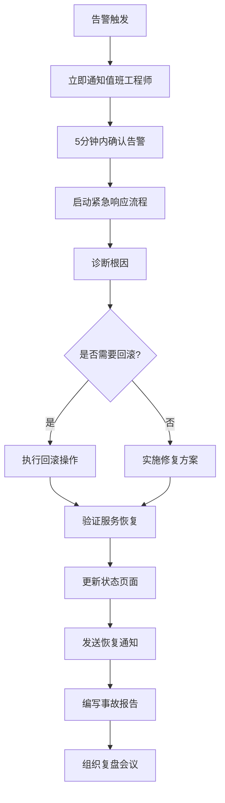

# bmad-core 问题诊断与解决方案文档

## 1. 诊断概述

### 1.1 诊断目标

本文档从 Site Reliability Engineering (SRE) 的角度，基于 bmad-core 系统的复杂流程分析，预测潜在的故障模式和用户问题，并提供具体的诊断方法和解决方案。帮助开发者和运维人员快速定位和解决系统问题。

### 1.2 诊断方法论

采用 **预测性故障分析** 方法：
- **用户视角**: 从最终用户体验出发识别问题
- **系统视角**: 从技术组件交互中发现潜在风险
- **数据驱动**: 基于系统指标和日志进行诊断
- **经验导向**: 结合行业最佳实践和常见故障模式

### 1.3 问题分类体系

- **P0 - 系统不可用**: 完全阻止系统功能的问题
- **P1 - 功能严重受损**: 影响核心功能但系统可用
- **P2 - 性能问题**: 功能正常但性能不佳
- **P3 - 用户体验问题**: 功能和性能正常但用户体验差

## 2. 核心流程问题诊断矩阵

### 2.1 代理激活与依赖注入问题

| 问题场景 | 症状描述 | 严重级别 | 根因分析 | 诊断步骤 | 解决方案 |
|----------|----------|----------|----------|----------|----------|
| **代理激活失败** | 用户执行@agent命令无响应，超过10秒无反馈 | P0 | 依赖文件缺失、路径配置错误、文件权限问题 | 1. 检查agent MD文件完整性<br/>2. 验证dependencies路径<br/>3. 检查文件系统权限<br/>4. 查看激活日志 | 1. 修复缺失的依赖文件<br/>2. 更正路径配置<br/>3. 调整文件权限<br/>4. 重建依赖索引 |
| **依赖解析超时** | 代理激活缓慢，依赖加载时间>30秒 | P2 | 大量依赖文件、磁盘I/O瓶颈、缓存失效 | 1. 分析依赖数量和大小<br/>2. 检查磁盘性能<br/>3. 验证缓存状态<br/>4. 监控内存使用 | 1. 实施依赖预加载<br/>2. 优化文件读取策略<br/>3. 调整缓存策略<br/>4. 增加内存分配 |
| **配置冲突错误** | 代理激活后commands不可用或行为异常 | P1 | 扩展包配置覆盖核心配置、YAML语法错误 | 1. 检查扩展包配置<br/>2. 验证YAML语法<br/>3. 对比配置优先级<br/>4. 查看配置加载日志 | 1. 解决配置冲突<br/>2. 修复YAML语法错误<br/>3. 调整配置优先级<br/>4. 实施配置验证 |
| **内存泄漏累积** | 多次代理切换后系统变慢，最终不响应 | P1 | 缓存未正确清理、循环引用、资源未释放 | 1. 监控内存使用趋势<br/>2. 分析对象引用关系<br/>3. 检查缓存清理机制<br/>4. 使用内存分析工具 | 1. 实施定期缓存清理<br/>2. 修复循环引用<br/>3. 添加资源释放逻辑<br/>4. 设置内存使用限制 |

### 2.2 模板处理与文档生成问题

| 问题场景 | 症状描述 | 严重级别 | 根因分析 | 诊断步骤 | 解决方案 |
|----------|----------|----------|----------|----------|----------|
| **模板渲染失败** | 文档生成中断，出现YAML解析错误 | P0 | 模板YAML语法错误、变量未定义、格式不正确 | 1. 验证模板YAML语法<br/>2. 检查变量定义<br/>3. 确认模板版本兼容性<br/>4. 查看解析错误日志 | 1. 修复YAML语法错误<br/>2. 定义缺失变量<br/>3. 更新模板版本<br/>4. 添加语法验证 |
| **交互死循环** | 用户输入验证反复失败，无法进入下一步 | P1 | 验证规则过严、用户理解偏差、输入格式错误 | 1. 分析验证规则逻辑<br/>2. 检查用户输入模式<br/>3. 查看验证失败日志<br/>4. 测试边界条件 | 1. 放宽验证规则<br/>2. 提供输入示例<br/>3. 改进错误提示<br/>4. 添加格式提示 |
| **文档格式异常** | 生成的文档结构错乱、内容缺失或重复 | P2 | 模板逻辑错误、变量替换失败、格式化问题 | 1. 检查模板逻辑<br/>2. 验证变量替换<br/>3. 分析格式化规则<br/>4. 对比期望输出 | 1. 修复模板逻辑<br/>2. 完善变量处理<br/>3. 优化格式化算法<br/>4. 添加输出验证 |
| **生成性能慢** | 大型文档生成时间>5分钟，用户体验差 | P3 | 模板复杂度高、串行处理、I/O瓶颈 | 1. 分析模板复杂度<br/>2. 监控处理时间<br/>3. 检查I/O操作<br/>4. 分析处理流程 | 1. 简化模板逻辑<br/>2. 实施并行处理<br/>3. 优化I/O操作<br/>4. 添加进度提示 |

### 2.3 SM-Dev开发循环问题

| 问题场景 | 症状描述 | 严重级别 | 根因分析 | 诊断步骤 | 解决方案 |
|----------|----------|----------|----------|----------|----------|
| **故事状态不一致** | 故事显示"Draft"但实际已开发完成 | P1 | 并发修改冲突、状态更新失败、文件锁异常 | 1. 检查文件锁状态<br/>2. 分析状态变更日志<br/>3. 验证并发控制机制<br/>4. 查看文件版本历史 | 1. 实施原子状态更新<br/>2. 修复文件锁机制<br/>3. 添加状态一致性检查<br/>4. 实施状态回滚机制 |
| **Dev代理上下文丢失** | 开发代理无法理解故事需求，反复询问 | P1 | 故事信息不完整、架构文档过期、依赖加载失败 | 1. 检查故事完整性<br/>2. 验证架构文档版本<br/>3. 确认依赖加载状态<br/>4. 分析上下文传递 | 1. 完善故事模板<br/>2. 更新架构文档<br/>3. 修复依赖加载<br/>4. 优化上下文传递 |
| **代码实现质量差** | 生成的代码不符合标准，测试失败率高 | P2 | 编码标准不明确、测试要求不清晰、质量检查缺失 | 1. 检查编码标准定义<br/>2. 分析测试失败原因<br/>3. 评估质量检查覆盖<br/>4. 查看代码审查结果 | 1. 明确编码标准<br/>2. 完善测试要求<br/>3. 强化质量检查<br/>4. 实施自动化审查 |
| **开发循环阻塞** | SM创建故事后Dev代理长时间无响应 | P0 | 资源竞争、死锁、依赖循环、系统资源不足 | 1. 检查系统资源使用<br/>2. 分析锁等待状态<br/>3. 验证依赖关系<br/>4. 监控代理状态 | 1. 释放系统资源<br/>2. 解除死锁状态<br/>3. 优化依赖结构<br/>4. 实施超时机制 |

### 2.4 工作流编排问题

| 问题场景 | 症状描述 | 严重级别 | 根因分析 | 诊断步骤 | 解决方案 |
|----------|----------|----------|----------|----------|----------|
| **工作流中断停滞** | 工作流在某个步骤停止，无法继续执行 | P0 | 前置条件未满足、代理激活失败、配置错误 | 1. 检查当前步骤状态<br/>2. 验证前置条件<br/>3. 测试代理激活<br/>4. 审查工作流配置 | 1. 满足前置条件<br/>2. 修复代理问题<br/>3. 更正配置错误<br/>4. 实施重试机制 |
| **代理协作混乱** | 多个代理同时活跃，产生冲突和混淆 | P1 | 工作流同步机制失效、状态管理错误、资源竞争 | 1. 分析代理活跃状态<br/>2. 检查同步机制<br/>3. 验证状态管理<br/>4. 监控资源使用 | 1. 修复同步机制<br/>2. 优化状态管理<br/>3. 实施资源调度<br/>4. 添加协作协议 |
| **条件分支错误** | 工作流执行错误的分支路径 | P2 | 条件逻辑错误、变量状态错误、判断依据过期 | 1. 分析条件逻辑<br/>2. 检查变量状态<br/>3. 验证判断依据<br/>4. 测试分支路径 | 1. 修复条件逻辑<br/>2. 更新变量状态<br/>3. 刷新判断依据<br/>4. 增强测试覆盖 |
| **工作流性能慢** | 整个工作流执行时间超过预期2倍以上 | P3 | 步骤冗余、等待时间长、资源分配不当 | 1. 分析步骤执行时间<br/>2. 识别等待瓶颈<br/>3. 评估资源分配<br/>4. 优化关键路径 | 1. 消除冗余步骤<br/>2. 减少等待时间<br/>3. 优化资源分配<br/>4. 并行化执行 |

### 2.5 质量保证门控问题

| 问题场景 | 症状描述 | 严重级别 | 根因分析 | 诊断步骤 | 解决方案 |
|----------|----------|----------|----------|----------|----------|
| **质量检查误报** | 明显正确的内容被标记为质量问题 | P2 | 检查规则过严、规则配置错误、标准过期 | 1. 分析误报案例<br/>2. 检查规则配置<br/>3. 评估标准合理性<br/>4. 测试边界情况 | 1. 调整检查规则<br/>2. 修复配置错误<br/>3. 更新质量标准<br/>4. 增加例外处理 |
| **质量门控瓶颈** | 人工审查环节成为流程瓶颈，响应慢 | P3 | 自动化程度低、审查者不可用、流程复杂 | 1. 分析审查时间<br/>2. 评估自动化比例<br/>3. 检查审查者可用性<br/>4. 简化审查流程 | 1. 提高自动化比例<br/>2. 增加审查者<br/>3. 简化流程<br/>4. 设置时限 |
| **质量标准不一致** | 不同代理/时期的质量要求存在差异 | P2 | 标准定义模糊、版本管理混乱、培训不足 | 1. 审查质量标准<br/>2. 检查版本一致性<br/>3. 评估理解程度<br/>4. 分析差异来源 | 1. 明确质量标准<br/>2. 统一版本管理<br/>3. 加强培训<br/>4. 实施标准审查 |
| **反馈循环无效** | 质量问题反馈后未得到有效解决 | P1 | 反馈路由错误、责任不明确、跟踪缺失 | 1. 检查反馈路由<br/>2. 明确责任分工<br/>3. 追踪问题状态<br/>4. 分析解决效果 | 1. 优化反馈路由<br/>2. 明确责任制<br/>3. 实施问题跟踪<br/>4. 建立闭环机制 |

## 3. 系统级问题诊断

### 3.1 性能问题诊断

#### 3.1.1 响应时间问题

**问题识别**:
- 代理激活时间 > 5秒
- 文档生成时间 > 2分钟  
- 工作流执行时间 > 8小时

**诊断检查清单**:
```bash
# 1. 系统资源检查
top                          # CPU使用率
free -h                      # 内存使用情况
df -h                        # 磁盘空间
iostat -x 1 5               # I/O性能

# 2. 进程级监控
ps aux | grep bmad           # BMad相关进程
lsof | grep bmad             # 文件描述符使用

# 3. 网络连接检查
netstat -an | grep :80       # 网络连接状态
ping external-service.com    # 外部依赖连通性

# 4. 应用级指标
grep "response_time" logs/*.log | tail -100
grep "ERROR\|WARN" logs/*.log | tail -50
```

**解决方案**:
1. **资源优化**: 增加内存分配，使用SSD存储
2. **缓存策略**: 实施多级缓存，预加载热数据
3. **并发处理**: 启用多线程，异步处理非关键路径
4. **代码优化**: 优化算法复杂度，减少不必要的计算

#### 3.1.2 内存泄漏问题

**问题识别**:
- 内存使用持续增长不下降
- 频繁的垃圾回收但内存不释放
- 系统运行一段时间后变慢

**诊断方法**:
```javascript
// 内存使用监控
setInterval(() => {
    const usage = process.memoryUsage();
    console.log({
        rss: Math.round(usage.rss / 1024 / 1024) + ' MB',
        heapTotal: Math.round(usage.heapTotal / 1024 / 1024) + ' MB',
        heapUsed: Math.round(usage.heapUsed / 1024 / 1024) + ' MB',
        external: Math.round(usage.external / 1024 / 1024) + ' MB'
    });
}, 30000);

// 对象引用分析
function analyzeObjectReferences() {
    // 使用heap dump工具分析对象引用链
    // 识别未释放的大对象
}
```

**解决方案**:
1. **引用管理**: 及时清理事件监听器，解除循环引用
2. **缓存限制**: 设置缓存大小限制，实施LRU策略
3. **资源释放**: 确保文件句柄、网络连接及时关闭
4. **监控告警**: 设置内存使用阈值告警

### 3.2 可用性问题诊断

#### 3.2.1 系统不可用

**问题识别**:
- 服务完全无响应
- 大量请求超时
- 关键功能完全失效

**诊断流程**:
```bash
# 1. 服务状态检查
systemctl status bmad-service
docker ps | grep bmad
ps aux | grep -v grep | grep bmad

# 2. 端口监听检查  
netstat -tulpn | grep :3000
lsof -i :3000

# 3. 日志检查
tail -f /var/log/bmad/error.log
journalctl -u bmad-service -f

# 4. 依赖服务检查
curl -I http://dependency-service/health
ping database-server
```

**解决方案**:
1. **服务重启**: 重启失效服务，检查启动日志
2. **依赖修复**: 修复依赖服务，确保连通性
3. **配置验证**: 检查配置文件，修复配置错误
4. **数据恢复**: 从备份恢复损坏的数据

#### 3.2.2 部分功能失效

**问题识别**:
- 特定代理无法激活
- 某些工作流无法执行
- 特定功能模块异常

**诊断方法**:
```bash
# 1. 功能模块测试
bmad test agent-activation
bmad test workflow-execution
bmad test template-processing

# 2. 组件依赖检查
bmad check dependencies
bmad validate configuration

# 3. 权限检查
ls -la /path/to/bmad/files
id bmad-user
sudo -u bmad-user ls /protected/path
```

**解决方案**:
1. **模块重载**: 重新加载失效模块
2. **依赖修复**: 安装缺失依赖，修复版本冲突
3. **权限修复**: 调整文件权限，用户组设置
4. **配置更新**: 更新模块配置，重启相关服务

## 4. 用户体验问题解决

### 4.1 界面交互问题

| 用户场景 | 问题描述 | 用户影响 | 解决方案 |
|----------|----------|----------|----------|
| **命令响应慢** | 执行@agent命令后等待时间过长 | 用户体验差，误以为系统卡死 | 1. 添加"正在激活代理..."提示<br/>2. 显示进度条或加载动画<br/>3. 优化代理激活速度<br/>4. 提供取消操作选项 |
| **错误信息不清晰** | 系统报错信息技术性强，用户难以理解 | 用户无法自主解决问题 | 1. 提供用户友好的错误信息<br/>2. 包含具体的解决建议<br/>3. 添加帮助文档链接<br/>4. 提供常见问题FAQ |
| **操作步骤复杂** | 完成一个任务需要太多步骤 | 用户学习成本高，易出错 | 1. 简化操作流程<br/>2. 提供操作向导<br/>3. 实施智能默认值<br/>4. 添加快捷操作 |
| **上下文丢失** | 代理切换时用户需要重复输入信息 | 用户感到挫败，效率低 | 1. 实施上下文保持机制<br/>2. 提供信息自动传递<br/>3. 显示当前上下文状态<br/>4. 支持上下文恢复 |

### 4.2 学习曲线问题

| 用户类型 | 主要困难 | 解决策略 |
|----------|----------|----------|
| **新手用户** | 不知道从哪里开始，概念太多 | 1. 提供入门向导<br/>2. 设计循序渐进的教程<br/>3. 简化初始配置<br/>4. 提供示例项目 |
| **中级用户** | 想要定制化但不知道如何配置 | 1. 提供配置模板<br/>2. 详细的配置文档<br/>3. 最佳实践指南<br/>4. 社区经验分享 |
| **高级用户** | 需要深度定制和扩展能力 | 1. 提供扩展包开发指南<br/>2. 开放API和插件接口<br/>3. 高级配置选项<br/>4. 源码级文档 |

## 5. 监控和告警策略

### 5.1 关键指标监控

#### 5.1.1 系统健康指标

| 指标类别 | 监控指标 | 正常范围 | 告警阈值 | 监控频率 |
|----------|----------|----------|----------|----------|
| **可用性** | 服务可用率 | >99.9% | <99.5% | 1分钟 |
| **性能** | 代理激活时间 | <2秒 | >5秒 | 实时 |
| **性能** | 文档生成时间 | <30秒 | >2分钟 | 实时 |
| **资源** | CPU使用率 | <70% | >85% | 30秒 |
| **资源** | 内存使用率 | <80% | >90% | 30秒 |
| **资源** | 磁盘使用率 | <80% | >90% | 5分钟 |

#### 5.1.2 业务指标监控

| 指标类别 | 监控指标 | 正常范围 | 告警阈值 | 监控频率 |
|----------|----------|----------|----------|----------|
| **质量** | 质量门通过率 | >90% | <80% | 实时 |
| **效率** | 工作流完成率 | >95% | <90% | 1小时 |
| **用户体验** | 错误率 | <1% | >3% | 实时 |
| **用户体验** | 用户会话时长 | 30-120分钟 | >180分钟 | 1小时 |

### 5.2 告警通知机制

#### 5.2.1 告警级别定义

| 级别 | 定义 | 响应时间 | 通知方式 | 处理要求 |
|------|------|----------|----------|----------|
| **Critical** | 系统不可用 | 立即 | 电话+短信+邮件 | 立即响应 |
| **High** | 核心功能受损 | 5分钟内 | 短信+邮件+Slack | 30分钟内响应 |
| **Medium** | 性能问题 | 15分钟内 | 邮件+Slack | 2小时内响应 |
| **Low** | 用户体验问题 | 1小时内 | 邮件 | 1个工作日内响应 |

#### 5.2.2 告警通知配置

```yaml
# monitoring-alerts.yaml
alerts:
  - name: "BMad Service Down"
    condition: "service_availability < 99%"
    severity: "critical"
    channels: ["phone", "sms", "email", "slack"]
    
  - name: "Agent Activation Slow"
    condition: "agent_activation_time > 5s"
    severity: "high"  
    channels: ["sms", "email", "slack"]
    
  - name: "Memory Usage High"
    condition: "memory_usage > 90%"
    severity: "medium"
    channels: ["email", "slack"]
    
  - name: "Quality Gate Failure Rate High" 
    condition: "quality_failure_rate > 20%"
    severity: "low"
    channels: ["email"]
```

### 5.3 故障响应流程

#### 5.3.1 Critical级别故障响应



#### 5.3.2 故障处理检查清单

**立即响应 (0-15分钟)**:
- [ ] 确认告警真实性
- [ ] 评估影响范围
- [ ] 启动响应团队
- [ ] 更新状态页面
- [ ] 通知相关stakeholder

**诊断分析 (15-30分钟)**:
- [ ] 收集系统日志
- [ ] 分析监控数据
- [ ] 检查最近变更
- [ ] 识别根本原因
- [ ] 制定修复计划

**修复实施 (30-60分钟)**:
- [ ] 执行修复方案
- [ ] 监控修复效果
- [ ] 验证服务恢复
- [ ] 确认无副作用
- [ ] 更新恢复状态

**事后跟进 (1-24小时)**:
- [ ] 编写详细事故报告
- [ ] 分析根本原因
- [ ] 制定预防措施
- [ ] 更新运维文档
- [ ] 组织复盘会议

## 6. 预防性维护建议

### 6.1 日常维护任务

#### 6.1.1 每日检查 (自动化)

```bash
#!/bin/bash
# daily-health-check.sh

echo "=== BMad Daily Health Check ==="
echo "Date: $(date)"

# 1. 服务状态检查
echo "1. Service Status:"
systemctl is-active bmad-service && echo "✅ BMad service is running" || echo "❌ BMad service is down"

# 2. 资源使用检查
echo "2. Resource Usage:"
MEMORY_USAGE=$(free | grep Mem | awk '{printf("%.1f"), $3/$2 * 100.0}')
echo "Memory Usage: ${MEMORY_USAGE}%"
if (( $(echo "$MEMORY_USAGE > 80" | bc -l) )); then
    echo "⚠️ High memory usage detected"
fi

# 3. 磁盘空间检查
echo "3. Disk Usage:"
DISK_USAGE=$(df -h / | awk 'NR==2 {print $5}' | sed 's/%//')
echo "Disk Usage: ${DISK_USAGE}%"
if [ "$DISK_USAGE" -gt 80 ]; then
    echo "⚠️ High disk usage detected"
fi

# 4. 日志错误检查
echo "4. Recent Errors:"
ERROR_COUNT=$(grep -c "ERROR\|FATAL" /var/log/bmad/*.log 2>/dev/null || echo "0")
echo "Error count in last 24h: $ERROR_COUNT"
if [ "$ERROR_COUNT" -gt 10 ]; then
    echo "⚠️ High error rate detected"
fi

# 5. 代理激活测试
echo "5. Agent Activation Test:"
if timeout 10s bmad test agent-activation >/dev/null 2>&1; then
    echo "✅ Agent activation test passed"
else
    echo "❌ Agent activation test failed"
fi

echo "=== Health Check Complete ==="
```

#### 6.1.2 每周维护 (半自动化)

```bash
#!/bin/bash
# weekly-maintenance.sh

echo "=== BMad Weekly Maintenance ==="

# 1. 日志轮转和清理
echo "1. Log rotation and cleanup..."
find /var/log/bmad/ -name "*.log" -mtime +7 -delete
logrotate /etc/logrotate.d/bmad

# 2. 缓存清理
echo "2. Cache cleanup..."
bmad cache clear --older-than=7days
bmad cache optimize

# 3. 依赖更新检查
echo "3. Dependency update check..."
bmad check updates
npm audit --audit-level=high

# 4. 性能基准测试
echo "4. Performance benchmarks..."
bmad benchmark --report=/tmp/bmad-benchmark-$(date +%Y%m%d).json

# 5. 配置文件备份
echo "5. Configuration backup..."
tar -czf /backup/bmad-config-$(date +%Y%m%d).tar.gz /etc/bmad/

echo "=== Weekly Maintenance Complete ==="
```

### 6.2 容量规划

#### 6.2.1 资源需求预测

| 指标 | 当前值 | 3个月预测 | 6个月预测 | 1年预测 |
|------|--------|-----------|-----------|----------|
| **日活用户** | 100 | 150 | 250 | 500 |
| **日均文档生成** | 500 | 750 | 1250 | 2500 |
| **存储需求** | 10GB | 15GB | 25GB | 50GB |
| **内存需求** | 4GB | 6GB | 8GB | 16GB |
| **CPU需求** | 4核 | 6核 | 8核 | 16核 |

#### 6.2.2 扩容触发条件

| 资源类型 | 当前配置 | 扩容触发条件 | 扩容方案 |
|----------|----------|--------------|----------|
| **CPU** | 4核 | 连续5天平均使用率>70% | 升级到8核 |
| **内存** | 8GB | 连续3天平均使用率>80% | 升级到16GB |
| **存储** | 100GB | 使用率>80% | 扩容到200GB |
| **网络** | 1Gbps | 连续峰值>80% | 升级到10Gbps |

### 6.3 灾难恢复计划

#### 6.3.1 备份策略

| 备份类型 | 备份内容 | 频率 | 保留期 | 存储位置 |
|----------|----------|------|--------|----------|
| **全量备份** | 完整系统镜像 | 每周 | 3个月 | 云存储 |
| **增量备份** | 变更文件 | 每日 | 1个月 | 本地+云存储 |
| **配置备份** | 配置文件 | 每次变更 | 6个月 | 版本控制系统 |
| **数据备份** | 用户数据 | 每6小时 | 3个月 | 多地域云存储 |

#### 6.3.2 恢复流程

**RTO (恢复时间目标)**: 4小时
**RPO (恢复点目标)**: 6小时

```bash
#!/bin/bash
# disaster-recovery.sh

echo "=== BMad Disaster Recovery Process ==="

# 1. 环境准备
echo "1. Preparing recovery environment..."
./scripts/setup-recovery-env.sh

# 2. 数据恢复
echo "2. Restoring data from backup..."
./scripts/restore-data.sh --source=backup --target=recovery

# 3. 配置恢复
echo "3. Restoring configuration..."
./scripts/restore-config.sh --version=latest

# 4. 服务启动
echo "4. Starting services..."
systemctl start bmad-service

# 5. 健康检查
echo "5. Health check..."
./scripts/health-check.sh --full

# 6. 切换流量
echo "6. Traffic switching..."
./scripts/switch-traffic.sh --to=recovery

echo "=== Recovery Complete ==="
```

---

**文档生成信息**:
- 生成时间: 2025-08-17
- 生成工具: BMad Documentation Generator (bmad-docs-generator v1.0.0)
- 代理: Problem Solver (Dr. Morgan)
- 基于: Complex Flow Analysis + Technical Overview + SRE最佳实践
- 文档版本: v1.0
