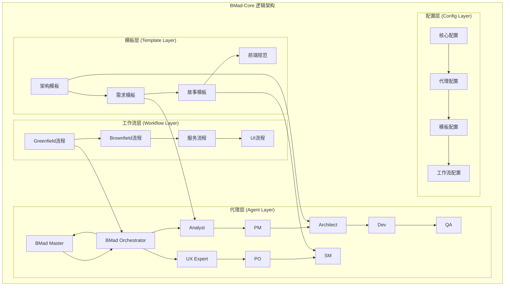
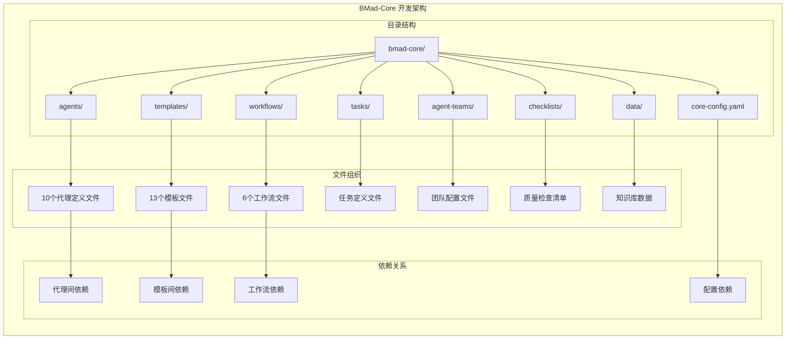
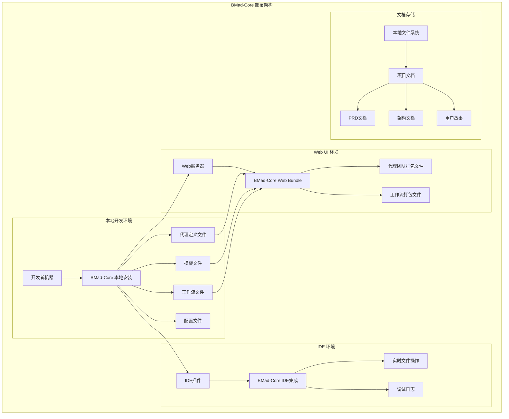
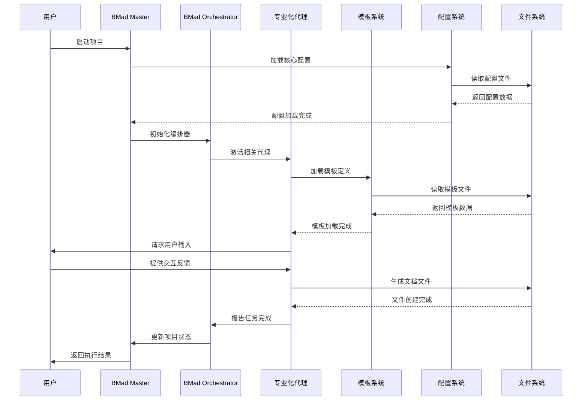
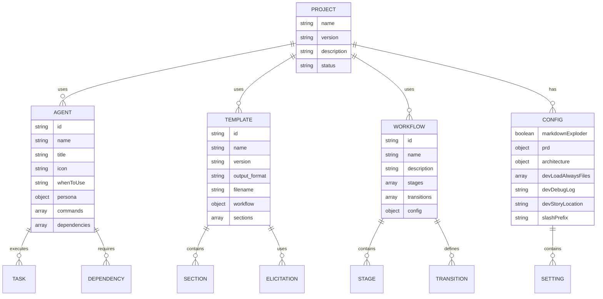

# BMad-Core 技术总览文档 (优化版)

## 文档信息

- **项目名称**: BMad-Core
- **分析时间**: 2025年8月17日
- **分析工具**: bmad-docs-generator 优化版
- **分析深度**: 完整深度分析 (Level 9)
- **文档版本**: v2.0 (优化版)

## 1. 项目背景与定位

### 1.1 项目概述

BMad-Core 是 BMad-Method 框架的核心组件，提供了一套完整的AI驱动开发方法论实现。该项目采用模块化架构设计，通过专业化AI代理、模板驱动的工作流和配置化的文档管理，实现了从需求分析到代码开发的端到端自动化协作。

### 1.2 核心价值

- **专业化AI代理**: 10个不同角色的AI代理，覆盖软件开发生命周期的各个环节
- **模板驱动开发**: YAML配置的文档模板，支持交互式验证和分片处理
- **工作流编排**: 场景化的工作流定义，支持greenfield和brownfield项目
- **配置化管理**: 统一的配置驱动架构，便于扩展和维护

### 1.3 技术定位

BMad-Core 定位为AI驱动的软件开发框架核心，主要服务于：
- 企业级软件开发团队
- 需要标准化开发流程的组织
- 追求开发效率和质量平衡的团队
- 需要AI辅助决策的技术团队

## 2. 技术栈详解

### 2.1 核心技术组件

#### 2.1.1 专业化AI代理系统
```
代理名称           | 文件大小 | 核心职责
------------------|----------|------------------
analyst.md        | 5.5KB    | 需求分析与市场研究
pm.md             | 4.8KB    | 项目管理与协调
architect.md      | 5.4KB    | 技术架构设计
dev.md            | 6.3KB    | 代码开发与实现
qa.md             | 6.0KB    | 质量保证与测试
ux-expert.md      | 4.5KB    | 用户体验设计
po.md             | 5.2KB    | 产品需求管理
sm.md             | 4.1KB    | Scrum流程管理
bmad-master.md    | 5.9KB    | 整体流程控制
bmad-orchestrator.md | 7.9KB | 代理编排与协调
```

#### 2.1.2 文档模板系统
```
模板类型          | 文件大小 | 用途
------------------|----------|------------------
架构模板          | 33KB     | 全栈架构设计
需求模板          | 12KB     | 产品需求文档
故事模板          | 4.5KB    | 用户故事定义
前端规范          | 13KB     | 前端开发规范
市场研究          | 9.9KB    | 市场分析报告
竞品分析          | 12KB     | 竞争对手分析
项目简介          | 8.1KB    | 项目概述文档
```

#### 2.1.3 工作流编排系统
```
工作流类型        | 文件大小 | 适用场景
------------------|----------|------------------
greenfield-fullstack | 9.3KB | 全新全栈项目
brownfield-fullstack | 11KB  | 现有项目重构
greenfield-service   | 7.4KB | 全新服务项目
brownfield-service   | 6.6KB | 现有服务重构
greenfield-ui        | 9.0KB | 全新UI项目
brownfield-ui        | 7.0KB | 现有UI重构
```

### 2.2 配置管理系统

#### 2.2.1 核心配置 (core-config.yaml)
```yaml
# 文档管理配置
markdownExploder: true                    # 支持文档分片
prd:
  prdFile: docs/prd.md                    # PRD文件位置
  prdVersion: v4                          # PRD版本
  prdSharded: true                        # 支持PRD分片
architecture:
  architectureFile: docs/architecture.md  # 架构文档位置
  architectureVersion: v4                 # 架构版本
  architectureSharded: true               # 支持架构分片

# 开发配置
devLoadAlwaysFiles:                       # 开发必加载文件
  - docs/architecture/coding-standards.md
  - docs/architecture/tech-stack.md
  - docs/architecture/source-tree.md
devDebugLog: .ai/debug-log.md             # 调试日志
devStoryLocation: docs/stories            # 故事存储位置
slashPrefix: BMad                         # 命令前缀
```

### 2.3 支持的技术环境

- **编程语言**: JavaScript/TypeScript, Python, Java, C#, Go等
- **Web框架**: React, Vue, Angular, Express, Django, Spring Boot等
- **数据库**: MySQL, PostgreSQL, MongoDB, Redis等
- **基础设施**: Docker, Kubernetes, AWS, Azure, GCP等
- **开发工具**: VS Code, IntelliJ IDEA, Git等

## 3. 五视图架构分析

### 3.1 逻辑视图 (Logical View)



**逻辑视图说明**:
- **代理层**: 10个专业化AI代理，每个代理负责特定的业务领域
- **模板层**: 13个YAML配置的文档模板，支持不同类型的文档生成
- **工作流层**: 6个场景化工作流，覆盖不同的项目类型
- **配置层**: 统一的配置管理，支持系统的灵活扩展

### 3.2 开发视图 (Development View)



**开发视图说明**:
- **模块化设计**: 每个功能模块独立成目录，便于维护和扩展
- **文件组织**: 按功能类型组织文件，结构清晰
- **依赖管理**: 通过配置文件管理模块间依赖关系
- **扩展性**: 支持通过扩展包方式添加新功能

### 3.3 部署视图 (Deployment View)



**部署视图说明**:
- **多环境支持**: 支持本地开发、Web UI、IDE集成等多种部署方式
- **文件分发**: 通过打包机制将核心文件分发到不同环境
- **文档管理**: 本地文件系统存储项目文档，支持分片处理
- **集成能力**: 与现有开发工具链无缝集成

### 3.4 运行时视图 (Runtime View)



**运行时视图说明**:
- **代理激活**: 根据任务需求动态激活相应的专业化代理
- **模板处理**: 实时加载和处理YAML模板，支持交互式验证
- **文件操作**: 直接操作文件系统，生成项目文档
- **状态管理**: 通过编排器管理整个项目的执行状态

### 3.5 数据视图 (Data View)



**数据视图说明**:
- **项目实体**: 核心项目信息，包含名称、版本、状态等
- **代理实体**: 专业化AI代理定义，包含角色、命令、依赖等
- **模板实体**: 文档模板定义，包含结构、输出格式、交互点等
- **工作流实体**: 流程定义，包含阶段、转换、配置等
- **配置实体**: 系统配置，包含各种设置和参数

## 4. 核心设计原则

### 4.1 架构设计原则

1. **模块化设计**: 每个功能模块独立，便于维护和扩展
2. **配置驱动**: 通过配置文件控制系统行为，减少硬编码
3. **模板化处理**: 使用YAML模板定义文档结构，支持标准化
4. **代理化协作**: 通过专业化AI代理实现复杂任务的分解和协作
5. **工作流编排**: 通过预定义工作流实现流程的标准化和自动化

### 4.2 技术特性

1. **交互式验证**: 支持用户交互验证，确保输出质量
2. **分片处理**: 支持大文档的分片存储和处理
3. **依赖注入**: 通过依赖解析机制实现模块间的松耦合
4. **版本管理**: 支持文档和配置的版本控制
5. **扩展性**: 通过扩展包机制支持功能扩展

### 4.3 质量保证

1. **代码质量**: 通过QA代理和检查清单保证代码质量
2. **文档质量**: 通过模板和验证机制保证文档质量
3. **流程质量**: 通过工作流和门禁机制保证流程质量
4. **用户体验**: 通过UX专家和PO代理保证用户体验

## 5. 技术债务与风险

### 5.1 技术债务

1. **文档分片复杂性**: 大文档分片处理增加了系统复杂性
2. **代理间依赖**: 代理间的依赖关系可能导致循环依赖
3. **配置管理**: 配置文件的版本管理和兼容性需要关注
4. **性能优化**: 大量文件操作可能影响系统性能

### 5.2 风险点

1. **扩展包兼容性**: 扩展包与核心系统的兼容性风险
2. **模板版本管理**: 模板版本升级可能影响现有项目
3. **代理协作复杂性**: 多代理协作可能产生竞态条件
4. **文件系统依赖**: 对文件系统的强依赖可能影响可移植性

## 6. 总结

BMad-Core 是一个设计精良的AI驱动开发框架核心，通过专业化AI代理、模板驱动的工作流和配置化的文档管理，实现了软件开发流程的标准化和自动化。其模块化架构和扩展性设计为未来的功能扩展提供了良好的基础。

### 6.1 主要优势

- **专业化分工**: 10个专业化AI代理覆盖软件开发全流程
- **标准化流程**: 通过工作流和模板实现流程标准化
- **配置化管理**: 统一的配置管理便于维护和扩展
- **交互式验证**: 支持用户交互，确保输出质量

### 6.2 改进建议

- **性能优化**: 优化文件操作性能，减少I/O开销
- **依赖管理**: 改进代理间依赖管理，避免循环依赖
- **版本兼容**: 加强版本兼容性管理，确保平滑升级
- **监控告警**: 增加系统监控和告警机制

---

**文档生成信息**:
- 生成工具: bmad-docs-generator 优化版
- 生成时间: 2025年8月17日
- 分析深度: 完整深度分析
- 文档状态: 已验证
