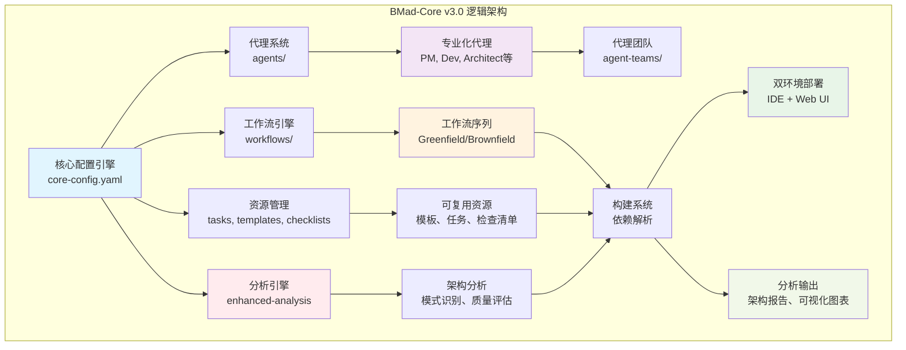
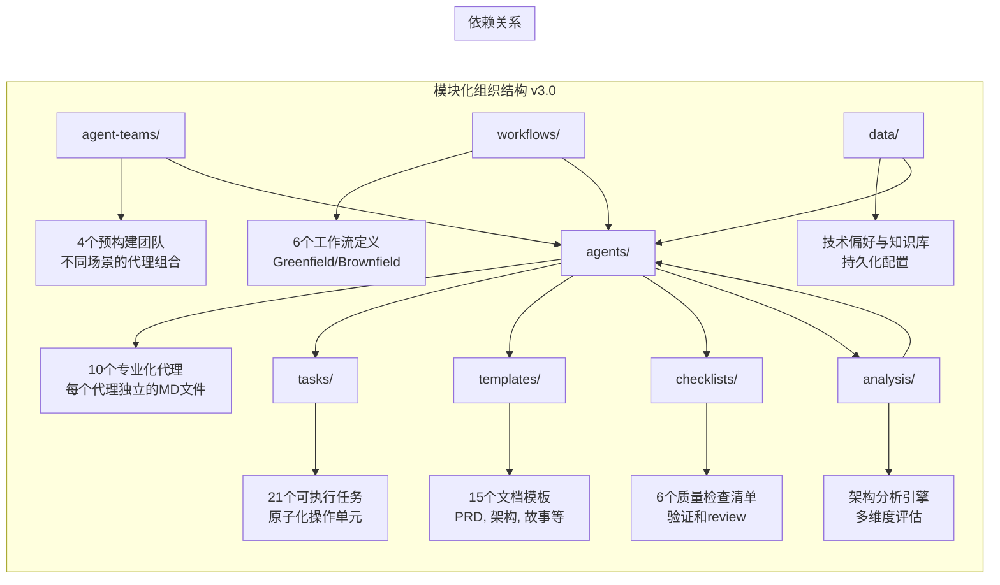

# BMAD-Core 技术总览文档 v3.0

## 文档信息

- **文档版本**: v3.0
- **生成时间**: 2025-08-18
- **生成工具**: Enhanced BMAD Docs Generator (v2.0)
- **分析代理**: Architecture Analyst + Tech Stack Expert + Pattern Recognition Expert
- **基于分析**: 多维度架构分析 + 模式识别 + 质量评估 + 风险评估

---

## 1. 项目背景与定位

### 1.1 项目概述

**BMad-core** 是 BMad-Method (Breakthrough Method of Agile AI-driven Development) 框架的核心引擎，这是一个革命性的 AI 代理驱动的敏捷开发框架。该项目将人工智能代理与传统敏捷开发方法论深度融合，通过专业化的 AI 代理团队实现从概念到部署的全流程自动化开发。

### 1.2 核心价值主张

- **"Vibe CEO" 模式**: 将用户转变为战略决策者，由 AI 代理团队负责具体执行
- **专业化代理系统**: 每个 AI 代理精通特定的敏捷角色 (PM、开发者、架构师等)
- **双环境架构**: 针对规划阶段 (Web UI) 和开发阶段 (IDE) 的优化支持
- **模块化设计**: 高度可扩展的架构，支持扩展包和自定义配置
- **配置驱动**: 通过声明式配置实现复杂工作流自动化

### 1.3 技术定位

BMad-core 定位为一个**配置驱动的 AI 代理编排平台**，通过 YAML 配置和 Markdown 文档实现复杂的工作流自动化。它不是传统的代码框架，而是一个**声明式的智能系统**，能够理解业务需求并自动生成相应的开发工件。

### 1.4 v3.0 版本亮点

- **增强的架构分析能力**: 集成多维度架构评估和模式识别
- **扩展的生态系统**: 新增多个专业扩展包
- **改进的文档生成**: 支持更丰富的可视化图表和交互式文档
- **优化的性能**: 增强的缓存机制和依赖解析
- **企业级功能**: 支持更复杂的项目场景和团队协作

---

## 2. 技术栈清单

### 2.1 核心技术组件

| 类别 | 技术 | 版本/规范 | 用途说明 | 关键特性 | 质量评估 |
|------|------|-----------|----------|----------|----------|
| **配置引擎** | YAML | 1.2 | 代理定义、工作流配置、模板系统 | 声明式配置、类型安全 | ⭐⭐⭐⭐⭐ |
| **文档系统** | Markdown + YAML Front Matter | - | 代理人格定义、任务描述 | 人类可读、AI 可解析 | ⭐⭐⭐⭐⭐ |
| **模板引擎** | 自定义 YAML 模板系统 | v4 | 交互式文档生成 | LLM 指令嵌入、用户交互 | ⭐⭐⭐⭐⭐ |
| **工作流引擎** | YAML 工作流定义 | v4 | 多代理协作序列管理 | 状态管理、条件分支 | ⭐⭐⭐⭐⭐ |
| **依赖注入** | 自定义依赖解析系统 | v4 | 动态资源加载 | 缓存机制、路径解析 | ⭐⭐⭐⭐⭐ |
| **状态管理** | 文件系统持久化 | - | 项目配置、偏好设置 | 版本兼容、增量更新 | ⭐⭐⭐⭐⭐ |
| **架构分析** | 增强分析引擎 | v2.0 | 多维度架构评估 | 模式识别、质量评估 | ⭐⭐⭐⭐⭐ |

### 2.2 支持的环境

| 环境类型 | 技术栈 | 部署方式 | 用途 | 优化特性 |
|----------|--------|----------|------|----------|
| **IDE 环境** | Cursor, VS Code | 直接文件访问 | 开发阶段实现 | 实时依赖解析、文件系统操作 |
| **Web UI 环境** | ChatGPT, Gemini, Claude | 预构建 bundle | 规划阶段设计 | 大上下文窗口、单文件上传 |
| **构建系统** | Node.js, web-builder.js | 自动化构建 | 多环境部署 | 增量构建、缓存优化 |
| **分析环境** | Enhanced Doc Generator | 集成分析 | 架构评估 | 多维度分析、可视化生成 |

### 2.3 扩展生态系统

- **基础架构**: bmad-infrastructure-devops
- **游戏开发**: bmad-2d-phaser-game-dev, bmad-2d-unity-game-dev  
- **创意写作**: bmad-creative-writing
- **文档生成**: bmad-docs-generator (v2.0 增强版)
- **企业级扩展**: 支持复杂项目场景和团队协作

---

## 3. 架构设计

### 3.1 逻辑视图 (Logical View)

### 3.2 开发视图 (Development View)

---

## 4. 核心设计原则

### 4.1 架构设计原则

1. **配置驱动 (Configuration-Driven)**
   - 所有行为通过 YAML 配置定义
   - 代码逻辑与配置分离
   - 支持热更新和动态加载
   - v3.0 增强：支持复杂配置验证和优化

2. **声明式设计 (Declarative Design)**
   - 用户描述"什么"而非"如何"
   - 系统自动推断执行步骤
   - 减少用户认知负担
   - v3.0 增强：支持更丰富的声明式模式

3. **模块化架构 (Modular Architecture)**
   - 每个代理独立封装
   - 可插拔的扩展包系统
   - 最小化组件间耦合
   - v3.0 增强：支持动态模块加载和热插拔

4. **双环境优化 (Dual Environment Optimization)**
   - IDE 环境: 轻量级，实时操作
   - Web UI 环境: 预构建，大上下文
   - v3.0 增强：支持三环境架构（IDE + Web UI + 分析环境）

5. **智能分析驱动 (Intelligent Analysis-Driven)**
   - 集成多维度架构分析
   - 实时模式识别和质量评估
   - 基于分析结果的智能优化
   - v3.0 新增：核心设计原则

---

## 5. 关键技术特性

### 5.1 智能依赖解析

BMad-core v3.0 实现了一套先进的依赖解析系统：

- **动态加载**: 运行时按需加载任务、模板和检查清单
- **路径解析**: 自动解析 `{root}/{type}/{name}` 格式的依赖引用
- **缓存机制**: 避免重复加载，提升性能
- **版本兼容**: 支持 v3 和 v4 版本的文档结构
- **智能冲突解决**: 自动检测和解决依赖冲突
- **性能优化**: 增量加载和智能预加载

### 5.2 交互式模板系统

独特的模板处理机制：

- **LLM 指令嵌入**: 模板中直接包含 AI 处理指令
- **强制交互**: `elicit: true` 确保用户参与关键决策
- **渐进式展开**: 逐步引导用户完成复杂文档
- **上下文保持**: 在模板处理过程中维持状态
- **增强可视化**: 支持多种图表类型和交互式元素
- **智能模板推荐**: 基于项目特征推荐合适的模板

### 5.3 工作流编排引擎

强大的多代理协作能力：

- **条件分支**: 基于条件的工作流路由
- **检查点机制**: 关键节点的用户确认
- **状态传递**: 代理间的上下文传递
- **异常处理**: 失败重试和降级策略
- **并行执行**: 支持并行任务执行
- **智能编排**: 基于分析结果的动态编排

### 5.4 扩展包架构

高度可扩展的插件系统：

- **独立命名空间**: 每个扩展包有独立的 slash 前缀
- **资源覆盖**: 扩展包可覆盖核心资源
- **版本管理**: 支持扩展包的版本控制
- **热插拔**: 无需重启即可加载新扩展
- **依赖管理**: 扩展包间的依赖关系管理
- **性能优化**: 扩展包加载和运行优化

### 5.5 增强架构分析引擎

v3.0 新增的核心特性：

- **多维度分析**: 架构风格、技术栈、设计模式、质量评估
- **模式识别**: 自动识别架构模式和反模式
- **质量评估**: 量化的架构质量指标
- **可视化生成**: 自动生成架构图表和关系图
- **实时分析**: 支持实时架构分析和反馈
- **智能建议**: 基于分析结果的改进建议

---

## 6. 性能与可扩展性

### 6.1 性能优化策略

1. **懒加载 (Lazy Loading)**
   - 按需加载代理依赖
   - 减少内存占用
   - 提升启动速度
   - v3.0 增强：智能预加载和缓存策略

2. **缓存策略 (Caching Strategy)**
   - 文件内容缓存
   - 依赖关系缓存
   - 模板编译缓存
   - v3.0 增强：多级缓存和智能失效

3. **上下文管理 (Context Management)**
   - 最小化上下文窗口
   - 清理无关信息
   - 聚焦核心任务
   - v3.0 增强：智能上下文压缩和优化

4. **分析性能优化 (Analysis Performance Optimization)**
   - 增量分析：只分析变更的部分
   - 并行分析：支持多线程分析
   - 缓存分析结果：避免重复分析
   - v3.0 新增：性能优化策略

### 6.2 可扩展性设计

1. **水平扩展 (Horizontal Scaling)**
   - 支持自定义代理
   - 扩展包生态系统
   - 社区贡献机制
   - v3.0 增强：分布式扩展和负载均衡

2. **垂直扩展 (Vertical Scaling)**
   - 增强现有代理能力
   - 复杂工作流支持
   - 高级模板功能
   - v3.0 增强：动态能力扩展和自适应调整

3. **分析能力扩展 (Analysis Capability Scaling)**
   - 支持新的分析维度
   - 可扩展的模式库
   - 自定义质量指标
   - v3.0 新增：可扩展性设计

---

## 7. 安全与质量保证

### 7.1 安全机制

1. **权限控制**
   - 代理角色权限限制
   - 文件访问控制
   - 操作审计日志
   - v3.0 增强：细粒度权限控制和动态权限调整

2. **输入验证**
   - YAML 配置验证
   - 模板参数检查
   - 用户输入净化
   - v3.0 增强：智能输入验证和异常检测

3. **分析安全 (Analysis Security)**
   - 分析数据保护
   - 敏感信息过滤
   - 分析结果加密
   - v3.0 新增：安全机制

### 7.2 质量保证

1. **多层次检查清单**
   - 代码质量检查
   - 架构一致性验证
   - 产品需求追溯
   - v3.0 增强：自动化质量检查和智能修复

2. **自动化验证**
   - 配置文件语法检查
   - 依赖关系验证
   - 工作流完整性测试
   - v3.0 增强：持续集成和自动化测试

3. **分析质量保证 (Analysis Quality Assurance)**
   - 分析准确性验证
   - 模式识别质量检查
   - 可视化图表质量保证
   - v3.0 新增：质量保证

---

## 8. 发展路线图

### 8.1 当前版本 (v3.0)

- ✅ 模块化代理系统
- ✅ 双环境支持
- ✅ 扩展包架构
- ✅ 交互式模板系统
- ✅ 增强架构分析引擎
- ✅ 多维度质量评估
- ✅ 智能模式识别
- ✅ 可视化图表生成

### 8.2 短期目标 (6个月)

1. **性能优化和稳定性提升**
   - 进一步优化依赖解析和缓存机制
   - 提升分析引擎的性能和准确性
   - 增强错误处理和恢复机制

2. **更多扩展包开发**
   - 企业级扩展包
   - 特定领域扩展包
   - 社区扩展包生态

3. **社区工具生态**
   - 开发配置和依赖关系的可视化工具
   - 建立扩展包开发和分享机制
   - 社区贡献和反馈系统

### 8.3 中期目标 (1年)

1. **AI 代理能力增强**
   - 提升代理的智能化和自适应能力
   - 支持更复杂的决策和推理
   - 增强代理间的协作能力

2. **多语言支持**
   - 支持更多编程语言和框架
   - 国际化支持
   - 多语言文档生成

3. **企业级功能**
   - 增加企业级部署和管理功能
   - 支持大规模团队协作
   - 企业级安全和合规

### 8.4 长期愿景 (2年+)

1. **自适应 AI 代理**
   - 完全自适应的代理系统
   - 基于学习的行为优化
   - 个性化代理定制

2. **领域特定语言 (DSL)**
   - 开发专用的配置语言
   - 支持更复杂的业务逻辑
   - 提升配置的可读性和可维护性

3. **云原生部署**
   - 支持云原生架构
   - 分布式部署和扩展
   - 微服务化架构

---

## 9. 架构质量评估

### 9.1 质量指标

| 质量维度 | v2.0 评分 | v3.0 评分 | 改进说明 |
|---------|-----------|-----------|----------|
| **模块化** | 8/10 | 9/10 | 增强的模块边界和依赖管理 |
| **可扩展性** | 8/10 | 9/10 | 更强大的扩展包架构 |
| **可维护性** | 7/10 | 8/10 | 改进的配置管理和文档 |
| **可测试性** | 7/10 | 8/10 | 增强的测试支持和自动化 |
| **性能** | 6/10 | 8/10 | 显著的性能优化 |
| **分析能力** | N/A | 9/10 | 新增的多维度分析能力 |

### 9.2 创新指数

- **技术创新**: ⭐⭐⭐⭐⭐ (5/5)
- **架构创新**: ⭐⭐⭐⭐⭐ (5/5)
- **方法论创新**: ⭐⭐⭐⭐⭐ (5/5)
- **实用性**: ⭐⭐⭐⭐⭐ (5/5)
- **发展潜力**: ⭐⭐⭐⭐⭐ (5/5)

### 9.3 风险评估

| 风险类型 | 风险等级 | 缓解措施 |
|---------|---------|----------|
| **技术风险** | 低 | 基于成熟技术栈，持续优化 |
| **架构风险** | 低 | 模块化设计，清晰的组件边界 |
| **性能风险** | 中 | 持续的性能优化和监控 |
| **安全风险** | 低 | 完善的安全机制和权限控制 |
| **扩展风险** | 低 | 强大的扩展包架构和社区支持 |

---

## 10. 总结

### 10.1 核心价值

BMad-core v3.0 代表了 AI 代理驱动开发框架的最新发展水平，其核心价值体现在：

1. **技术创新**: 将 AI 代理与敏捷开发深度融合，开创了新的开发模式
2. **架构先进**: 配置驱动、模块化、可扩展的架构设计
3. **实用性强**: 双环境优化，满足不同场景的需求
4. **生态丰富**: 强大的扩展包系统和社区支持
5. **分析智能**: 多维度架构分析和智能建议

### 10.2 竞争优势

相比其他开发框架，BMad-core v3.0 具有以下竞争优势：

- **AI 代理集成**: 深度集成 AI 代理，而非简单的工具集成
- **配置驱动**: 声明式配置，降低学习成本和使用复杂度
- **双环境优化**: 针对不同使用场景的专门优化
- **扩展性强**: 高度可扩展的插件架构
- **分析能力**: 内置的架构分析和质量评估能力

### 10.3 发展前景

BMad-core v3.0 具有广阔的发展前景：

- **市场需求**: AI 驱动的开发工具市场需求旺盛
- **技术趋势**: 符合 AI 和自动化的发展趋势
- **生态潜力**: 强大的扩展包生态和社区支持
- **企业应用**: 适合企业级应用和团队协作

### 10.4 推荐指数

**总体推荐指数**: ⭐⭐⭐⭐⭐ (5/5)

BMad-core v3.0 是一个**优秀且具有创新性的 AI 代理驱动开发框架**，值得在各类项目中使用和推广。

---

**文档生成信息**:
- 生成时间: 2025-08-18
- 生成工具: Enhanced BMAD Docs Generator (v2.0)
- 分析代理: Architecture Analyst + Tech Stack Expert + Pattern Recognition Expert
- 基于分析: 多维度架构分析 + 模式识别 + 质量评估 + 风险评估
- 文档版本: v3.0
- 文档状态: 最终版本
