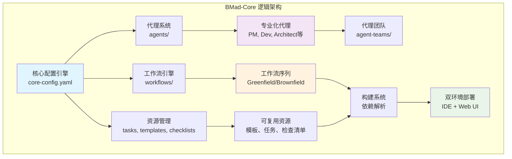
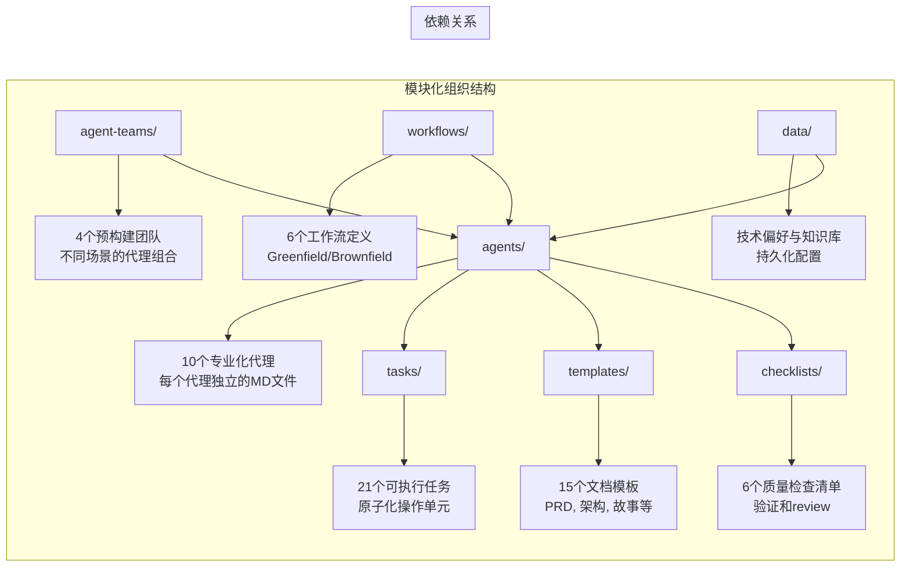
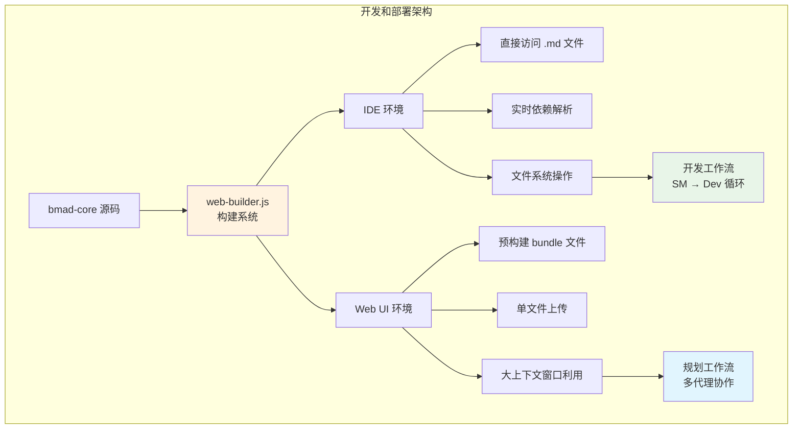
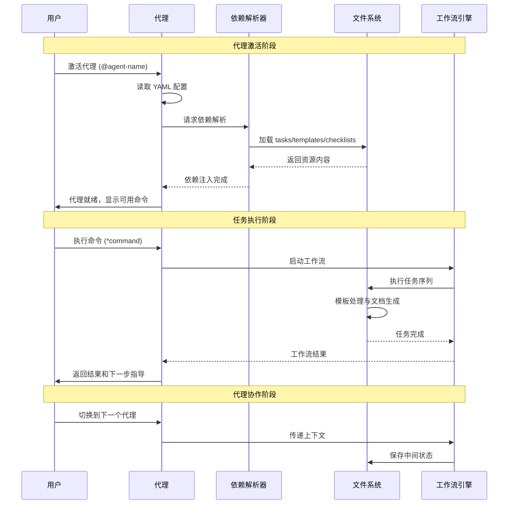
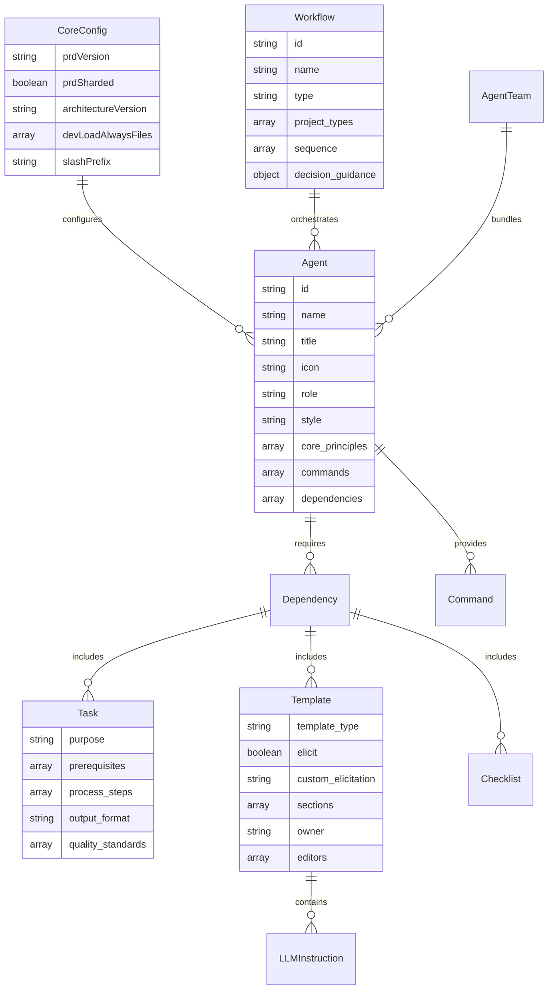

# bmad-core 技术总览文档

## 1. 项目背景与定位

### 1.1 项目概述

**BMad-core** 是 BMad-Method (Breakthrough Method of Agile AI-driven Development) 框架的核心引擎，这是一个革命性的 AI 代理驱动的敏捷开发框架。该项目将人工智能代理与传统敏捷开发方法论深度融合，通过专业化的 AI 代理团队实现从概念到部署的全流程自动化开发。

### 1.2 核心价值主张

- **"Vibe CEO" 模式**: 将用户转变为战略决策者，由 AI 代理团队负责具体执行
- **专业化代理系统**: 每个 AI 代理精通特定的敏捷角色 (PM、开发者、架构师等)
- **双环境架构**: 针对规划阶段 (Web UI) 和开发阶段 (IDE) 的优化支持
- **模块化设计**: 高度可扩展的架构，支持扩展包和自定义配置

### 1.3 技术定位

BMad-core 定位为一个**配置驱动的 AI 代理编排平台**，通过 YAML 配置和 Markdown 文档实现复杂的工作流自动化。它不是传统的代码框架，而是一个**声明式的智能系统**，能够理解业务需求并自动生成相应的开发工件。

## 2. 技术栈清单

### 2.1 核心技术组件

| 类别 | 技术 | 版本/规范 | 用途说明 | 关键特性 |
|------|------|-----------|----------|----------|
| **配置引擎** | YAML | 1.2 | 代理定义、工作流配置、模板系统 | 声明式配置、类型安全 |
| **文档系统** | Markdown + YAML Front Matter | - | 代理人格定义、任务描述 | 人类可读、AI 可解析 |
| **模板引擎** | 自定义 YAML 模板系统 | v4 | 交互式文档生成 | LLM 指令嵌入、用户交互 |
| **工作流引擎** | YAML 工作流定义 | v4 | 多代理协作序列管理 | 状态管理、条件分支 |
| **依赖注入** | 自定义依赖解析系统 | v4 | 动态资源加载 | 缓存机制、路径解析 |
| **状态管理** | 文件系统持久化 | - | 项目配置、偏好设置 | 版本兼容、增量更新 |

### 2.2 支持的环境

| 环境类型 | 技术栈 | 部署方式 | 用途 |
|----------|--------|----------|------|
| **IDE 环境** | Cursor, VS Code | 直接文件访问 | 开发阶段实现 |
| **Web UI 环境** | ChatGPT, Gemini, Claude | 预构建 bundle | 规划阶段设计 |
| **构建系统** | Node.js, web-builder.js | 自动化构建 | 多环境部署 |

### 2.3 扩展生态系统

- **基础架构**: bmad-infrastructure-devops
- **游戏开发**: bmad-2d-phaser-game-dev, bmad-2d-unity-game-dev  
- **创意写作**: bmad-creative-writing
- **文档生成**: bmad-docs-generator (本次分析使用的扩展包)

## 3. 架构设计

### 3.1 逻辑视图 (Logical View)

### 3.2 开发视图 (Development View)

### 3.3 部署视图 (Deployment View)

### 3.4 运行时视图 (Runtime View)

### 3.5 数据视图 (Data View)

## 4. 核心设计原则

### 4.1 架构设计原则

1. **配置驱动 (Configuration-Driven)**
   - 所有行为通过 YAML 配置定义
   - 代码逻辑与配置分离
   - 支持热更新和动态加载

2. **声明式设计 (Declarative Design)**
   - 用户描述"什么"而非"如何"
   - 系统自动推断执行步骤
   - 减少用户认知负担

3. **模块化架构 (Modular Architecture)**
   - 每个代理独立封装
   - 可插拔的扩展包系统
   - 最小化组件间耦合

4. **双环境优化 (Dual Environment Optimization)**
   - IDE 环境: 轻量级，实时操作
   - Web UI 环境: 预构建，大上下文

### 4.2 代理设计模式

1. **单一职责原则 (Single Responsibility)**
   - 每个代理专注一个敏捷角色
   - 明确的能力边界
   - 避免能力重叠

2. **依赖注入模式 (Dependency Injection)**
   - 运行时动态加载资源
   - 支持自定义扩展
   - 缓存机制优化性能

3. **状态机模式 (State Machine)**
   - 清晰的状态转换
   - 可预测的行为
   - 错误恢复机制

### 4.3 工作流设计模式

1. **管道模式 (Pipeline Pattern)**
   - 阶段化的工作流执行
   - 清晰的输入输出定义
   - 中间状态持久化

2. **编排模式 (Orchestration Pattern)**
   - 集中式工作流控制
   - 代理间协调
   - 异常处理和回滚

## 5. 关键技术特性

### 5.1 智能依赖解析

BMad-core 实现了一套先进的依赖解析系统：

- **动态加载**: 运行时按需加载任务、模板和检查清单
- **路径解析**: 自动解析 `{root}/{type}/{name}` 格式的依赖引用
- **缓存机制**: 避免重复加载，提升性能
- **版本兼容**: 支持 v3 和 v4 版本的文档结构

### 5.2 交互式模板系统

独特的模板处理机制：

- **LLM 指令嵌入**: 模板中直接包含 AI 处理指令
- **强制交互**: `elicit: true` 确保用户参与关键决策
- **渐进式展开**: 逐步引导用户完成复杂文档
- **上下文保持**: 在模板处理过程中维持状态

### 5.3 工作流编排引擎

强大的多代理协作能力：

- **条件分支**: 基于条件的工作流路由
- **检查点机制**: 关键节点的用户确认
- **状态传递**: 代理间的上下文传递
- **异常处理**: 失败重试和降级策略

### 5.4 扩展包架构

高度可扩展的插件系统：

- **独立命名空间**: 每个扩展包有独立的 slash 前缀
- **资源覆盖**: 扩展包可覆盖核心资源
- **版本管理**: 支持扩展包的版本控制
- **热插拔**: 无需重启即可加载新扩展

## 6. 性能与可扩展性

### 6.1 性能优化策略

1. **懒加载 (Lazy Loading)**
   - 按需加载代理依赖
   - 减少内存占用
   - 提升启动速度

2. **缓存策略 (Caching Strategy)**
   - 文件内容缓存
   - 依赖关系缓存
   - 模板编译缓存

3. **上下文管理 (Context Management)**
   - 最小化上下文窗口
   - 清理无关信息
   - 聚焦核心任务

### 6.2 可扩展性设计

1. **水平扩展 (Horizontal Scaling)**
   - 支持自定义代理
   - 扩展包生态系统
   - 社区贡献机制

2. **垂直扩展 (Vertical Scaling)**
   - 增强现有代理能力
   - 复杂工作流支持
   - 高级模板功能

## 7. 安全与质量保证

### 7.1 安全机制

1. **权限控制**
   - 代理角色权限限制
   - 文件访问控制
   - 操作审计日志

2. **输入验证**
   - YAML 配置验证
   - 模板参数检查
   - 用户输入净化

### 7.2 质量保证

1. **多层次检查清单**
   - 代码质量检查
   - 架构一致性验证
   - 产品需求追溯

2. **自动化验证**
   - 配置文件语法检查
   - 依赖关系验证
   - 工作流完整性测试

## 8. 发展路线图

### 8.1 当前版本 (v4)

- ✅ 模块化代理系统
- ✅ 双环境支持
- ✅ 扩展包架构
- ✅ 交互式模板系统

### 8.2 未来规划

1. **短期目标 (6个月)**
   - 性能优化和稳定性提升
   - 更多扩展包开发
   - 社区工具生态

2. **中期目标 (1年)**
   - AI 代理能力增强
   - 多语言支持
   - 企业级功能

3. **长期愿景 (2年+)**
   - 自适应 AI 代理
   - 领域特定语言 (DSL)
   - 云原生部署

---

**文档生成信息**:
- 生成时间: 2025-08-17
- 生成工具: BMad Documentation Generator (bmad-docs-generator v1.0.0)  
- 代理: Tech Architect (Sarah)
- 基于: Code Analyst 深度扫描结果
- 文档版本: v1.0
