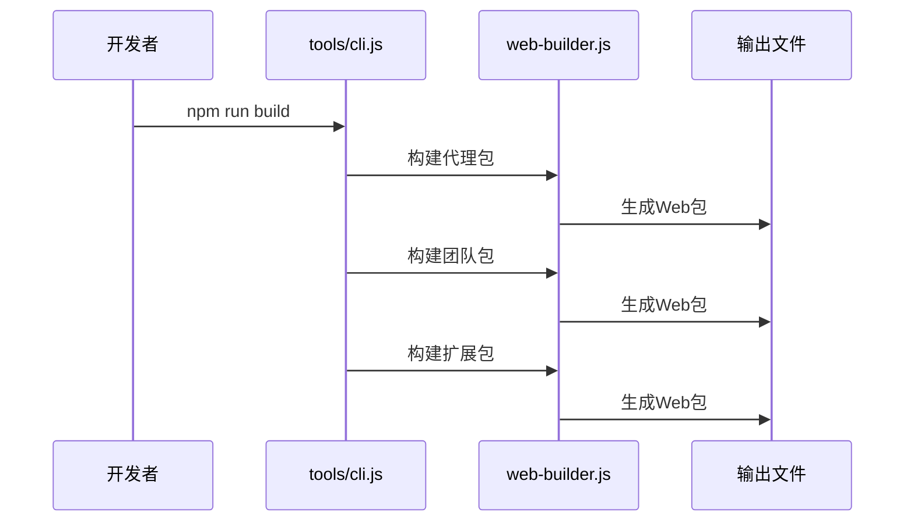
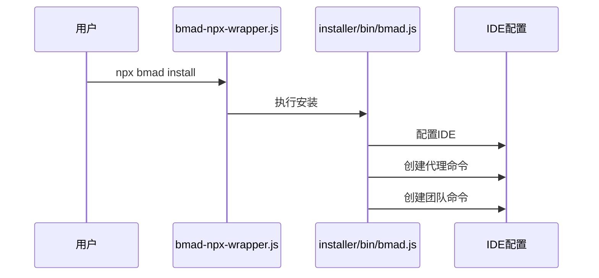
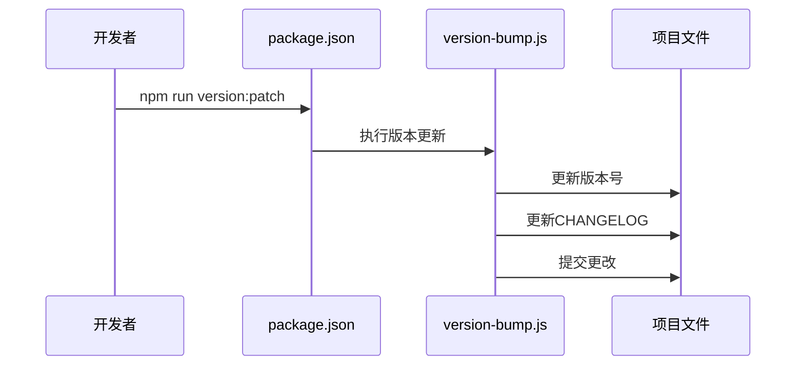
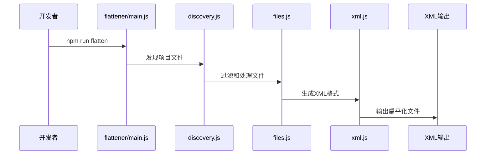

# BMad Method Tools 架构图

```mermaid
graph TB
    %% 用户交互层
    User[👤 用户] --> CLI[🖥️ CLI 命令]
    User --> NPX[npx bmad]
    User --> NPM[npm run *]

    %% CLI 入口层
    CLI --> MainCLI[tools/cli.js]
    NPX --> NPXWrapper[tools/bmad-npx-wrapper.js]
    NPM --> PackageScripts[package.json scripts]

    %% 主要工具分类
    subgraph "🛠️ 构建工具 (Build Tools)"
        WebBuilder[tools/builders/web-builder.js]
        MainCLI --> WebBuilder
        WebBuilder --> AgentBundles[📦 代理包]
        WebBuilder --> TeamBundles[📦 团队包]
        WebBuilder --> ExpansionBundles[📦 扩展包]
    end

    subgraph "🔧 安装工具 (Installation Tools)"
        Installer[tools/installer/bin/bmad.js]
        NPXWrapper --> Installer
        Installer --> IDESetup[IDE 配置]
        Installer --> AgentCommands[代理命令]
        Installer --> TeamCommands[团队命令]
    end

    subgraph "📊 代码处理工具 (Code Processing)"
        Flattener[tools/flattener/main.js]
        MainCLI --> Flattener
        Flattener --> Discovery[tools/flattener/discovery.js]
        Flattener --> Files[tools/flattener/files.js]
        Flattener --> XML[tools/flattener/xml.js]
        Flattener --> Stats[tools/flattener/stats.js]
        Flattener --> XMLOutput[📄 扁平化XML]
    end

    subgraph "🔄 版本管理工具 (Version Management)"
        VersionBump[tools/version-bump.js]
        BumpAll[tools/bump-all-versions.js]
        BumpExpansion[tools/bump-expansion-version.js]
        UpdateExpansion[tools/update-expansion-version.js]
        PackageScripts --> VersionBump
        PackageScripts --> BumpAll
        PackageScripts --> BumpExpansion
        PackageScripts --> UpdateExpansion
    end

    subgraph "🔍 开发工具 (Development Tools)"
        YAMLFormat[tools/yaml-format.js]
        PreviewRelease[tools/preview-release-notes.js]
        SyncInstaller[tools/sync-installer-version.js]
        PackageScripts --> YAMLFormat
        PackageScripts --> PreviewRelease
        PackageScripts --> SyncInstaller
    end

    subgraph "⬆️ 升级工具 (Upgrade Tools)"
        V3ToV4[tools/upgraders/v3-to-v4-upgrader.js]
        MainCLI --> V3ToV4
        V3ToV4 --> Migration[版本迁移]
    end

    subgraph "📚 共享库 (Shared Libraries)"
        Lib[tools/lib/]
        Shared[tools/shared/]
        Lib --> DependencyResolver[dependency-resolver.js]
        Lib --> YAMLUtils[yaml-utils.js]
        Shared --> BannerArt[bannerArt.js]
    end

    %% 输出和结果
    AgentBundles --> WebOutput[🌐 Web 包输出]
    TeamBundles --> WebOutput
    ExpansionBundles --> WebOutput
    IDESetup --> IDEConfig[⚙️ IDE 配置]
    XMLOutput --> AIAnalysis[🤖 AI 分析]

    %% 样式定义
    classDef userClass fill:#e1f5fe,stroke:#01579b,stroke-width:2px
    classDef toolClass fill:#f3e5f5,stroke:#4a148c,stroke-width:2px
    classDef outputClass fill:#e8f5e8,stroke:#1b5e20,stroke-width:2px
    classDef processClass fill:#fff3e0,stroke:#e65100,stroke-width:2px

    class User userClass
    class MainCLI,NPXWrapper,WebBuilder,Installer,Flattener,VersionBump,BumpAll,YAMLFormat,V3ToV4 toolClass
    class WebOutput,IDEConfig,XMLOutput,AIAnalysis outputClass
    class AgentBundles,TeamBundles,ExpansionBundles,IDESetup,AgentCommands,TeamCommands,Migration processClass
```

## 工具使用流程

### 1. 🚀 开发阶段流程

### 2. 📦 安装阶段流程

### 3. 🔄 版本管理流程

### 4. 📊 代码扁平化流程

## 工具分类说明

### 🛠️ 构建工具

- **用途**: 将代理、团队、扩展包构建为Web可用的格式
- **主要文件**: `tools/builders/web-builder.js`
- **输出**: Web包、HTML文件、JavaScript文件

### 🔧 安装工具

- **用途**: 在用户IDE中安装和配置BMad Method
- **主要文件**: `tools/installer/bin/bmad.js`
- **输出**: IDE配置、命令文件、配置文件

### 📊 代码处理工具

- **用途**: 将代码库扁平化为AI可分析的格式
- **主要文件**: `tools/flattener/main.js`
- **输出**: XML格式的代码文件

### 🔄 版本管理工具

- **用途**: 管理项目版本号和发布流程
- **主要文件**: 各种version-\*.js文件
- **输出**: 更新的版本号、CHANGELOG、发布说明

### 🔍 开发工具

- **用途**: 代码格式化、质量检查、发布预览
- **主要文件**: yaml-format.js、preview-release-notes.js等
- **输出**: 格式化的代码、发布预览

### ⬆️ 升级工具

- **用途**: 处理版本升级和迁移
- **主要文件**: `tools/upgraders/v3-to-v4-upgrader.js`
- **输出**: 升级后的配置和文件

### 📚 共享库

- **用途**: 提供通用工具函数和共享资源
- **主要文件**: `tools/lib/`、`tools/shared/`
- **输出**: 可复用的工具函数和资源
