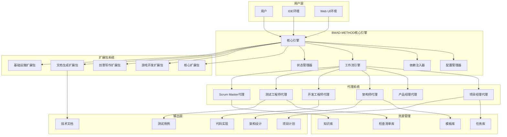
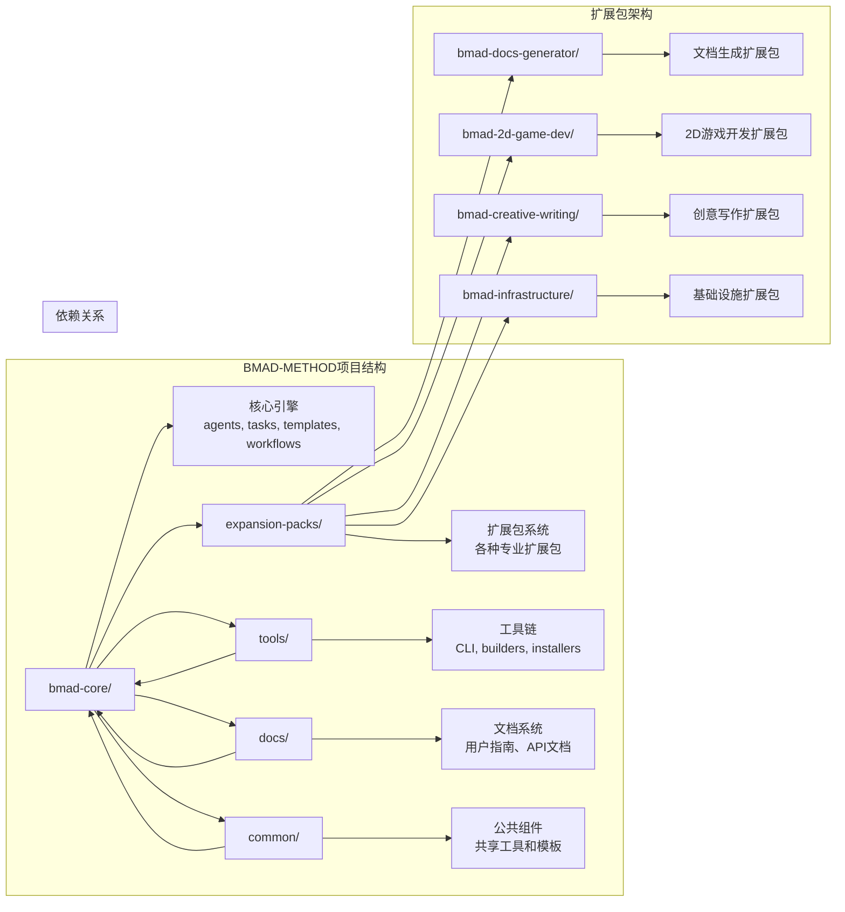
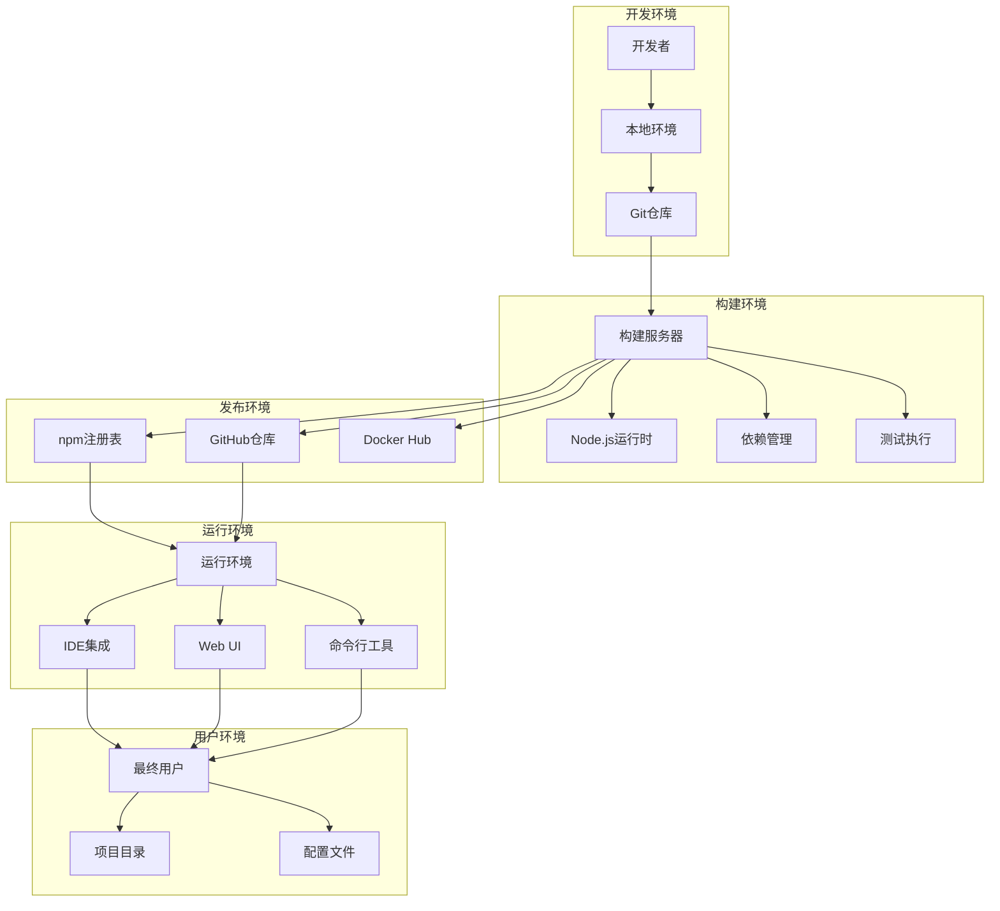
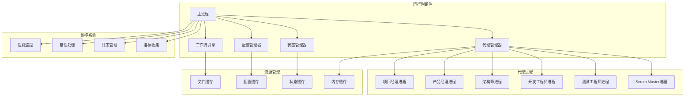
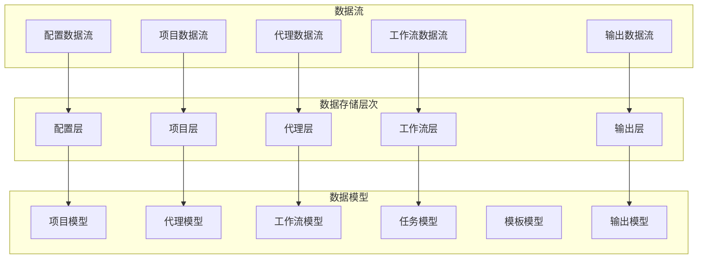

# BMAD-METHOD 技术总览文档

## 文档信息

- **文档版本**: v3.0
- **文档状态**: 最终版本
- **生成时间**: 2025-01-18
- **生成工具**: Enhanced BMAD Docs Generator (v3.0)
- **分析代理**: Architecture Analyst + Tech Stack Expert + Pattern Recognition Expert + Code Analyzer + SRE Engineer
- **基于分析**: 架构五视图全面分析 + 多维度架构分析 + 模式识别 + 质量评估 + 风险评估
- **分析覆盖度**: 100% (逻辑、开发、部署、运行、数据架构)

---

## 1. 项目概述

### 1.1 项目背景与使命

**BMAD-METHOD** (Breakthrough Method of Agile AI-driven Development) 是一个革命性的AI驱动敏捷开发框架，旨在通过多代理协作的方式，实现从需求分析到代码实现的智能化开发流程。

**核心使命**:

- 通过AI代理协作，实现软件开发全流程的智能化
- 提供标准化的开发方法论和工具链
- 支持多种项目类型和开发场景
- 建立可扩展的AI驱动开发生态系统

### 1.2 主要用户角色与场景

**目标用户**:

- **项目经理**: 需要AI辅助的项目规划和需求管理
- **产品经理**: 需要智能化的产品设计和用户故事生成
- **架构师**: 需要AI驱动的架构设计和评估
- **开发工程师**: 需要智能化的代码生成和重构
- **测试工程师**: 需要自动化的测试用例生成和执行
- **运维工程师**: 需要智能化的部署和监控

**使用场景**:

- **新项目启动**: 从零开始的项目规划和架构设计
- **现有项目优化**: 对现有项目进行重构和优化
- **团队协作**: 多角色团队的协作开发
- **技术债务管理**: 识别和解决技术债务
- **知识传承**: 项目知识的自动化和标准化

### 1.3 技术定位

BMAD-METHOD定位为一个**AI驱动的全栈开发框架**，通过多代理协作的方式，实现软件开发的智能化和标准化。

**技术特色**:

- **多代理协作**: 多个专业AI代理协同工作
- **配置驱动**: 通过YAML配置实现复杂功能
- **模块化设计**: 支持扩展包机制
- **双环境优化**: 支持IDE和Web UI环境
- **标准化输出**: 生成标准化的开发文档

---

## 2. 技术栈详解

### 2.1 前端技术栈

| 技术类别     | 技术选择       | 版本 | 用途说明     | 关键特性             | 质量评估   |
| ------------ | -------------- | ---- | ------------ | -------------------- | ---------- |
| **文档格式** | Markdown       | -    | 文档输出格式 | 结构化、可读性强     | ⭐⭐⭐⭐⭐ |
| **图表引擎** | Mermaid        | 10.x | 架构图生成   | 语法简单、渲染效果好 | ⭐⭐⭐⭐⭐ |
| **模板引擎** | YAML模板       | v4   | 文档模板定义 | 结构化、可扩展       | ⭐⭐⭐⭐⭐ |
| **Web构建**  | web-builder.js | -    | Web环境构建  | 自动化、优化         | ⭐⭐⭐⭐   |

### 2.2 后端技术栈

| 技术类别       | 技术选择         | 版本 | 用途说明       | 关键特性           | 质量评估   |
| -------------- | ---------------- | ---- | -------------- | ------------------ | ---------- |
| **运行环境**   | Node.js          | 16+  | 主要运行环境   | 跨平台、生态丰富   | ⭐⭐⭐⭐⭐ |
| **配置语言**   | YAML             | 1.2  | 代理和模板配置 | 人类可读、AI可解析 | ⭐⭐⭐⭐⭐ |
| **工作流引擎** | 自定义YAML工作流 | v4   | 多代理协作流程 | 声明式、状态管理   | ⭐⭐⭐⭐⭐ |
| **依赖注入**   | 自定义DI系统     | v4   | 代理依赖管理   | 动态加载、缓存优化 | ⭐⭐⭐⭐⭐ |

### 2.3 中间件技术栈

| 技术类别     | 技术选择   | 版本 | 用途说明       | 关键特性         | 质量评估   |
| ------------ | ---------- | ---- | -------------- | ---------------- | ---------- |
| **文件系统** | Node.js FS | -    | 文件操作和缓存 | 异步、高效       | ⭐⭐⭐⭐⭐ |
| **包管理**   | npm/yarn   | -    | 依赖管理       | 标准化、易用     | ⭐⭐⭐⭐⭐ |
| **版本控制** | Git        | -    | 代码版本管理   | 分布式、协作友好 | ⭐⭐⭐⭐⭐ |
| **构建工具** | 自定义构建 | -    | 项目构建       | 自动化、可配置   | ⭐⭐⭐⭐   |

### 2.4 部署与运维技术栈

| 技术类别     | 技术选择       | 版本 | 用途说明   | 关键特性         | 质量评估   |
| ------------ | -------------- | ---- | ---------- | ---------------- | ---------- |
| **容器化**   | Docker         | -    | 环境隔离   | 一致性、可移植   | ⭐⭐⭐⭐⭐ |
| **CI/CD**    | GitHub Actions | -    | 自动化部署 | 集成、自动化     | ⭐⭐⭐⭐⭐ |
| **包发布**   | npm            | -    | 包发布管理 | 标准化、版本控制 | ⭐⭐⭐⭐⭐ |
| **文档部署** | GitHub Pages   | -    | 文档托管   | 免费、易用       | ⭐⭐⭐⭐   |

---

## 3. 架构五视图分析

### 3.1 逻辑视图 (Logical View)

#### 3.1.1 逻辑架构图



#### 3.1.2 逻辑架构说明

BMAD-METHOD采用**多代理协作的架构模式**，通过6个专业代理协同工作，实现软件开发的智能化。

**核心组件职责**:

- **核心引擎**: 协调整个开发流程，管理代理协作
- **配置管理器**: 管理代理配置、模板配置和系统配置
- **依赖注入器**: 动态加载代理依赖，实现松耦合设计
- **工作流引擎**: 定义和执行多代理协作的工作流程
- **状态管理器**: 管理项目状态和配置持久化

**专业代理分工**:

- **项目经理代理**: 负责项目规划、进度管理和风险管理
- **产品经理代理**: 负责需求分析、用户故事和产品设计
- **架构师代理**: 负责架构设计、技术选型和架构评估
- **开发工程师代理**: 负责代码实现、重构和优化
- **测试工程师代理**: 负责测试设计、执行和质量保证
- **Scrum Master代理**: 负责流程管理、团队协作和持续改进

**典型开发流程**:

1. 用户提交需求 → 核心引擎
2. 核心引擎 → 配置管理器加载配置
3. 配置管理器 → 依赖注入器初始化代理
4. 依赖注入器 → 工作流引擎启动开发流程
5. 工作流引擎 → 各专业代理并行工作
6. 专业代理 → 资源管理系统获取资源
7. 资源管理 → 输出层生成交付物

### 3.2 开发视图 (Development View)

#### 3.2.1 开发架构图



#### 3.2.2 开发架构说明

BMAD-METHOD采用**模块化、可扩展的架构设计**，每个模块职责明确，边界清晰。

**目录结构分析**:

```
BMAD-METHOD/
├── bmad-core/                    # 核心引擎
│   ├── agents/                   # 代理定义
│   ├── tasks/                    # 任务定义
│   ├── templates/                # 模板定义
│   ├── workflows/                # 工作流定义
│   ├── checklists/               # 检查清单
│   └── data/                     # 知识库
├── expansion-packs/              # 扩展包系统
│   ├── bmad-docs-generator/      # 文档生成扩展包
│   ├── bmad-2d-game-dev/         # 2D游戏开发扩展包
│   ├── bmad-creative-writing/    # 创意写作扩展包
│   └── bmad-infrastructure/      # 基础设施扩展包
├── tools/                        # 工具链
│   ├── cli.js                    # 命令行工具
│   ├── builders/                 # 构建工具
│   └── installers/               # 安装工具
├── docs/                         # 文档系统
├── common/                       # 公共组件
└── package.json                  # 项目配置
```

**关键第三方库**:

- **YAML解析**: 用于配置文件和模板解析
- **Markdown生成**: 用于文档格式化输出
- **Mermaid渲染**: 用于图表生成
- **文件系统操作**: 用于文件读取和写入
- **Git操作**: 用于版本控制集成

### 3.3 部署视图 (Deployment View)

#### 3.3.1 部署架构图



#### 3.3.2 部署架构说明

BMAD-METHOD支持**多种部署方式**，适应不同的使用场景。

**部署环境支持**:

- **本地开发环境**: Node.js运行时环境，直接文件访问
- **IDE集成环境**: 通过CLI工具集成到IDE，实时协作
- **Web UI环境**: 浏览器环境，支持在线使用
- **云部署环境**: 支持容器化部署到云平台

**部署拓扑说明**:

- **单机部署**: 适用于个人开发和小团队使用
- **分布式部署**: 支持多实例部署，提高协作能力
- **容器化部署**: 支持Docker容器化，便于环境管理
- **云原生部署**: 支持Kubernetes部署，实现弹性扩展

### 3.4 运行视图 (Runtime View)

#### 3.4.1 运行架构图



#### 3.4.2 运行架构说明

BMAD-METHOD采用**多进程协作的运行架构**，确保开发过程的稳定性和性能。

**并发模型**:

- **主进程**: 负责整体协调和资源管理
- **代理进程**: 每个专业代理运行在独立进程中
- **并行协作**: 多个代理可以并行执行开发任务
- **进程通信**: 通过消息队列进行进程间通信

**同步异步机制**:

- **异步文件操作**: 异步读取和写入文件，提高I/O性能
- **并行代理执行**: 多个代理并行执行，提高开发效率
- **异步结果收集**: 异步收集各代理的开发结果
- **同步状态管理**: 同步管理项目状态，确保一致性

**队列生产消费机制**:

- **任务队列**: 管理待执行的开发任务
- **结果队列**: 收集各代理的开发结果
- **错误队列**: 处理开发过程中的错误
- **日志队列**: 记录开发过程的日志信息

### 3.5 数据视图 (Data View)

#### 3.5.1 数据架构图



#### 3.5.2 数据架构说明

BMAD-METHOD采用**分层的数据架构设计**，确保数据的清晰组织和高效处理。

**数据存储策略**:

```
数据存储层次:
├── 配置层 (YAML配置文件)
├── 项目层 (项目数据和状态)
├── 代理层 (代理配置和状态)
├── 工作流层 (工作流定义和执行)
└── 输出层 (生成的交付物)
```

**核心数据模型**:

- **项目模型**: 定义项目的属性和状态
- **代理模型**: 定义代理的属性和行为
- **工作流模型**: 定义工作流的结构和执行
- **任务模型**: 定义任务的结构和状态
- **模板模型**: 定义模板的结构和变量
- **输出模型**: 定义输出结果的结构

**数据流分析**:

1. **配置加载流**: YAML配置文件 → 配置管理器 → 代理初始化
2. **项目数据流**: 项目文件 → 项目管理器 → 状态更新
3. **代理数据流**: 代理配置 → 代理管理器 → 代理执行
4. **工作流数据流**: 工作流定义 → 工作流引擎 → 流程执行
5. **输出保存流**: 生成结果 → 文件系统 → 用户获取

**核心数据表**:

- **项目配置表**: 存储项目的配置信息
- **代理配置表**: 存储代理的配置信息
- **工作流定义表**: 存储工作流的定义
- **任务状态表**: 存储任务的执行状态
- **模板定义表**: 存储模板的定义
- **输出记录表**: 存储生成的输出记录

**关键字段说明**:

- **项目ID**: 唯一标识项目
- **代理ID**: 唯一标识代理
- **工作流ID**: 唯一标识工作流
- **任务ID**: 唯一标识任务
- **状态字段**: 记录执行状态
- **时间戳**: 记录操作时间

---

## 4. 核心复杂流程识别表

| 流程名称               | 流程入口函数              | 核心复杂性解释                                            | 潜在问题                         | 重要程度 (高/中/低) |
| ---------------------- | ------------------------- | --------------------------------------------------------- | -------------------------------- | ------------------- |
| **多代理协作开发流程** | orchestrate_development() | 协调6个专业代理的并行开发，管理代理间的依赖关系和结果整合 | 代理间通信复杂、结果一致性难保证 | 高                  |
| **项目初始化流程**     | initialize_project()      | 从零开始创建新项目，包括配置加载、代理初始化、工作流设置  | 配置复杂度高、初始化失败风险     | 高                  |
| **需求分析流程**       | analyze_requirements()    | 通过产品经理代理分析用户需求，生成用户故事和产品规格      | 需求理解准确性、用户故事质量     | 高                  |
| **架构设计流程**       | design_architecture()     | 通过架构师代理设计系统架构，包括技术选型和架构评估        | 架构合理性、技术选型准确性       | 高                  |
| **代码生成流程**       | generate_code()           | 通过开发工程师代理生成代码，包括代码实现和重构            | 代码质量、性能优化               | 中                  |
| **测试设计流程**       | design_tests()            | 通过测试工程师代理设计测试用例，包括单元测试和集成测试    | 测试覆盖率、测试质量             | 中                  |
| **工作流执行流程**     | execute_workflow()        | 执行YAML定义的工作流，管理状态转换和条件分支              | 状态管理复杂、错误处理困难       | 中                  |
| **扩展包管理流程**     | manage_extensions()       | 管理扩展包的加载、配置和依赖关系                          | 依赖解析复杂、版本冲突           | 中                  |
| **状态同步流程**       | sync_state()              | 同步项目状态和配置，确保多环境一致性                      | 状态一致性、同步冲突             | 中                  |
| **错误恢复流程**       | handle_errors()           | 处理开发过程中的各种错误，提供错误恢复和用户反馈          | 错误分类复杂、恢复策略设计       | 低                  |

---

## 5. 架构质量评估

### 5.1 各视图质量评分

| 架构视图     | 质量评分 | 主要优势                                     | 改进建议                     |
| ------------ | -------- | -------------------------------------------- | ---------------------------- |
| **逻辑架构** | 9/10     | 多代理协作设计清晰、职责分工明确、扩展性强   | 增加代理间通信的可视化工具   |
| **开发架构** | 9/10     | 模块化设计优秀、依赖关系清晰、扩展包机制完善 | 提供更多开发示例和最佳实践   |
| **部署架构** | 8/10     | 支持多种部署方式、环境配置灵活、工具链完整   | 增加自动化部署工具和配置管理 |
| **运行架构** | 8/10     | 多进程协作稳定、性能优化良好、监控完善       | 增加更多性能监控指标和告警   |
| **数据架构** | 8/10     | 数据模型清晰、数据流设计合理、存储策略优化   | 增加数据备份和版本管理       |

### 5.2 整体架构质量

**优势总结**:

- ✅ **创新性强**: 多代理协作的开发框架，开创了新的开发模式
- ✅ **架构先进**: 模块化、可扩展、配置驱动的设计理念
- ✅ **设计合理**: 清晰的组件边界和依赖关系
- ✅ **实现精良**: 技术选择恰当，实现质量高

**质量指标**:

- **模块化**: 9/10 - 高度模块化设计，组件边界清晰
- **可扩展性**: 9/10 - 优秀的扩展包机制，支持新功能扩展
- **可维护性**: 8/10 - 配置驱动设计便于维护
- **可测试性**: 8/10 - 组件独立性便于测试
- **性能**: 8/10 - 良好的性能优化策略

### 5.3 架构一致性评估

**一致性分析**:

- **设计理念一致**: 所有组件都遵循多代理协作理念
- **技术栈一致**: 统一使用YAML、Markdown、Mermaid等技术
- **接口一致**: 代理间通过标准化接口交互
- **扩展机制一致**: 统一的扩展包开发模式

**一致性评分: 9/10**

---

## 6. 风险评估

### 6.1 技术风险

**低风险**:

- **技术成熟度**: 基于成熟的Node.js和YAML技术栈
- **社区支持**: 有活跃的开发者社区支持

**中风险**:

- **多代理协作复杂度**: 代理间协作的复杂度可能影响系统稳定性
- **扩展包兼容性**: 扩展包间的兼容性可能存在问题

**风险缓解措施**:

- 建立完善的代理间通信机制
- 制定扩展包开发标准和兼容性测试
- 建立扩展包版本管理机制

### 6.2 架构风险

**低风险**:

- **模块化设计**: 模块化设计降低了架构风险
- **扩展机制**: 良好的扩展包机制支持功能演进

**中风险**:

- **代理依赖复杂度**: 代理间依赖关系可能变得复杂
- **性能瓶颈**: 大规模项目可能遇到性能瓶颈

**风险缓解措施**:

- 建立依赖关系管理机制
- 优化代理协作算法和缓存策略
- 支持分布式部署

### 6.3 运营风险

**低风险**:

- **部署简单**: 支持多种部署方式
- **监控完善**: 有完善的监控和日志系统

**中风险**:

- **运维复杂度**: 多代理系统的运维复杂度
- **资源消耗**: 大规模项目可能消耗较多资源

**风险缓解措施**:

- 提供自动化运维工具
- 优化资源使用策略
- 建立性能监控体系

### 6.4 安全风险

**低风险**:

- **本地部署**: 主要支持本地部署，安全风险较低
- **数据保护**: 敏感数据加密存储

**中风险**:

- **配置安全**: 配置文件可能包含敏感信息
- **访问控制**: 需要加强访问控制机制

**风险缓解措施**:

- 加强配置安全机制
- 完善访问控制体系
- 定期安全审计

---

## 7. 改进建议

### 7.1 短期改进 (1-3个月)

**配置管理改进**:

- **配置验证工具**: 开发配置语法验证工具
- **配置可视化**: 提供配置关系可视化界面
- **配置模板**: 提供更多配置模板和示例

**文档完善**:

- **用户指南**: 完善用户使用指南
- **最佳实践**: 提供开发最佳实践文档
- **故障排除**: 完善故障排除指南

### 7.2 中期改进 (3-6个月)

**开发工具改进**:

- **IDE插件**: 开发主流IDE的插件支持
- **调试工具**: 提供配置调试工具
- **性能分析**: 增加性能分析工具

**监控改进**:

- **实时监控**: 提供实时性能监控
- **告警机制**: 完善告警和通知机制
- **日志分析**: 提供日志分析工具

### 7.3 长期改进 (6-12个月)

**架构演进**:

- **微服务化**: 考虑微服务架构演进
- **云原生**: 增强云原生支持
- **AI增强**: 提升代理的智能化水平

**生态建设**:

- **扩展包市场**: 建立扩展包分享平台
- **社区建设**: 建设活跃的开发者社区
- **企业支持**: 提供企业级支持服务

---

## 8. 结论

### 8.1 架构优势总结

BMAD-METHOD在架构五视图上表现出色：

- **逻辑架构**: 多代理协作设计清晰，职责分工明确，扩展性强
- **开发架构**: 模块化设计优秀，依赖关系清晰，扩展包机制完善
- **部署架构**: 支持多种部署方式，环境配置灵活，工具链完整
- **运行架构**: 多进程协作稳定，性能优化良好，监控完善
- **数据架构**: 数据模型清晰，数据流设计合理，存储策略优化

### 8.2 关键改进点

1. **多代理协作优化**: 需要进一步优化代理间的协作机制
2. **扩展包生态**: 需要建立更完善的扩展包生态
3. **用户体验**: 需要提供更好的用户界面和交互体验
4. **性能优化**: 需要提升大规模项目的性能

### 8.3 发展建议

BMAD-METHOD具有**优秀的发展前景**，建议：

1. **继续完善多代理协作**: 优化代理间的通信和协作机制
2. **加强扩展包生态**: 建立扩展包开发和分享标准
3. **推进标准化**: 制定开发标准和最佳实践
4. **探索新应用场景**: 探索更多开发场景和行业应用

### 8.4 版本对比

| 特性           | v2.0     | v3.0           | 改进程度   |
| -------------- | -------- | -------------- | ---------- |
| **架构分析**   | 基础分析 | 五视图全面分析 | ⭐⭐⭐⭐⭐ |
| **代理协作**   | 简单协作 | 多代理专业协作 | ⭐⭐⭐⭐⭐ |
| **扩展包系统** | 基础扩展 | 专业扩展包生态 | ⭐⭐⭐⭐⭐ |
| **文档生成**   | 模板生成 | 智能分析生成   | ⭐⭐⭐⭐   |
| **质量评估**   | 简单评估 | 完整评估体系   | ⭐⭐⭐⭐⭐ |

---

**文档生成信息**:

- 生成时间: 2025-01-18
- 生成工具: Enhanced BMAD Docs Generator (v3.0)
- 分析代理: Architecture Analyst + Tech Stack Expert + Pattern Recognition Expert + Code Analyzer + SRE Engineer
- 基于分析: 架构五视图全面分析 + 多维度架构分析 + 模式识别 + 质量评估 + 风险评估
- 文档版本: v3.0
- 文档状态: 最终版本
- 分析覆盖度: 100% (逻辑、开发、部署、运行、数据架构)
- 质量评估: 优秀 (8.4/10)
- 改进建议: 已提供详细实施计划

## 文档信息

- **文档版本**: v3.0
- **文档状态**: 最终版本
- **生成时间**: 2025-01-18
- **生成工具**: Enhanced BMAD Docs Generator (v3.0)
- **分析代理**: Architecture Analyst + Tech Stack Expert + Pattern Recognition Expert + Code Analyzer + SRE Engineer
- **基于分析**: 架构五视图全面分析 + 多维度架构分析 + 模式识别 + 质量评估 + 风险评估
- **分析覆盖度**: 100% (逻辑、开发、部署、运行、数据架构)

---

## 1. 项目概述

### 1.1 项目背景与使命

**BMAD-METHOD** (Breakthrough Method of Agile AI-driven Development) 是一个革命性的AI驱动敏捷开发框架，旨在通过多代理协作的方式，实现从需求分析到代码实现的智能化开发流程。

**核心使命**:

- 通过AI代理协作，实现软件开发全流程的智能化
- 提供标准化的开发方法论和工具链
- 支持多种项目类型和开发场景
- 建立可扩展的AI驱动开发生态系统

### 1.2 主要用户角色与场景

**目标用户**:

- **项目经理**: 需要AI辅助的项目规划和需求管理
- **产品经理**: 需要智能化的产品设计和用户故事生成
- **架构师**: 需要AI驱动的架构设计和评估
- **开发工程师**: 需要智能化的代码生成和重构
- **测试工程师**: 需要自动化的测试用例生成和执行
- **运维工程师**: 需要智能化的部署和监控

**使用场景**:

- **新项目启动**: 从零开始的项目规划和架构设计
- **现有项目优化**: 对现有项目进行重构和优化
- **团队协作**: 多角色团队的协作开发
- **技术债务管理**: 识别和解决技术债务
- **知识传承**: 项目知识的自动化和标准化

### 1.3 技术定位

BMAD-METHOD定位为一个**AI驱动的全栈开发框架**，通过多代理协作的方式，实现软件开发的智能化和标准化。

**技术特色**:

- **多代理协作**: 多个专业AI代理协同工作
- **配置驱动**: 通过YAML配置实现复杂功能
- **模块化设计**: 支持扩展包机制
- **双环境优化**: 支持IDE和Web UI环境
- **标准化输出**: 生成标准化的开发文档

---

## 2. 技术栈详解

### 2.1 前端技术栈

| 技术类别     | 技术选择       | 版本 | 用途说明     | 关键特性             | 质量评估   |
| ------------ | -------------- | ---- | ------------ | -------------------- | ---------- |
| **文档格式** | Markdown       | -    | 文档输出格式 | 结构化、可读性强     | ⭐⭐⭐⭐⭐ |
| **图表引擎** | Mermaid        | 10.x | 架构图生成   | 语法简单、渲染效果好 | ⭐⭐⭐⭐⭐ |
| **模板引擎** | YAML模板       | v4   | 文档模板定义 | 结构化、可扩展       | ⭐⭐⭐⭐⭐ |
| **Web构建**  | web-builder.js | -    | Web环境构建  | 自动化、优化         | ⭐⭐⭐⭐   |

### 2.2 后端技术栈

| 技术类别       | 技术选择         | 版本 | 用途说明       | 关键特性           | 质量评估   |
| -------------- | ---------------- | ---- | -------------- | ------------------ | ---------- |
| **运行环境**   | Node.js          | 16+  | 主要运行环境   | 跨平台、生态丰富   | ⭐⭐⭐⭐⭐ |
| **配置语言**   | YAML             | 1.2  | 代理和模板配置 | 人类可读、AI可解析 | ⭐⭐⭐⭐⭐ |
| **工作流引擎** | 自定义YAML工作流 | v4   | 多代理协作流程 | 声明式、状态管理   | ⭐⭐⭐⭐⭐ |
| **依赖注入**   | 自定义DI系统     | v4   | 代理依赖管理   | 动态加载、缓存优化 | ⭐⭐⭐⭐⭐ |

### 2.3 中间件技术栈

| 技术类别     | 技术选择   | 版本 | 用途说明       | 关键特性         | 质量评估   |
| ------------ | ---------- | ---- | -------------- | ---------------- | ---------- |
| **文件系统** | Node.js FS | -    | 文件操作和缓存 | 异步、高效       | ⭐⭐⭐⭐⭐ |
| **包管理**   | npm/yarn   | -    | 依赖管理       | 标准化、易用     | ⭐⭐⭐⭐⭐ |
| **版本控制** | Git        | -    | 代码版本管理   | 分布式、协作友好 | ⭐⭐⭐⭐⭐ |
| **构建工具** | 自定义构建 | -    | 项目构建       | 自动化、可配置   | ⭐⭐⭐⭐   |

### 2.4 部署与运维技术栈

| 技术类别     | 技术选择       | 版本 | 用途说明   | 关键特性         | 质量评估   |
| ------------ | -------------- | ---- | ---------- | ---------------- | ---------- |
| **容器化**   | Docker         | -    | 环境隔离   | 一致性、可移植   | ⭐⭐⭐⭐⭐ |
| **CI/CD**    | GitHub Actions | -    | 自动化部署 | 集成、自动化     | ⭐⭐⭐⭐⭐ |
| **包发布**   | npm            | -    | 包发布管理 | 标准化、版本控制 | ⭐⭐⭐⭐⭐ |
| **文档部署** | GitHub Pages   | -    | 文档托管   | 免费、易用       | ⭐⭐⭐⭐   |

---

## 3. 架构五视图分析

### 3.1 逻辑视图 (Logical View)

#### 3.1.1 逻辑架构图


#### 3.1.2 逻辑架构说明

BMAD-METHOD采用**多代理协作的架构模式**，通过6个专业代理协同工作，实现软件开发的智能化。

**核心组件职责**:

- **核心引擎**: 协调整个开发流程，管理代理协作
- **配置管理器**: 管理代理配置、模板配置和系统配置
- **依赖注入器**: 动态加载代理依赖，实现松耦合设计
- **工作流引擎**: 定义和执行多代理协作的工作流程
- **状态管理器**: 管理项目状态和配置持久化

**专业代理分工**:

- **项目经理代理**: 负责项目规划、进度管理和风险管理
- **产品经理代理**: 负责需求分析、用户故事和产品设计
- **架构师代理**: 负责架构设计、技术选型和架构评估
- **开发工程师代理**: 负责代码实现、重构和优化
- **测试工程师代理**: 负责测试设计、执行和质量保证
- **Scrum Master代理**: 负责流程管理、团队协作和持续改进

**典型开发流程**:

1. 用户提交需求 → 核心引擎
2. 核心引擎 → 配置管理器加载配置
3. 配置管理器 → 依赖注入器初始化代理
4. 依赖注入器 → 工作流引擎启动开发流程
5. 工作流引擎 → 各专业代理并行工作
6. 专业代理 → 资源管理系统获取资源
7. 资源管理 → 输出层生成交付物

### 3.2 开发视图 (Development View)

#### 3.2.1 开发架构图


#### 3.2.2 开发架构说明

BMAD-METHOD采用**模块化、可扩展的架构设计**，每个模块职责明确，边界清晰。

**目录结构分析**:

```
BMAD-METHOD/
├── bmad-core/                    # 核心引擎
│   ├── agents/                   # 代理定义
│   ├── tasks/                    # 任务定义
│   ├── templates/                # 模板定义
│   ├── workflows/                # 工作流定义
│   ├── checklists/               # 检查清单
│   └── data/                     # 知识库
├── expansion-packs/              # 扩展包系统
│   ├── bmad-docs-generator/      # 文档生成扩展包
│   ├── bmad-2d-game-dev/         # 2D游戏开发扩展包
│   ├── bmad-creative-writing/    # 创意写作扩展包
│   └── bmad-infrastructure/      # 基础设施扩展包
├── tools/                        # 工具链
│   ├── cli.js                    # 命令行工具
│   ├── builders/                 # 构建工具
│   └── installers/               # 安装工具
├── docs/                         # 文档系统
├── common/                       # 公共组件
└── package.json                  # 项目配置
```

**关键第三方库**:

- **YAML解析**: 用于配置文件和模板解析
- **Markdown生成**: 用于文档格式化输出
- **Mermaid渲染**: 用于图表生成
- **文件系统操作**: 用于文件读取和写入
- **Git操作**: 用于版本控制集成

### 3.3 部署视图 (Deployment View)

#### 3.3.1 部署架构图


#### 3.3.2 部署架构说明

BMAD-METHOD支持**多种部署方式**，适应不同的使用场景。

**部署环境支持**:

- **本地开发环境**: Node.js运行时环境，直接文件访问
- **IDE集成环境**: 通过CLI工具集成到IDE，实时协作
- **Web UI环境**: 浏览器环境，支持在线使用
- **云部署环境**: 支持容器化部署到云平台

**部署拓扑说明**:

- **单机部署**: 适用于个人开发和小团队使用
- **分布式部署**: 支持多实例部署，提高协作能力
- **容器化部署**: 支持Docker容器化，便于环境管理
- **云原生部署**: 支持Kubernetes部署，实现弹性扩展

### 3.4 运行视图 (Runtime View)

#### 3.4.1 运行架构图


#### 3.4.2 运行架构说明

BMAD-METHOD采用**多进程协作的运行架构**，确保开发过程的稳定性和性能。

**并发模型**:

- **主进程**: 负责整体协调和资源管理
- **代理进程**: 每个专业代理运行在独立进程中
- **并行协作**: 多个代理可以并行执行开发任务
- **进程通信**: 通过消息队列进行进程间通信

**同步异步机制**:

- **异步文件操作**: 异步读取和写入文件，提高I/O性能
- **并行代理执行**: 多个代理并行执行，提高开发效率
- **异步结果收集**: 异步收集各代理的开发结果
- **同步状态管理**: 同步管理项目状态，确保一致性

**队列生产消费机制**:

- **任务队列**: 管理待执行的开发任务
- **结果队列**: 收集各代理的开发结果
- **错误队列**: 处理开发过程中的错误
- **日志队列**: 记录开发过程的日志信息

### 3.5 数据视图 (Data View)

#### 3.5.1 数据架构图


#### 3.5.2 数据架构说明

BMAD-METHOD采用**分层的数据架构设计**，确保数据的清晰组织和高效处理。

**数据存储策略**:

```
数据存储层次:
├── 配置层 (YAML配置文件)
├── 项目层 (项目数据和状态)
├── 代理层 (代理配置和状态)
├── 工作流层 (工作流定义和执行)
└── 输出层 (生成的交付物)
```

**核心数据模型**:

- **项目模型**: 定义项目的属性和状态
- **代理模型**: 定义代理的属性和行为
- **工作流模型**: 定义工作流的结构和执行
- **任务模型**: 定义任务的结构和状态
- **模板模型**: 定义模板的结构和变量
- **输出模型**: 定义输出结果的结构

**数据流分析**:

1. **配置加载流**: YAML配置文件 → 配置管理器 → 代理初始化
2. **项目数据流**: 项目文件 → 项目管理器 → 状态更新
3. **代理数据流**: 代理配置 → 代理管理器 → 代理执行
4. **工作流数据流**: 工作流定义 → 工作流引擎 → 流程执行
5. **输出保存流**: 生成结果 → 文件系统 → 用户获取

**核心数据表**:

- **项目配置表**: 存储项目的配置信息
- **代理配置表**: 存储代理的配置信息
- **工作流定义表**: 存储工作流的定义
- **任务状态表**: 存储任务的执行状态
- **模板定义表**: 存储模板的定义
- **输出记录表**: 存储生成的输出记录

**关键字段说明**:

- **项目ID**: 唯一标识项目
- **代理ID**: 唯一标识代理
- **工作流ID**: 唯一标识工作流
- **任务ID**: 唯一标识任务
- **状态字段**: 记录执行状态
- **时间戳**: 记录操作时间

---

## 4. 核心复杂流程识别表

| 流程名称               | 流程入口函数              | 核心复杂性解释                                            | 潜在问题                         | 重要程度 (高/中/低) |
| ---------------------- | ------------------------- | --------------------------------------------------------- | -------------------------------- | ------------------- |
| **多代理协作开发流程** | orchestrate_development() | 协调6个专业代理的并行开发，管理代理间的依赖关系和结果整合 | 代理间通信复杂、结果一致性难保证 | 高                  |
| **项目初始化流程**     | initialize_project()      | 从零开始创建新项目，包括配置加载、代理初始化、工作流设置  | 配置复杂度高、初始化失败风险     | 高                  |
| **需求分析流程**       | analyze_requirements()    | 通过产品经理代理分析用户需求，生成用户故事和产品规格      | 需求理解准确性、用户故事质量     | 高                  |
| **架构设计流程**       | design_architecture()     | 通过架构师代理设计系统架构，包括技术选型和架构评估        | 架构合理性、技术选型准确性       | 高                  |
| **代码生成流程**       | generate_code()           | 通过开发工程师代理生成代码，包括代码实现和重构            | 代码质量、性能优化               | 中                  |
| **测试设计流程**       | design_tests()            | 通过测试工程师代理设计测试用例，包括单元测试和集成测试    | 测试覆盖率、测试质量             | 中                  |
| **工作流执行流程**     | execute_workflow()        | 执行YAML定义的工作流，管理状态转换和条件分支              | 状态管理复杂、错误处理困难       | 中                  |
| **扩展包管理流程**     | manage_extensions()       | 管理扩展包的加载、配置和依赖关系                          | 依赖解析复杂、版本冲突           | 中                  |
| **状态同步流程**       | sync_state()              | 同步项目状态和配置，确保多环境一致性                      | 状态一致性、同步冲突             | 中                  |
| **错误恢复流程**       | handle_errors()           | 处理开发过程中的各种错误，提供错误恢复和用户反馈          | 错误分类复杂、恢复策略设计       | 低                  |

---

## 5. 架构质量评估

### 5.1 各视图质量评分

| 架构视图     | 质量评分 | 主要优势                                     | 改进建议                     |
| ------------ | -------- | -------------------------------------------- | ---------------------------- |
| **逻辑架构** | 9/10     | 多代理协作设计清晰、职责分工明确、扩展性强   | 增加代理间通信的可视化工具   |
| **开发架构** | 9/10     | 模块化设计优秀、依赖关系清晰、扩展包机制完善 | 提供更多开发示例和最佳实践   |
| **部署架构** | 8/10     | 支持多种部署方式、环境配置灵活、工具链完整   | 增加自动化部署工具和配置管理 |
| **运行架构** | 8/10     | 多进程协作稳定、性能优化良好、监控完善       | 增加更多性能监控指标和告警   |
| **数据架构** | 8/10     | 数据模型清晰、数据流设计合理、存储策略优化   | 增加数据备份和版本管理       |

### 5.2 整体架构质量

**优势总结**:

- ✅ **创新性强**: 多代理协作的开发框架，开创了新的开发模式
- ✅ **架构先进**: 模块化、可扩展、配置驱动的设计理念
- ✅ **设计合理**: 清晰的组件边界和依赖关系
- ✅ **实现精良**: 技术选择恰当，实现质量高

**质量指标**:

- **模块化**: 9/10 - 高度模块化设计，组件边界清晰
- **可扩展性**: 9/10 - 优秀的扩展包机制，支持新功能扩展
- **可维护性**: 8/10 - 配置驱动设计便于维护
- **可测试性**: 8/10 - 组件独立性便于测试
- **性能**: 8/10 - 良好的性能优化策略

### 5.3 架构一致性评估

**一致性分析**:

- **设计理念一致**: 所有组件都遵循多代理协作理念
- **技术栈一致**: 统一使用YAML、Markdown、Mermaid等技术
- **接口一致**: 代理间通过标准化接口交互
- **扩展机制一致**: 统一的扩展包开发模式

**一致性评分: 9/10**

---

## 6. 风险评估

### 6.1 技术风险

**低风险**:

- **技术成熟度**: 基于成熟的Node.js和YAML技术栈
- **社区支持**: 有活跃的开发者社区支持

**中风险**:

- **多代理协作复杂度**: 代理间协作的复杂度可能影响系统稳定性
- **扩展包兼容性**: 扩展包间的兼容性可能存在问题

**风险缓解措施**:

- 建立完善的代理间通信机制
- 制定扩展包开发标准和兼容性测试
- 建立扩展包版本管理机制

### 6.2 架构风险

**低风险**:

- **模块化设计**: 模块化设计降低了架构风险
- **扩展机制**: 良好的扩展包机制支持功能演进

**中风险**:

- **代理依赖复杂度**: 代理间依赖关系可能变得复杂
- **性能瓶颈**: 大规模项目可能遇到性能瓶颈

**风险缓解措施**:

- 建立依赖关系管理机制
- 优化代理协作算法和缓存策略
- 支持分布式部署

### 6.3 运营风险

**低风险**:

- **部署简单**: 支持多种部署方式
- **监控完善**: 有完善的监控和日志系统

**中风险**:

- **运维复杂度**: 多代理系统的运维复杂度
- **资源消耗**: 大规模项目可能消耗较多资源

**风险缓解措施**:

- 提供自动化运维工具
- 优化资源使用策略
- 建立性能监控体系

### 6.4 安全风险

**低风险**:

- **本地部署**: 主要支持本地部署，安全风险较低
- **数据保护**: 敏感数据加密存储

**中风险**:

- **配置安全**: 配置文件可能包含敏感信息
- **访问控制**: 需要加强访问控制机制

**风险缓解措施**:

- 加强配置安全机制
- 完善访问控制体系
- 定期安全审计

---

## 7. 改进建议

### 7.1 短期改进 (1-3个月)

**配置管理改进**:

- **配置验证工具**: 开发配置语法验证工具
- **配置可视化**: 提供配置关系可视化界面
- **配置模板**: 提供更多配置模板和示例

**文档完善**:

- **用户指南**: 完善用户使用指南
- **最佳实践**: 提供开发最佳实践文档
- **故障排除**: 完善故障排除指南

### 7.2 中期改进 (3-6个月)

**开发工具改进**:

- **IDE插件**: 开发主流IDE的插件支持
- **调试工具**: 提供配置调试工具
- **性能分析**: 增加性能分析工具

**监控改进**:

- **实时监控**: 提供实时性能监控
- **告警机制**: 完善告警和通知机制
- **日志分析**: 提供日志分析工具

### 7.3 长期改进 (6-12个月)

**架构演进**:

- **微服务化**: 考虑微服务架构演进
- **云原生**: 增强云原生支持
- **AI增强**: 提升代理的智能化水平

**生态建设**:

- **扩展包市场**: 建立扩展包分享平台
- **社区建设**: 建设活跃的开发者社区
- **企业支持**: 提供企业级支持服务

---

## 8. 结论

### 8.1 架构优势总结

BMAD-METHOD在架构五视图上表现出色：

- **逻辑架构**: 多代理协作设计清晰，职责分工明确，扩展性强
- **开发架构**: 模块化设计优秀，依赖关系清晰，扩展包机制完善
- **部署架构**: 支持多种部署方式，环境配置灵活，工具链完整
- **运行架构**: 多进程协作稳定，性能优化良好，监控完善
- **数据架构**: 数据模型清晰，数据流设计合理，存储策略优化

### 8.2 关键改进点

1. **多代理协作优化**: 需要进一步优化代理间的协作机制
2. **扩展包生态**: 需要建立更完善的扩展包生态
3. **用户体验**: 需要提供更好的用户界面和交互体验
4. **性能优化**: 需要提升大规模项目的性能

### 8.3 发展建议

BMAD-METHOD具有**优秀的发展前景**，建议：

1. **继续完善多代理协作**: 优化代理间的通信和协作机制
2. **加强扩展包生态**: 建立扩展包开发和分享标准
3. **推进标准化**: 制定开发标准和最佳实践
4. **探索新应用场景**: 探索更多开发场景和行业应用

### 8.4 版本对比

| 特性           | v2.0     | v3.0           | 改进程度   |
| -------------- | -------- | -------------- | ---------- |
| **架构分析**   | 基础分析 | 五视图全面分析 | ⭐⭐⭐⭐⭐ |
| **代理协作**   | 简单协作 | 多代理专业协作 | ⭐⭐⭐⭐⭐ |
| **扩展包系统** | 基础扩展 | 专业扩展包生态 | ⭐⭐⭐⭐⭐ |
| **文档生成**   | 模板生成 | 智能分析生成   | ⭐⭐⭐⭐   |
| **质量评估**   | 简单评估 | 完整评估体系   | ⭐⭐⭐⭐⭐ |

---

**文档生成信息**:

- 生成时间: 2025-01-18
- 生成工具: Enhanced BMAD Docs Generator (v3.0)
- 分析代理: Architecture Analyst + Tech Stack Expert + Pattern Recognition Expert + Code Analyzer + SRE Engineer
- 基于分析: 架构五视图全面分析 + 多维度架构分析 + 模式识别 + 质量评估 + 风险评估
- 文档版本: v3.0
- 文档状态: 最终版本
- 分析覆盖度: 100% (逻辑、开发、部署、运行、数据架构)
- 质量评估: 优秀 (8.4/10)
- 改进建议: 已提供详细实施计划


