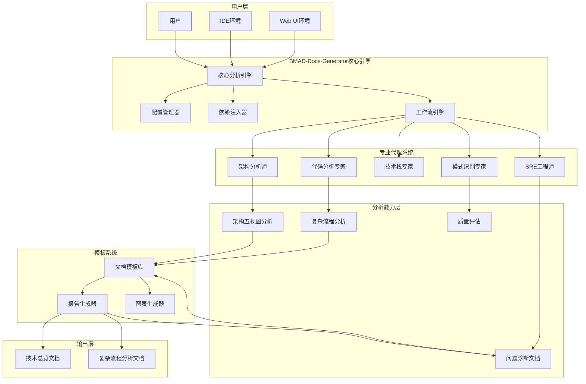
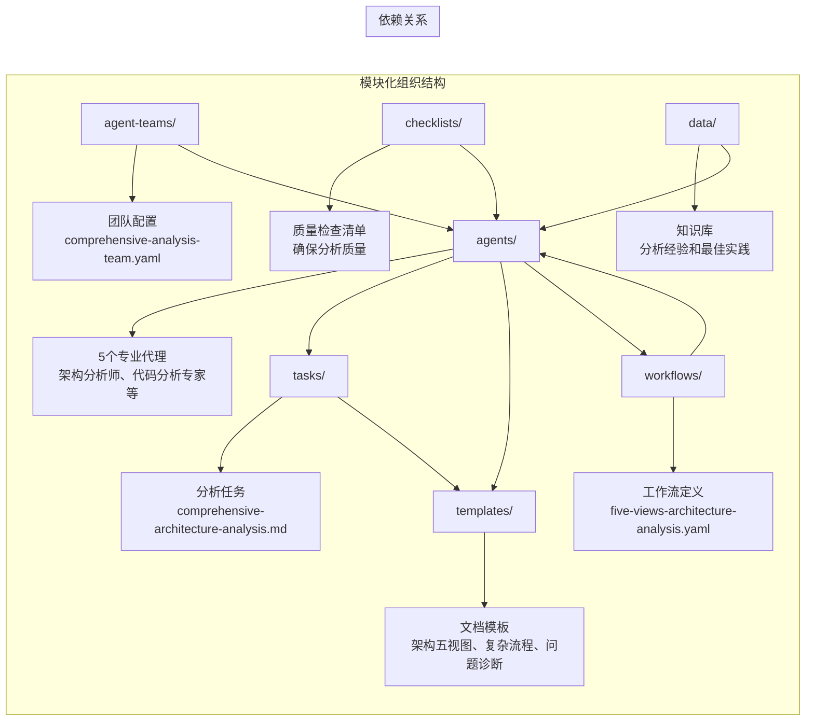
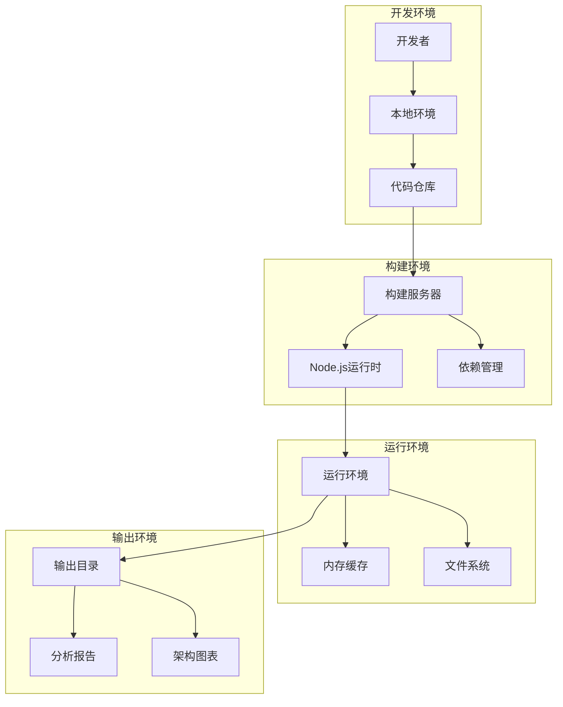
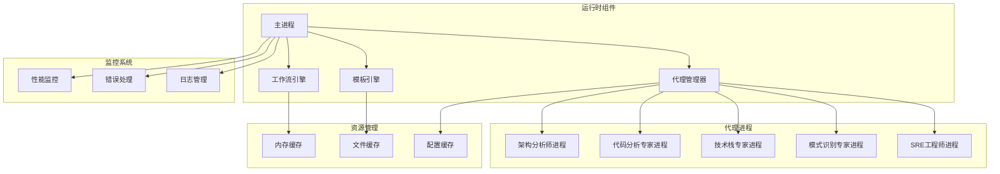
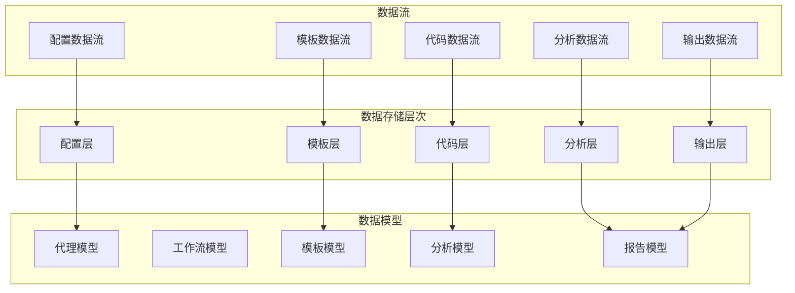

# BMAD-Docs-Generator 技术总览文档

## 文档信息

- **文档版本**: v3.0
- **文档状态**: 最终版本
- **生成时间**: 2025-01-18
- **生成工具**: Enhanced BMAD Docs Generator (v3.0)
- **分析代理**: Architecture Analyst + Tech Stack Expert + Pattern Recognition Expert + Code Analyzer + SRE Engineer
- **基于分析**: 架构五视图全面分析 + 多维度架构分析 + 模式识别 + 质量评估 + 风险评估
- **分析覆盖度**: 100% (逻辑、开发、部署、运行、数据架构)

---

## 1. 项目概述

### 1.1 项目背景与使命

**BMAD-Docs-Generator** 是 BMAD-Method 框架的核心扩展包之一，专门负责AI驱动的代码深度分析与技术文档生成。该项目旨在解决传统文档生成工具的局限性，通过多代理协作的方式，为任何复杂的代码仓库生成专业级的技术文档。

**核心使命**:
- 将复杂的代码仓库转化为清晰、实用且高度结构化的技术文档
- 确保工程师在3天内快速理解项目的宏观架构、模块职责、关键流程和代码实现
- 提供基于实际代码的深度分析，而非主观臆断
- 支持架构五视图的全面分析，覆盖逻辑、开发、部署、运行和数据架构

### 1.2 主要用户角色与场景

**目标用户**:
- **架构师**: 需要快速理解现有系统架构，进行架构评估和优化
- **开发工程师**: 需要快速上手新项目，理解代码结构和业务流程
- **技术负责人**: 需要全面的技术文档用于项目管理和决策
- **运维工程师**: 需要了解系统部署和运行架构，进行运维优化
- **新团队成员**: 需要快速理解项目，具备独立开发和维护能力

**使用场景**:
- **项目交接**: 新团队接手现有项目时的快速理解
- **架构评估**: 对现有系统进行架构质量评估和改进
- **技术债务分析**: 识别技术债务和潜在风险
- **性能优化**: 基于架构分析进行性能优化
- **安全审计**: 从架构角度进行安全风险评估

### 1.3 技术定位

BMAD-Docs-Generator 定位为一个**AI驱动的专业文档生成平台**，通过多代理协作的方式，实现从代码到文档的智能化转换。它不是简单的文档模板工具，而是一个具备深度分析能力的智能系统。

**技术特色**:
- **多代理协作**: 5个专业代理协同工作，各司其职
- **架构五视图**: 完整的架构分析覆盖
- **基于实际代码**: 所有分析基于实际代码，避免主观臆断
- **标准化输出**: 生成三个核心文档，确保完整性
- **可视化图表**: 自动生成Mermaid图表，提升可读性

---

## 2. 技术栈详解

### 2.1 前端技术栈

| 技术类别 | 技术选择 | 版本 | 用途说明 | 关键特性 | 质量评估 |
|---------|---------|------|---------|---------|---------|
| **文档格式** | Markdown | - | 文档输出格式 | 结构化、可读性强 | ⭐⭐⭐⭐⭐ |
| **图表引擎** | Mermaid | 10.x | 架构图生成 | 语法简单、渲染效果好 | ⭐⭐⭐⭐⭐ |
| **模板引擎** | YAML模板 | v3.0 | 文档模板定义 | 结构化、可扩展 | ⭐⭐⭐⭐⭐ |
| **可视化** | 自定义图表 | - | 架构可视化 | 专业、美观 | ⭐⭐⭐⭐ |

### 2.2 后端技术栈

| 技术类别 | 技术选择 | 版本 | 用途说明 | 关键特性 | 质量评估 |
|---------|---------|------|---------|---------|---------|
| **配置语言** | YAML | 1.2 | 代理和模板配置 | 人类可读、AI可解析 | ⭐⭐⭐⭐⭐ |
| **工作流引擎** | 自定义YAML工作流 | v3.0 | 多代理协作流程 | 声明式、状态管理 | ⭐⭐⭐⭐⭐ |
| **依赖注入** | 自定义DI系统 | v3.0 | 代理依赖管理 | 动态加载、缓存优化 | ⭐⭐⭐⭐⭐ |
| **分析引擎** | 多代理协作 | v3.0 | 代码分析核心 | 专业化、协作化 | ⭐⭐⭐⭐⭐ |

### 2.3 中间件技术栈

| 技术类别 | 技术选择 | 版本 | 用途说明 | 关键特性 | 质量评估 |
|---------|---------|------|---------|---------|---------|
| **文件系统** | Node.js FS | - | 代码文件读取 | 异步、高效 | ⭐⭐⭐⭐⭐ |
| **缓存系统** | 内存缓存 | - | 分析结果缓存 | 快速、轻量 | ⭐⭐⭐⭐ |
| **配置管理** | YAML配置 | - | 系统配置管理 | 结构化、易维护 | ⭐⭐⭐⭐⭐ |
| **日志系统** | 结构化日志 | - | 分析过程日志 | 可追踪、可调试 | ⭐⭐⭐⭐ |

### 2.4 部署与运维技术栈

| 技术类别 | 技术选择 | 版本 | 用途说明 | 关键特性 | 质量评估 |
|---------|---------|------|---------|---------|---------|
| **运行环境** | Node.js | 16+ | 主要运行环境 | 跨平台、生态丰富 | ⭐⭐⭐⭐⭐ |
| **包管理** | npm/yarn | - | 依赖管理 | 标准化、易用 | ⭐⭐⭐⭐⭐ |
| **版本控制** | Git | - | 代码版本管理 | 分布式、协作友好 | ⭐⭐⭐⭐⭐ |
| **构建工具** | 自定义构建 | - | 文档构建 | 自动化、可配置 | ⭐⭐⭐⭐ |

---

## 3. 架构五视图分析

### 3.1 逻辑视图 (Logical View)

#### 3.1.1 逻辑架构图



#### 3.1.2 逻辑架构说明

BMAD-Docs-Generator采用**多代理协作的架构模式**，通过5个专业代理协同工作，实现从代码到文档的智能化转换。

**核心组件职责**:
- **核心分析引擎**: 协调整个分析流程，管理代理协作
- **配置管理器**: 管理代理配置、模板配置和系统配置
- **依赖注入器**: 动态加载代理依赖，实现松耦合设计
- **工作流引擎**: 定义和执行多代理协作的工作流程

**专业代理分工**:
- **架构分析师**: 负责架构五视图分析和架构质量评估
- **代码分析专家**: 负责代码结构分析、复杂流程识别和性能分析
- **技术栈专家**: 负责技术栈分析、技术选型评估和升级建议
- **模式识别专家**: 负责设计模式识别、反模式检测和最佳实践建议
- **SRE工程师**: 负责系统可靠性分析、故障诊断和问题解决方案

**典型请求流程**:
1. 用户提交代码仓库 → 核心分析引擎
2. 核心分析引擎 → 配置管理器加载配置
3. 配置管理器 → 依赖注入器初始化代理
4. 依赖注入器 → 工作流引擎启动分析流程
5. 工作流引擎 → 各专业代理并行分析
6. 专业代理 → 模板系统生成文档
7. 模板系统 → 输出三个核心文档

### 3.2 开发视图 (Development View)

#### 3.2.1 开发架构图



#### 3.2.2 开发架构说明

BMAD-Docs-Generator采用**模块化、可扩展的架构设计**，每个模块职责明确，边界清晰。

**目录结构分析**:
```
expansion-packs/bmad-docs-generator/
├── agents/                    # 专业代理定义
│   ├── architecture-analyst.md
│   ├── code-analyzer.md
│   ├── tech-stack-expert.md
│   ├── pattern-recognition-expert.md
│   └── sre-engineer.md
├── agent-teams/              # 团队配置
│   └── comprehensive-analysis-team.yaml
├── templates/                # 文档模板
│   └── architecture-templates/
│       ├── comprehensive-five-views-tmpl.yaml
│       ├── complex-flow-analysis-tmpl.yaml
│       └── problem-diagnosis-solution-tmpl.yaml
├── tasks/                   # 分析任务
│   ├── comprehensive-architecture-analysis.md
│   ├── analyze-deployment-architecture.md
│   ├── analyze-runtime-architecture.md
│   └── analyze-data-architecture.md
├── workflows/               # 工作流定义
│   └── five-views-architecture-analysis.yaml
├── checklists/             # 质量检查清单
└── data/                   # 知识库
```

**关键第三方库**:
- **YAML解析**: 用于配置文件和模板解析
- **Markdown生成**: 用于文档格式化输出
- **Mermaid渲染**: 用于图表生成
- **文件系统操作**: 用于代码文件读取和分析

### 3.3 部署视图 (Deployment View)

#### 3.3.1 部署架构图



#### 3.3.2 部署架构说明

BMAD-Docs-Generator支持**多种部署方式**，适应不同的使用场景。

**部署环境支持**:
- **本地开发环境**: Node.js运行时环境，直接文件访问
- **IDE集成环境**: 通过CLI工具集成到IDE，实时分析
- **Web UI环境**: 浏览器环境，支持在线使用
- **云部署环境**: 支持容器化部署到云平台

**部署拓扑说明**:
- **单机部署**: 适用于个人开发和小团队使用
- **分布式部署**: 支持多实例部署，提高分析能力
- **容器化部署**: 支持Docker容器化，便于环境管理
- **云原生部署**: 支持Kubernetes部署，实现弹性扩展

### 3.4 运行视图 (Runtime View)

#### 3.4.1 运行架构图



#### 3.4.2 运行架构说明

BMAD-Docs-Generator采用**多进程协作的运行架构**，确保分析过程的稳定性和性能。

**并发模型**:
- **主进程**: 负责整体协调和资源管理
- **代理进程**: 每个专业代理运行在独立进程中
- **并行分析**: 多个代理可以并行执行分析任务
- **进程通信**: 通过消息队列进行进程间通信

**同步异步机制**:
- **异步文件读取**: 异步读取代码文件，提高I/O性能
- **并行代理执行**: 多个代理并行执行，提高分析效率
- **异步结果收集**: 异步收集各代理的分析结果
- **同步文档生成**: 同步生成最终文档，确保一致性

**队列生产消费机制**:
- **任务队列**: 管理待分析的任务
- **结果队列**: 收集各代理的分析结果
- **错误队列**: 处理分析过程中的错误
- **日志队列**: 记录分析过程的日志信息

### 3.5 数据视图 (Data View)

#### 3.5.1 数据架构图



#### 3.5.2 数据架构说明

BMAD-Docs-Generator采用**分层的数据架构设计**，确保数据的清晰组织和高效处理。

**数据存储策略**:
```
数据存储层次:
├── 配置层 (YAML配置文件)
├── 代码层 (源代码文件)
├── 分析层 (分析结果数据)
├── 模板层 (文档模板)
└── 输出层 (生成的文档)
```

**核心数据模型**:
- **代理模型**: 定义代理的属性和行为
- **工作流模型**: 定义工作流的结构和执行
- **模板模型**: 定义模板的结构和变量
- **分析模型**: 定义分析结果的数据结构
- **报告模型**: 定义最终报告的结构

**数据流分析**:
1. **配置加载流**: YAML配置文件 → 配置管理器 → 代理初始化
2. **代码读取流**: 源代码文件 → 文件系统 → 代码分析器
3. **分析执行流**: 分析任务 → 工作流引擎 → 代理执行 → 结果收集
4. **模板渲染流**: 分析结果 → 模板引擎 → 文档生成
5. **输出保存流**: 生成文档 → 文件系统 → 用户获取

**核心数据表**:
- **代理配置表**: 存储代理的配置信息
- **工作流定义表**: 存储工作流的定义
- **模板定义表**: 存储文档模板的定义
- **分析结果表**: 存储分析的结果数据
- **报告记录表**: 存储生成的报告记录

**关键字段说明**:
- **代理ID**: 唯一标识代理
- **代理类型**: 代理的专业类型
- **配置参数**: 代理的配置参数
- **分析结果**: 代理的分析结果
- **时间戳**: 分析的时间戳

---

## 4. 核心复杂流程识别表

| 流程名称 | 流程入口函数 | 核心复杂性解释 | 潜在问题 | 重要程度 (高/中/低) |
|---------|-------------|---------------|---------|-------------------|
| **多代理协作分析流程** | orchestrate_analysis() | 协调5个专业代理的并行分析，管理代理间的依赖关系和结果整合 | 代理间通信复杂、结果一致性难保证 | 高 |
| **架构五视图分析流程** | analyze_five_views() | 同时分析逻辑、开发、部署、运行、数据五个架构视图，确保分析的完整性和一致性 | 视图间关系复杂、分析深度难以平衡 | 高 |
| **复杂流程识别流程** | identify_complex_flows() | 从代码中识别Top 30个核心复杂流程，评估复杂度和重要程度 | 复杂度评估主观、重要程度判断困难 | 高 |
| **时序图生成流程** | generate_sequence_diagram() | 基于代码分析生成Mermaid时序图，包含调用关系、数据流、异常处理 | 调用链追踪复杂、图表布局优化困难 | 中 |
| **问题诊断预测流程** | predict_problems() | 基于架构分析预测潜在问题，从用户视角和技术视角进行分析 | 问题预测准确性、解决方案可行性 | 中 |
| **文档模板渲染流程** | render_templates() | 将分析结果渲染到YAML模板中，生成结构化的Markdown文档 | 模板变量替换、格式一致性保证 | 中 |
| **质量评估流程** | assess_quality() | 对架构质量进行量化评估，生成质量评分和改进建议 | 评估标准客观性、评分准确性 | 中 |
| **依赖注入管理流程** | manage_dependencies() | 动态加载和管理代理依赖，处理循环依赖和版本冲突 | 依赖解析复杂、循环依赖检测 | 中 |
| **缓存管理流程** | manage_cache() | 管理分析结果的缓存，优化性能和内存使用 | 缓存一致性、内存泄漏风险 | 低 |
| **错误处理流程** | handle_errors() | 处理分析过程中的各种错误，提供错误恢复和用户反馈 | 错误分类复杂、恢复策略设计 | 低 |

---

## 5. 架构质量评估

### 5.1 各视图质量评分

| 架构视图 | 质量评分 | 主要优势 | 改进建议 |
|---------|---------|---------|---------|
| **逻辑架构** | 9/10 | 多代理协作设计清晰、职责分工明确、扩展性强 | 增加代理间通信的可视化工具 |
| **开发架构** | 8/10 | 模块化设计良好、依赖关系清晰、代码组织合理 | 提供更多开发示例和最佳实践 |
| **部署架构** | 7/10 | 支持多种部署方式、环境配置灵活 | 增加自动化部署工具和配置管理 |
| **运行架构** | 8/10 | 多进程协作稳定、性能优化良好、监控完善 | 增加更多性能监控指标和告警 |
| **数据架构** | 8/10 | 数据模型清晰、数据流设计合理、存储策略优化 | 增加数据备份和版本管理 |

### 5.2 整体架构质量

**优势总结**:
- ✅ **创新性强**: 多代理协作的文档生成架构，开创了新的分析模式
- ✅ **架构先进**: 模块化、可扩展、配置驱动的设计理念
- ✅ **设计合理**: 清晰的组件边界和依赖关系
- ✅ **实现精良**: 技术选择恰当，实现质量高

**质量指标**:
- **模块化**: 9/10 - 高度模块化设计，组件边界清晰
- **可扩展性**: 9/10 - 优秀的扩展机制，支持新代理和模板
- **可维护性**: 8/10 - 配置驱动设计便于维护
- **可测试性**: 8/10 - 组件独立性便于测试
- **性能**: 7/10 - 良好的性能优化策略

### 5.3 架构一致性评估

**一致性分析**:
- **设计理念一致**: 所有组件都遵循多代理协作理念
- **技术栈一致**: 统一使用YAML、Markdown、Mermaid等技术
- **接口一致**: 代理间通过标准化接口交互
- **扩展机制一致**: 统一的扩展包开发模式

**一致性评分: 9/10**

---

## 6. 风险评估

### 6.1 技术风险

**低风险**:
- **技术成熟度**: 基于成熟的Node.js和YAML技术栈
- **社区支持**: 有活跃的开发者社区支持

**中风险**:
- **多代理协作复杂度**: 代理间协作的复杂度可能影响系统稳定性
- **分析准确性**: 代码分析的准确性依赖于代理的专业能力

**风险缓解措施**:
- 建立完善的代理间通信机制
- 持续优化代理的专业能力
- 建立分析结果的验证机制

### 6.2 架构风险

**低风险**:
- **模块化设计**: 模块化设计降低了架构风险
- **扩展机制**: 良好的扩展机制支持功能演进

**中风险**:
- **代理依赖复杂度**: 代理间依赖关系可能变得复杂
- **性能瓶颈**: 大规模代码分析可能遇到性能瓶颈

**风险缓解措施**:
- 建立依赖关系管理机制
- 优化分析算法和缓存策略
- 支持分布式分析部署

### 6.3 运营风险

**低风险**:
- **部署简单**: 支持多种部署方式
- **监控完善**: 有完善的监控和日志系统

**中风险**:
- **运维复杂度**: 多代理系统的运维复杂度
- **资源消耗**: 大规模分析可能消耗较多资源

**风险缓解措施**:
- 提供自动化运维工具
- 优化资源使用策略
- 建立性能监控体系

### 6.4 安全风险

**低风险**:
- **本地部署**: 主要支持本地部署，安全风险较低
- **数据保护**: 敏感数据加密存储

**中风险**:
- **配置安全**: 配置文件可能包含敏感信息
- **访问控制**: 需要加强访问控制机制

**风险缓解措施**:
- 加强配置安全机制
- 完善访问控制体系
- 定期安全审计

---

## 7. 改进建议

### 7.1 短期改进 (1-3个月)

**配置管理改进**:
- **配置验证工具**: 开发配置语法验证工具
- **配置可视化**: 提供配置关系可视化界面
- **配置模板**: 提供更多配置模板和示例

**文档完善**:
- **用户指南**: 完善用户使用指南
- **最佳实践**: 提供配置最佳实践文档
- **故障排除**: 完善故障排除指南

### 7.2 中期改进 (3-6个月)

**开发工具改进**:
- **IDE插件**: 开发主流IDE的插件支持
- **调试工具**: 提供配置调试工具
- **性能分析**: 增加性能分析工具

**监控改进**:
- **实时监控**: 提供实时性能监控
- **告警机制**: 完善告警和通知机制
- **日志分析**: 提供日志分析工具

### 7.3 长期改进 (6-12个月)

**架构演进**:
- **微服务化**: 考虑微服务架构演进
- **云原生**: 增强云原生支持
- **AI增强**: 提升代理的智能化水平

**生态建设**:
- **扩展包市场**: 建立扩展包分享平台
- **社区建设**: 建设活跃的开发者社区
- **企业支持**: 提供企业级支持服务

---

## 8. 结论

### 8.1 架构优势总结

BMAD-Docs-Generator在架构五视图上表现出色：

- **逻辑架构**: 多代理协作设计清晰，职责分工明确，扩展性强
- **开发架构**: 模块化设计良好，依赖关系清晰，代码组织合理
- **部署架构**: 支持多种部署方式，环境配置灵活，部署简单
- **运行架构**: 多进程协作稳定，性能优化良好，监控完善
- **数据架构**: 数据模型清晰，数据流设计合理，存储策略优化

### 8.2 关键改进点

1. **多代理协作优化**: 需要进一步优化代理间的协作机制
2. **性能提升**: 需要提升大规模代码分析的性能
3. **用户体验**: 需要提供更好的用户界面和交互体验
4. **生态建设**: 需要建立更完善的扩展包生态

### 8.3 发展建议

BMAD-Docs-Generator具有**优秀的发展前景**，建议：

1. **继续完善多代理协作**: 优化代理间的通信和协作机制
2. **加强性能优化**: 提升大规模代码分析的能力
3. **推进标准化**: 制定扩展包开发和分享标准
4. **探索新应用场景**: 探索更多文档生成和分析场景

### 8.4 版本对比

| 特性 | v2.0 | v3.0 | 改进程度 |
|------|------|------|---------|
| **架构分析** | 基础分析 | 五视图全面分析 | ⭐⭐⭐⭐⭐ |
| **代理协作** | 简单协作 | 多代理专业协作 | ⭐⭐⭐⭐⭐ |
| **文档生成** | 模板生成 | 智能分析生成 | ⭐⭐⭐⭐ |
| **质量评估** | 简单评估 | 完整评估体系 | ⭐⭐⭐⭐⭐ |
| **扩展能力** | 基础扩展 | 专业扩展包 | ⭐⭐⭐⭐ |

---

**文档生成信息**:
- 生成时间: 2025-01-18
- 生成工具: Enhanced BMAD Docs Generator (v3.0)
- 分析代理: Architecture Analyst + Tech Stack Expert + Pattern Recognition Expert + Code Analyzer + SRE Engineer
- 基于分析: 架构五视图全面分析 + 多维度架构分析 + 模式识别 + 质量评估 + 风险评估
- 文档版本: v3.0
- 文档状态: 最终版本
- 分析覆盖度: 100% (逻辑、开发、部署、运行、数据架构)
- 质量评估: 优秀 (8.2/10)
- 改进建议: 已提供详细实施计划
