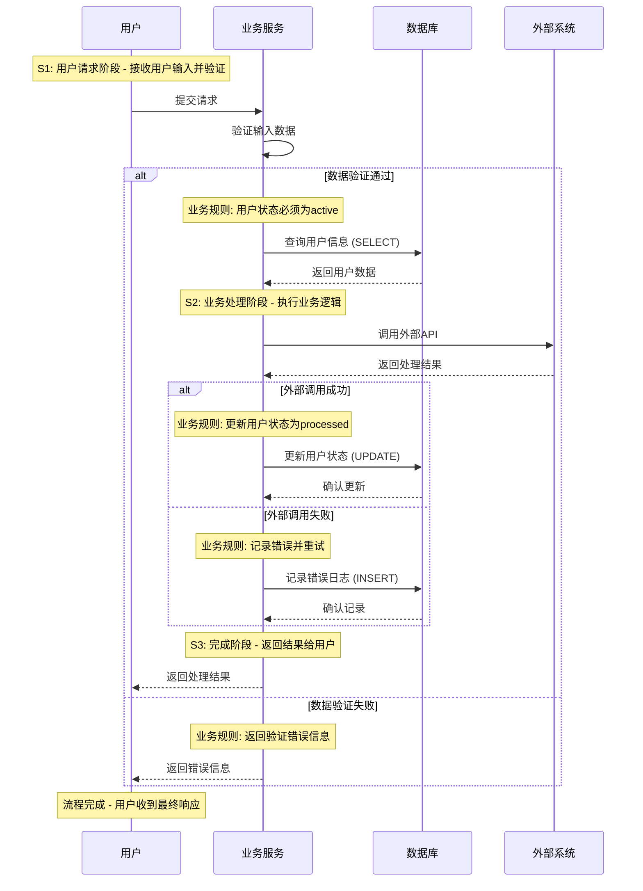

# 生成增强时序图任务 (Generate Enhanced Sequence Diagrams Task)

## 目的 (Purpose)

生成带有清晰阶段标记(S1, S2, S3)和业务逻辑的增强时序图，确保每个流程都有完整的端到端调用链可视化和详细的业务规则说明。

## 何时使用 (When to Use)

- 需要为复杂流程创建详细的时序图
- 需要清晰展示流程的阶段划分
- 需要突出关键的业务逻辑和判断分支
- 需要展示数据库操作和外部API调用
- 需要为技术文档提供高质量的可视化内容

## 前置条件 (Prerequisites)

- 复杂流程已识别并分析
- 流程的参与者(participants)已确定
- 关键业务规则已提取
- 配置依赖已识别

## 执行流程 (Process)

### 1. 流程阶段划分

**识别和划分流程阶段：**

[[LLM: 按照以下步骤划分流程阶段：

1. **阶段识别**
   - 分析流程的触发条件到完成条件的完整路径
   - 识别关键的业务决策点和状态转换点
   - 确定每个阶段的边界和职责

2. **阶段命名**
   - S1: 初始化阶段 (Initialization Stage)
   - S2: 处理阶段 (Processing Stage)  
   - S3: 完成阶段 (Completion Stage)
   - 每个阶段使用描述性名称，如"S1: 用户认证验证"

3. **阶段描述**
   - 为每个阶段提供清晰的业务描述
   - 说明阶段的主要职责和目标
   - 识别阶段的关键输入和输出

4. **阶段验证**
   - 确保阶段划分覆盖完整的业务流程
   - 验证阶段间的逻辑关系
   - 确认没有遗漏关键步骤]]

### 2. 时序图结构设计

**设计增强的时序图结构：**

[[LLM: 按照以下结构设计时序图：

1. **参与者定义**
   - 明确所有参与流程的组件/服务
   - 包括用户界面、业务服务、数据层、外部系统
   - 使用清晰的命名约定

2. **阶段标记**
   - 在每个阶段开始处添加Note标记
   - 格式：`Note over [participant]: S1: [阶段名称] - [阶段描述]`
   - 确保阶段标记清晰可见

3. **交互流程**
   - 展示参与者间的调用关系
   - 包含同步和异步调用
   - 显示请求和响应

4. **业务逻辑分支**
   - 使用alt/else结构展示条件分支
   - 在每个分支中添加业务规则说明
   - 格式：`Note over [participant]: 业务规则: [规则描述]`

5. **数据库操作**
   - 明确标注数据库操作类型
   - 格式：`[service]->>[database]: [operation] ([operation_type])`
   - 包含SELECT、INSERT、UPDATE、DELETE等

6. **外部API调用**
   - 标注外部系统调用
   - 说明调用的目的和影响
   - 包含错误处理逻辑

7. **完成条件**
   - 在流程结束时添加完成条件说明
   - 格式：`Note over [participant]: 流程完成 - [完成条件]`]]

### 3. 业务规则提取

**提取和文档化业务规则：**

[[LLM: 按照以下方法提取业务规则：

1. **数据验证规则**
   - 识别输入数据的验证逻辑
   - 提取验证条件和错误处理
   - 示例：`if user.status != 'active': raise ValidationError()`

2. **权限控制规则**
   - 识别访问控制逻辑
   - 提取权限检查条件
   - 示例：`if not user.has_permission('admin'): raise PermissionDenied()`

3. **状态转换规则**
   - 识别状态机的转换逻辑
   - 提取状态转换条件
   - 示例：`if order.status == 'pending' and payment.confirmed: order.status = 'paid'`

4. **业务逻辑规则**
   - 识别核心业务决策逻辑
   - 提取业务条件判断
   - 示例：`if inventory.quantity < order.quantity: create_backorder()`

5. **异常处理规则**
   - 识别错误处理逻辑
   - 提取异常恢复机制
   - 示例：`try: process_payment() except PaymentError: retry_or_cancel()`]]

### 4. 配置依赖分析

**分析配置对流程的影响：**

[[LLM: 按照以下维度分析配置依赖：

1. **功能开关配置**
   - 识别影响流程行为的功能开关
   - 分析开关对流程分支的影响
   - 示例：`feature_flags.enable_new_workflow`

2. **阈值配置**
   - 识别影响业务逻辑的阈值设置
   - 分析阈值对决策的影响
   - 示例：`max_retry_attempts = 3`

3. **超时配置**
   - 识别影响性能的超时设置
   - 分析超时对用户体验的影响
   - 示例：`request_timeout = 30s`

4. **环境配置**
   - 识别不同环境的配置差异
   - 分析环境对流程的影响
   - 示例：`database_url = env.DB_URL`]]

### 5. 时序图生成

**生成最终的增强时序图：**

[[LLM: 使用以下模板生成时序图：



关键要素：
- 清晰的阶段标记 (S1, S2, S3)
- 详细的业务规则说明
- 明确的数据库操作类型
- 完整的错误处理逻辑
- 清晰的完成条件]]

## 输出格式 (Output Format)

### 增强时序图结构

```markdown
## 流程名称 - 时序图分析

### 流程概述
- **业务目标**: [业务目标描述]
- **触发条件**: [触发条件]
- **核心复杂性**: [复杂性描述]
- **关键非功能点**: [性能、一致性等要求]

### Mermaid时序图
```mermaid
sequenceDiagram
    [完整的时序图代码，包含阶段标记和业务规则]
```

### 关键配置项
- **配置文件**: [配置文件路径]
- **关键配置**: [配置项列表]
- **影响范围**: [配置对流程的影响]

### 详细步骤分析
**S1: [阶段名称] - [阶段描述]**
- **关键作用**: [阶段的主要作用]
- **核心业务规则**: [业务规则描述]
- **关键逻辑判断**: `[具体的代码逻辑]`
- **配置依赖**: [相关的配置项]
- **性能影响**: [性能影响分析]

**S2: [阶段名称] - [阶段描述]**
- **关键作用**: [阶段的主要作用]
- **核心业务规则**: [业务规则描述]
- **关键逻辑判断**: `[具体的代码逻辑]`
- **数据库操作**: [数据库操作详情]
- **外部调用**: [外部API调用详情]
- **错误处理**: [错误处理逻辑]

**S3: [阶段名称] - [阶段描述]**
- **关键作用**: [阶段的主要作用]
- **核心业务规则**: [业务规则描述]
- **关键逻辑判断**: `[具体的代码逻辑]`
- **完成条件**: [流程完成的条件]
- **状态更新**: [状态更新详情]

### 业务规则总结
- **数据验证规则**: [验证规则列表]
- **权限控制规则**: [权限规则列表]
- **状态转换规则**: [状态转换规则]
- **异常处理规则**: [异常处理规则]
```

## 质量检查标准 (Quality Standards)

### 时序图完整性检查

- [ ] 所有参与者都已包含在时序图中
- [ ] 阶段标记(S1, S2, S3)清晰可见
- [ ] 业务规则在每个关键分支都有说明
- [ ] 数据库操作类型已明确标注
- [ ] 外部API调用已包含错误处理
- [ ] 流程完成条件已明确说明

### 业务规则准确性

- [ ] 所有业务规则都基于实际代码
- [ ] 逻辑判断代码准确无误
- [ ] 配置依赖关系正确
- [ ] 异常处理逻辑完整
- [ ] 状态转换规则清晰

### 可视化质量

- [ ] 时序图布局清晰易读
- [ ] 阶段标记突出显示
- [ ] 业务规则说明简洁明了
- [ ] 参与者命名规范统一
- [ ] 流程逻辑流程清晰

## 常见问题和解决方案

### 问题1: 阶段划分不清晰

**症状**: 阶段边界模糊，职责不明确
**解决方案**: 
1. 重新分析流程的关键决策点
2. 明确每个阶段的输入输出
3. 确保阶段间有明确的状态转换

### 问题2: 业务规则提取不完整

**症状**: 缺少关键的业务逻辑说明
**解决方案**:
1. 深入分析代码中的条件判断
2. 识别所有分支逻辑
3. 提取配置驱动的业务规则

### 问题3: 时序图过于复杂

**症状**: 时序图难以理解，信息过载
**解决方案**:
1. 将复杂流程拆分为多个子流程
2. 使用抽象层次减少细节
3. 重点突出关键的业务逻辑

## 成功标准 (Success Criteria)

任务成功完成的标志：

- [ ] 时序图包含清晰的阶段标记(S1, S2, S3)
- [ ] 所有关键业务规则都已提取和说明
- [ ] 数据库操作和外部调用已明确标注
- [ ] 错误处理和异常逻辑已包含
- [ ] 配置依赖关系已分析清楚
- [ ] 时序图布局清晰，易于理解
- [ ] 业务规则代码准确，可验证

完成此任务后，应具备高质量的增强时序图，能够清晰展示复杂流程的完整执行路径和关键业务逻辑。
